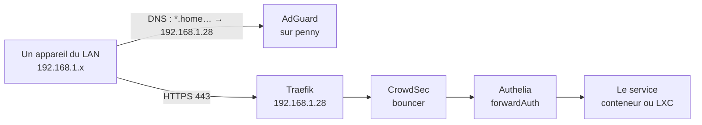
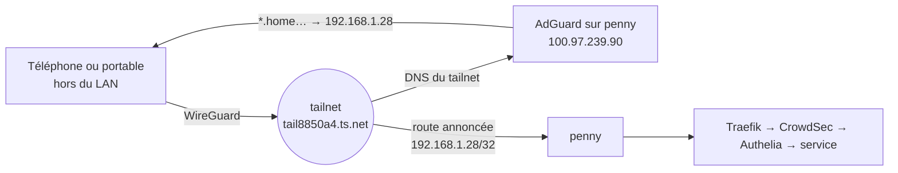

# Comment on accède aux services

Cette page répond à une seule question : **quand une machine demande
`grafana.home.gabin-simond.fr`, par où passe la requête ?** Elle complète
[Réseau actuel](reseau.md), qui décrit l'adressage, et sert de légende à la
cartographie Homelable.

Il n'y a que **trois** chemins d'entrée. Aucun autre n'existe.

## Le point de départ : la box ne redirige rien

La Freebox **ne fait aucune redirection de port** vers le LAN. Rien n'écoute sur
l'IP publique pour le homelab. Conséquence : depuis l'extérieur, aucun service
n'est joignable en direct, et les certificats TLS ne peuvent pas se valider par
HTTP-01 — c'est pour cela que Traefik utilise **DNS-01 via Cloudflare**.

## Chemin 1 — depuis le LAN (le cas courant)



La résolution vient d'**une seule règle AdGuard**, et elle est *délibérément
restreinte par client* :

```
||home.gabin-simond.fr^$dnsrewrite=192.168.1.28,client=192.168.1.0/24|172.16.0.0/12|100.64.0.0/10
```

Trois familles de clients y ont droit : le **LAN**, les **réseaux Docker**, et
le **tailnet** (`100.64.0.0/10`). Toute autre source — dont `127.0.0.1` — obtient
une réponse vide.

:::warning[Le joker ne doit pas avaler `_acme-challenge`]
Une réécriture trop large a déjà cassé **tous** les renouvellements TLS en
silence : `_acme-challenge.*` tombait dans le joker au lieu d'aller chez
Cloudflare. La règle ci-dessus est scopée par client, et les resolvers ACME
sont forcés sur du DNS public.
:::

Ensuite, tout entre par **Traefik sur `192.168.1.28:443`** — un seul port, pour
une vingtaine de vhosts. Traefik route soit vers un conteneur de penny (par nom
sur le réseau Docker `proxy`), soit vers un LXC par IP:port, via les fichiers de
`traefik/dynamic/` :

| Vhost | Destination réelle |
|---|---|
| `vault.home…` | `192.168.1.32:8080` — Vaultwarden (LXC 102) |
| `backup.home…` | `https://192.168.1.33:8007` — PBS (LXC 103) |
| `pulse.home…` | `192.168.1.34:7655` — Pulse (LXC 106) |
| `logs.home…` | `192.168.1.31:3000` — Grafana (LXC 101) |
| `finance.home…` / `import.home…` | `192.168.1.37:8080` et `:8081` — Firefly III (LXC 109) |
| `dns-failover.home…` | `192.168.1.30:3000` — AdGuard secondaire (LXC 100) |
| `galahad.home…` / `lancelot.home…` | `https://192.168.1.1x:8006` — les deux nœuds PVE |
| `dns.home…` | `192.168.1.28:3000` — AdGuard primaire |

## Chemin 2 — depuis l'extérieur, par le tailnet

C'est le chemin qui n'était pas documenté, et il repose sur **deux** mécanismes
qu'il faut voir ensemble.



1. **Le DNS du tailnet pointe sur le homelab.** Les résolveurs distribués à tous
   les membres sont, dans l'ordre, `100.97.239.90` (AdGuard sur penny) puis
   `100.74.145.26` (AdGuard secondaire, le LXC `dns-failover` — son nom Tailscale
   est `guardian`). Un appareil distant résout donc `*.home…` exactement comme
   s'il était à la maison, et c'est la règle scopée `100.64.0.0/10` ci-dessus qui
   l'autorise.

2. **penny annonce une route `192.168.1.28/32`.** C'est ce qui rend l'adresse
   `192.168.1.28` — donc Traefik — atteignable *à travers* le tunnel. Un `/32` et
   non le `/24` : seule penny est exposée, le reste du LAN reste hors de portée
   du tailnet.

Il faut donc, côté client, `--accept-routes` pour que cette route soit installée.

:::danger[N'active pas `--accept-routes` sur une machine déjà sur le LAN]
Une machine du LAN qui accepte la route reçoit `192.168.1.28/32` dans la
table 52 et se met à joindre penny **par le tunnel** : le SYN part par
Tailscale, le SYN-ACK revient par le LAN, et la connexion tombe en timeout
alors que le ping passe. Symptôme classique : SSH qui gèle sur un LXC qui
répond au ping.
:::

### Membres du tailnet

| Nom Tailscale | IP | Ce que c'est |
|---|---|---|
| `penny` | `100.97.239.90` | Serveur principal, **resolveur DNS n°1**, annonce `192.168.1.28/32`, porte le Funnel |
| `guardian` | `100.74.145.26` | LXC 100 `dns-failover` — **resolveur DNS n°2** |
| `galahad` / `lancelot` | `100.98.58.121` / `100.69.6.13` | Les deux nœuds Proxmox (Tailscale SSH) |
| `sucre` | `100.119.15.67` | LXC 105 (`tagged-devices`) |
| `zomboid` / `waterline` | `100.118.152.0` / `100.93.179.106` | Serveurs de jeu (LXC 104 et 107) |
| `macbook-pro-de-gabin` | `100.68.165.36` | Le Mac (`192.168.1.173` quand il est à la maison) |
| `A00783` | `100.64.114.40` | PC Windows |
| `iphone175-1`, `SHADOW-7HAGR4KS` | — | Hors ligne de longue date |

## Chemin 3 — le Funnel, seule porte publique

```
https://penny.tail8850a4.ts.net  →  proxy  →  127.0.0.1:8090  (ntfy)
```

Un unique service est exposé **publiquement**, sans passer par le tailnet ni par
Authelia : **ntfy**, parce que les notifications push iOS exigent une URL
publique. Rien d'autre ne sort par là.

:::note[Contrainte de port]
`tailscaled` tient le `:443` de l'interface Tailscale tant que `serve` ou
`funnel` est actif. Traefik n'écoute donc **que** sur `192.168.1.28:443` et
`127.0.0.1:443`, jamais sur `100.97.239.90:443` — et c'est pour cette raison
que le chemin 2 passe par la route `/32` et pas par un `tailscale serve`.
:::

## Ce qui n'est joignable par aucun de ces chemins

- Les services qui n'écoutent que sur un **réseau Docker interne** : `outline-db`
  (PostgreSQL), `outline-redis`, `socket-proxy`, `kroki-mermaid`, `status`,
  `autoheal`. Ils sont volontairement sans sonde dans Homelable — un contrôle
  qui ne peut pas échouer ne renseigne sur rien.
- Le **reste du LAN depuis le tailnet** : la route annoncée est un `/32`. Pour
  joindre un LXC par son IP privée depuis l'extérieur, on passe par son propre
  nom Tailscale, pas par le LAN.

## Comment lire la cartographie Homelable

| Type de lien | Ce qu'il représente |
|---|---|
| `fibre` | l'arrivée FTTH |
| `ethernet` (1 Gb/s) | câblage : box → switch → les trois hôtes |
| `wifi` | clients sans fil rattachés à la box |
| `virtual` (pointillé) | dépendance logicielle : vhost Traefik, WireGuard, API Docker, base de données, qdevice, NFS |
| `cluster` | le lien Corosync galahad ↔ lancelot |

Les tuiles portent leurs interfaces en propriétés (`eth0`, `tailscale0`, `vmbr0`,
réseaux Docker). Le câblage entre le switch et les machines est **déduit, pas
mesuré** : le switch (`192.168.1.2`, alias DNS `switch.lan.gabin-simond.fr`) ne
répond pas en SNMP, donc sa table MAC est inaccessible.
