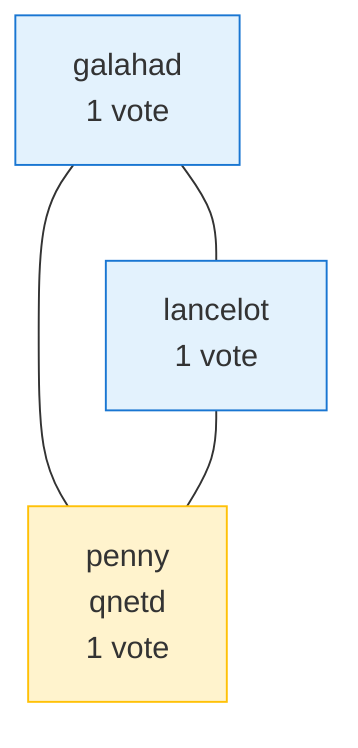

# Cluster Proxmox — qdevice (3 votes)

**Deployé 2026-04-19** suite à incident perte-de-quorum sur cluster 2-node.

## Problème initial (2-node)

Cluster Proxmox `homelab` = 2 nodes (galahad + lancelot), chacun 1 vote. Quorum exige **2/2 votes**. Conséquence : si UN node tombe, le survivant a 1/2 → pas de quorum → `/etc/pve` passe en read-only → aucune action cluster possible (pas de `pct start`, pas de modif config, pas de backup vzdump, etc.).

Apparaît structurellement a chaque panne d'un node. L'incident 2026-04-19 (lancelot down ~6h) l'a démontré : galahad seul mais paralysé.

## Solution : qdevice sur penny

`corosync-qnetd` tourne sur penny (hors cluster PVE), fournit un 3e vote arbitraire aux 2 nodes PVE. Quorum devient 2/3 — un node peut tomber, le survivant + qdevice = 2/3 = quorate.



## Déploiement effectué

### Penny (qnetd host)

```bash
apt install corosync-qnetd
# firewall
iptables -I INPUT -s 192.168.1.0/24 -p tcp --dport 5403 -j ACCEPT
iptables -I INPUT -s 100.64.0.0/10 -p tcp --dport 5403 -j ACCEPT
iptables-save > /etc/iptables/rules.v4
```

### Galahad + Lancelot (qdevice hosts)

```bash
apt install corosync-qdevice

# Config SSH port override pour penny (penny SSH = port 2806 hardened)
cat >> /root/.ssh/config <<EOF
Host 192.168.1.28
  Port 2806
  StrictHostKeyChecking accept-new
EOF
```

### Setup initial

Depuis UN node PVE (peu importe lequel), une fois :

```bash
pvecm qdevice setup 192.168.1.28 -f
```

Script PVE qui :
1. SSH root@penny pour copier les certs corosync
2. Généré cert qdevice sur chaque node
3. Met a jour `/etc/corosync/corosync.conf` (config_version incremente)
4. Démarre `corosync-qdevice.service` sur chaque node

!!! warning "Pre-requis SSH root penny"
    `pvecm qdevice setup` utilisé root@qnetd. Si penny a `PermitRootLogin no` (hardening), enable temporaire via drop-in `/etc/ssh/sshd_config.d/99-qdevice-setup.conf` avec `PermitRootLogin prohibit-password` + depose les pubkeys root galahad+lancelot dans `/root/.ssh/authorized_keys` penny. Revert immédiat après setup.

## Vérification

```bash
sudo corosync-quorumtool -s
```

Attendu :

```text
Quorate:          Yes
Expected votes:   3
Total votes:      3
Flags:            Quorate Qdevice

Membership node list:   1, 2
  0x00000001          1    A,V,NMW 192.168.1.18 (local)
  0x00000002          1    A,V,NMW 192.168.1.19
  0x00000000          1            Qdevice
```

```bash
sudo corosync-qdevice-tool -s
```

Doit afficher `Model: Net` + membership list des 2 nodes PVE.

## Gain resilience

- **Perte d'un node** : l'autre + qdevice = 2/3, reste quorate. `/etc/pve` RW maintenu. Les LXC du node survivant continuent, on peut même migrer les LXC du node mort si storage partagé.
- **Perte de penny** (qdevice) : les 2 nodes PVE ont 2/3 votes = quorate. Pas d'impact immédiat cluster.
- **Double perte (penny + 1 node PVE)** : 1/3, KO. Mais c'est un double-fault extreme.

## Piège : pmxcfs stuck RO

Voir `operations/depannage.md` section "pmxcfs stuck read-only". Le qdevice **ne previent pas** ce bug transitionnel. Après une recovery, si `/etc/pve` reste RO malgre `Quorate: Yes`, `systemctl restart pve-cluster` sur le node revenu.

## DR : re-provisioning qnetd

Si penny brule, le cluster reste quorate avec 2/3 temporairement puis passe a 2 votes + 1 vote deficit au prochain hello corosync — re-dimensionnement automatique OK.

Pour restaurer qdevice après re-installation penny :

```bash
# Sur penny reinstalle
apt install corosync-qnetd
# Re-open firewall 5403 TCP LAN + Tailscale

# Sur un node PVE (les 2 en fait, les certs sont par-node)
pvecm qdevice remove
pvecm qdevice setup 192.168.1.28 -f
```

## Voir aussi

- [Dépannage : pmxcfs stuck RO](../operations/depannage.md#pmxcfs-stuck-read-only-apres-recovery-node-cluster)
- [Réseau](reseau.md) — topologie 2-node cluster
