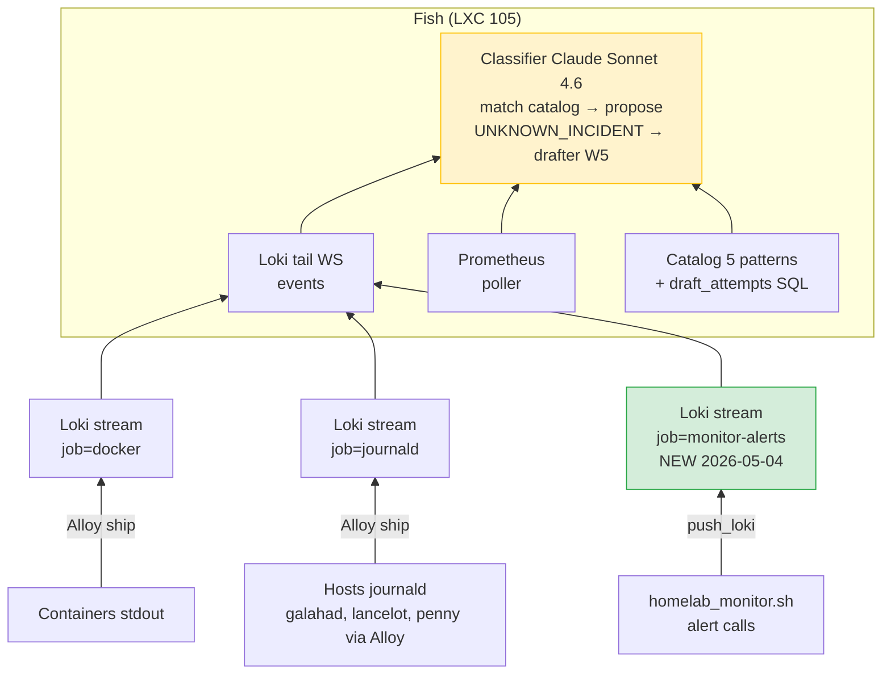

# Fish observability

Cette page documenté comment fish voit le homelab et où il bipe — pas le design fish (voir [Projet Fish](../projet/fish.md)) mais l'architecture de l'observation et la delivery.

## Surface d'observation de fish



**3 streams Loki que fish observé** :

1. **`job=docker`** : stdout des containers Docker (adguard, traefik, authelia, etc.) shipped par Alloy
2. **`job=journald`** : journalctl des hosts galahad/lancelot/penny shipped par Alloy
3. **`job=monitor-alerts`** *(nouveau 2026-05-04)* : alertes émises par `homelab_monitor.sh` (`alert()` push à Loki en plus du ntfy)

Le 3ème stream est ce qui ferme un gap critique : avant le 04/05, fish ne voyait pas les alertes "backup stale", "fish-down", "AdGuard desync" parce qu'elles partaient en ntfy direct. Maintenant elles arrivent dans Loki, fish peut classifier+drafter dessus.

## Loki query filter (fish.config.loki_query)

```text
{job=~".+"}
  !~ "^\\[EGRESS-"
  !~ "martian source"
  !~ "auth key pair too old"
| detected_level=~"error|warn|warning|critical|fatal"
| job!~"fail2ban|monitor"
```

Décomposé :

| Stage | Effet |
|-------|-------|
| `{job=~".+"}` | Stream selector — tous les streams Loki |
| `!~ "^\[EGRESS-"` | Drop les logs kernel iptables firewall (EGRESS-HOST/EGRESS-DOCKER) — bruit réseau, pas d'incident |
| `!~ "martian source"` | Drop kernel routing asymétrique sur bridges Proxmox — comportement normal LXC |
| `!~ "auth key pair too old"` | Drop pvestatd auth key rotation auto — comportement normal Proxmox |
| `\| detected_level=~"error\|warn..."` | Filtre structured metadata pour level (post stream selector) |
| `\| job!~"fail2ban\|monitor"` | Drop fail2ban INFO floods + monitor INFO logs (mais `monitor-alerts` passe ✓) |

**Note technique** : les `!~` line filters sont placés AVANT les `|` label filters dans la pipeline LogQL — c'est la syntaxe correcte (line filters bare, label filters préfixés `|`).

## Ntfy delivery — pourquoi 2 topics

### Topic 1 — `ae8fcbd80e6c5fa1b6c39f013da61d4e` (homelab generic)

**Property : RESILIENT** — bypass fish entirely. Si fish meurt, ces alertes arrivent quand même.

| Source | Comportement |
|--------|--------------|
| `homelab_monitor.sh` | `ALERT [tag]` ntfy |
| `homelab_backup.sh` | FAILED only (post-2026-05-04) |
| `lynis-weekly.sh` | échec ou score < 70 |
| vault/logs/dnsfailover | backup FAILED |
| watchtower | ECHEC + Skipped (level=warn) |
| `ct-log-monitor.sh` | nouveau sous-domaine |
| fish-down canary | BYPASS fish — survival critical |

### Topic 2 — `fish-homelab-c1e65af331c04569b97a` (fish proposals)

**Property : SMART** — callback flow `/approve/{proposal_id}` POST back to `fish:8080`. Demande fish runtime alive.

| Source | Comportement |
|--------|--------------|
| `fish.proposer.NtfyNotifier` | Approve/Deny callback flow |
| `fish.drafter.PatternDrafter` | drafter PR ready notif |

### Pourquoi pas un seul topic

Le callback handler de fish (`/approve/{id}`) attend que les requests viennent UNIQUEMENT des proposals fish. Si on mélange les topics :
- Watchtower ntfy "Maj auto OK" arrive dans topic unique
- Tu cliques sur la notif Watchtower (curieux/par erreur)
- ntfy fire le callback URL configurée (qui pointe vers fish)
- Fish reçoit un proposal_id qui n'existe pas → 404

Isolation namespace via 2 topics = bonne séparation de concerns.

### Phone côté

L'app ntfy iOS subscribe les 2 topics. Tu vois **un seul inbox unifié**. La séparation est invisible côté UX, présente côté code/résilience.

## Centralisation = OBSERVATION, pas DELIVERY

Une question naturelle : "fish ne devrait-il pas être central, point unique de tout ?"

| Axe | Réponse |
|-----|---------|
| **Observation** (fish voit tout) | ✅ Oui, c'est le but. Step B (2026-05-04) ferme le dernier gap (monitor→Loki). Fish a maintenant ~5x plus de signal. |
| **Delivery** (fish envoie tout) | ❌ Non, fragile. La fish-DOWN canary doit bypass fish (sinon fish mort = silence indistinguable). Loki down ne doit pas casser les alertes critiques (qui restent en ntfy direct topic 1). |

Le centralisme intelligent est sur l'observation. La delivery reste distribuée pour la résilience. C'est un design conscient, pas un accident.

## Healthchecks.io — le canary deadman

Voir [notif-hygiene](../operations/notif-hygiene.md) pour le setup. C'est complémentaire de fish-observability :
- Fish observé via Loki → détecte les pannes des SERVICES qu'il watch
- Healthchecks.io ping → détecte la panne du **HOST penny** qui run fish + monitor

Sans healthchecks, "silence côté ntfy" = "tout va bien" OU "penny est mort", indistinguable.

## Fichier de config

Tout est dans `/mnt/ssd/config/fish/src/fish/config.py` :

| Variable | Default | Effet |
|----------|---------|-------|
| `loki_query` | string LogQL | Stream + filtres décrits ci-dessus |
| `classifier_enabled` | True | Activer/désactiver le LLM classifier |
| `classifier_skip_sources` | `{prometheus}` | Sources à pas classifier (noise) |
| `classifier_rate_limit_window_s` | 300 | Rate limit par (host, service) |
| `classifier_rate_limit_max_calls` | 1 | Max calls par window |
| `drafter_enabled` | True (en prod) | Activer drafter W5 |
| `drafter_dedup_window_h` | 168 | Window dedup drafter (7j) |
| `budget_hard_stop_eur` | 20 | Hard stop mensuel Claude API |
| `budget_soft_warn_eur` | 10 | Soft warn ntfy mensuel Claude API |
