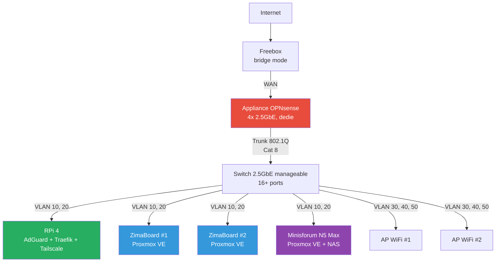
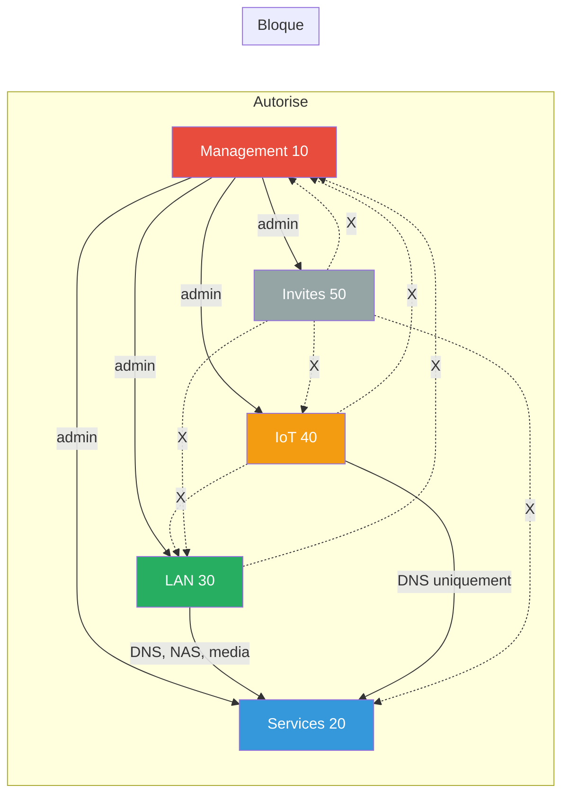

# Reseau cible

Architecture reseau prevue pour la maison renovee.

## Schema reseau

## Roles par machine

### Raspberry Pi 4 — Appliance reseau

!!! success "Independant du cluster"
    Si le cluster Proxmox tombe, le reseau continue de fonctionner.

- **AdGuard Home** — DNS principal + ad-blocking
- **Traefik** — reverse proxy + TLS auto
- **Tailscale** — VPN mesh distant
- **Beszel** — monitoring systeme
- **Homepage** — dashboard
- **Watchtower** — auto-update containers non-critiques + notif pour critiques

### Appliance OPNsense — Firewall dedie

Machine dediee bare-metal. Seul point de passage entre les VLANs et vers Internet.

| Port | Role |
|---|---|
| ETH0 | WAN (Freebox en bridge) |
| ETH1 | LAN trunk 802.1Q vers le switch |
| ETH2/ETH3 | Spare (DMZ, lien direct NAS, HA futur) |

Fonctions :

- Inter-VLAN routing avec regles firewall strictes
- DHCP server par VLAN
- OPNsense bare-metal pour la fiabilite

### ZimaBoard #1 + #2 — Compute

Deux noeuds Proxmox VE pour les services applicatifs en LXC/VM.

- Services legers : outils internes, dev, tests
- Proxmox Backup Server (en LXC sur un des deux)
- Avec le Minisforum → cluster Proxmox 3 noeuds (quorum natif)

### Minisforum N5 Max — Compute + Storage

Noeud Proxmox le plus puissant, double role.

- **NAS** — partage NFS/SMB vers les autres noeuds
- **Jellyfin** — media server avec transcodage hardware (Intel Quick Sync)
- **Services lourds** — VMs/LXC gourmands
- ZFS mirror recommande (minimum 2 disques)

## Plan VLANs

| VLAN ID | Nom | Subnet | Usage |
|---|---|---|---|
| 10 | Management | `10.0.10.0/24` | Admin switch, Proxmox, OPNsense, RPi SSH |
| 20 | Services | `10.0.20.0/24` | Containers, VMs, NAS, DNS, reverse proxy |
| 30 | LAN perso | `10.0.30.0/24` | Devices personnels (PC, tel, tablettes) |
| 40 | IoT | `10.0.40.0/24` | Domotique, cameras — isole |
| 50 | Invites | `10.0.50.0/24` | WiFi guest — acces internet uniquement |

## Matrice de flux

## Regles firewall OPNsense

### VLAN 10 — Management

- :material-check: Acces a **tous** les VLANs (administration)
- :material-check: Acces internet

### VLAN 20 — Services

- :material-check: Acces internet
- :material-check: Acces NAS (VLAN 20 interne)
- :material-close: Pas d'acces au management (VLAN 10)

### VLAN 30 — LAN personnel

- :material-check: Acces internet
- :material-check: Acces services : DNS, NAS, Jellyfin (VLAN 20)
- :material-close: Pas d'acces management (VLAN 10)

### VLAN 40 — IoT / Domotique

- :material-check: Acces internet **limite**
- :material-check: Acces DNS uniquement (VLAN 20, port 53)
- :material-close: **Isole** de tout le reste (pas de LAN, pas de management)

### VLAN 50 — Invites

- :material-check: Acces internet uniquement
- :material-close: **Isole** de tout (pas de LAN, pas de services, pas d'IoT)

## WiFi et VLANs

Chaque VLAN qui necessite du WiFi a son propre SSID :

| SSID | VLAN | Usage |
|---|---|---|
| `HomeNet` | 30 | Devices personnels |
| `HomeIoT` | 40 | Objets connectes |
| `HomeGuest` | 50 | Invites |

Les APs WiFi (Ubiquiti / TP-Link EAP) recoivent un **trunk 802.1Q** et taguent le trafic par SSID.
