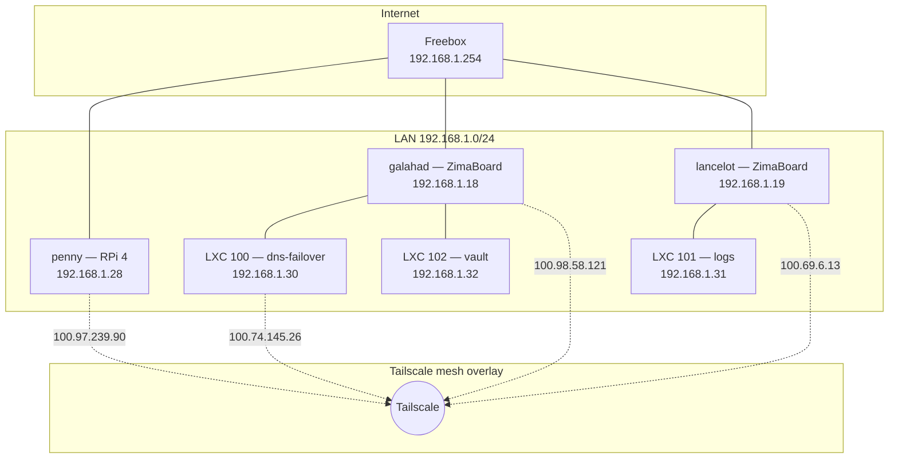
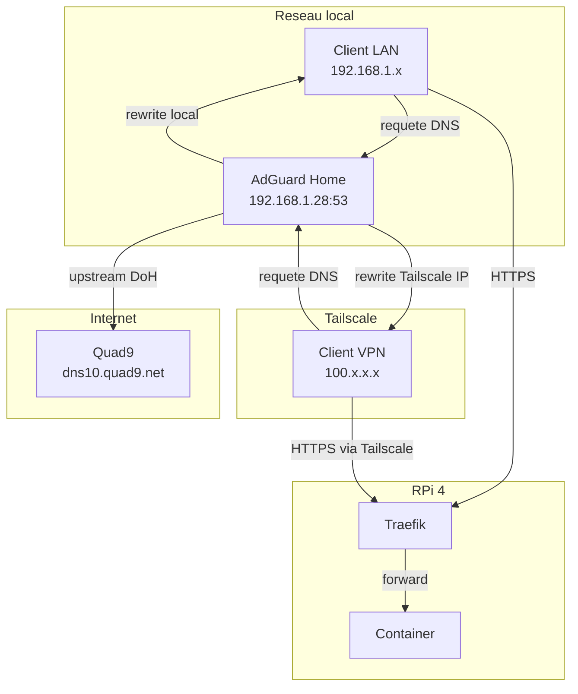
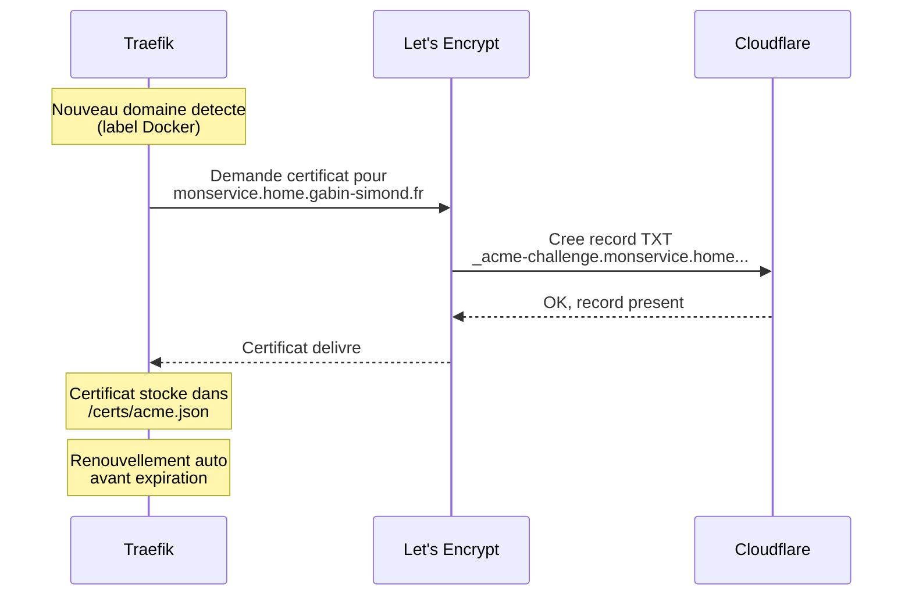

# Réseau

État actuel du réseau homelab : topologie, adressage, DNS, VPN mesh et certificats TLS.

## Topologie actuelle

Réseau plat `192.168.1.0/24` derriere une Freebox (gateway `192.168.1.254`). Pas de VLANs pour l'instant — la segmentation est prévue dans l'[architecture cible](reseau-cible.md). L'acces distant est assure par un mesh VPN Tailscale (WireGuard) superpose au LAN. Il **n'y a aucun port forwarde** sur la Freebox — tout le trafic inter-devices distant passe par le tunnel WireGuard.



## Machines et adresses

| Hostname | Type | Rôle | IP LAN | IP Tailscale |
|---|---|---|---|---|
| `penny` (homelab) | RPi 4 (DietPi) | Serveur principal (Docker, Traefik, AdGuard) | `192.168.1.28` | `100.97.239.90` |
| `galahad` | ZimaBoard (Proxmox) | Hyperviseur (LXC vault + dns-failover) | `192.168.1.18` | `100.98.58.121` |
| `lancelot` | ZimaBoard (Proxmox) | Hyperviseur (LXC logs) | `192.168.1.19` | `100.69.6.13` |
| `dns-failover` | LXC 100 (sur galahad) | AdGuard secondaire + healthcheck | `192.168.1.30` | `100.74.145.26` |
| `vault` | LXC 102 (sur galahad) | Vaultwarden | `192.168.1.32` | — |
| `logs` | LXC 101 (sur lancelot) | Loki + Grafana | `192.168.1.31` | — |
| `iphone175` | iOS | Mobile | — | `100.84.188.65` |
| `macbook-pro-de-gabin` | macOS | Laptop | — | `100.68.165.36` |
| `a00783` | Windows | Desktop | — | `100.64.114.40` |

Les LXC `logs` (101, sur lancelot) et `vault` (102, sur galahad) ne sont **pas** sur Tailscale — accessibles via l'IP LAN de leur host uniquement.

## DNS (AdGuard Home)

### Architecture DNS



### Les DNS rewrites (la piece clé)

AdGuard Home utilisé des **règles de reecritures conditionnelles** dans `user_rules` pour rediriger les domaines internes vers le RPi **sans passer par Internet** :

```text
||home.gabin-simond.fr^$dnsrewrite=192.168.1.28,client=192.168.1.0/24
||home.gabin-simond.fr^$dnsrewrite=100.97.239.90,client=100.64.0.0/10
```

#### Que font ces règles ?

| Règle | Client vu par AdGuard | Réponse DNS | Pourquoi |
|---|---|---|---|
| 1ere | LAN (`192.168.1.0/24`) | `192.168.1.28` (IP locale) | Clients du réseau local |
| 2eme | Tailscale (`100.64.0.0/10`) | `100.97.239.90` (IP Tailscale) | Clients VPN distants |

!!! danger "Ne pas utiliser les DNS Rewrites statiques"
    La section **DNS Rewrites** d'AdGuard (Filters > DNS Rewrites) ne doit **pas** contenir d'entrees pour `*.home.gabin-simond.fr`.
    Les rewrites statiques sont appliquees **avant** les `user_rules` et ne supportent pas le filtrage par client.
    Elles ecraseraient les règles conditionnelles ci-dessus, renvoyant toujours l'IP LAN, même aux clients Tailscale — rendant les services inaccessibles via VPN.

    **Seule exception** : `switch.lan` → `192.168.1.2` (equipement HTTP-only, hors du domaine `home.*` pour éviter le HSTS).

!!! success "AdGuard en `network_mode: host`"
    AdGuard tourne avec `network_mode: host` — il voit les **vraies IPs clients** (LAN et Tailscale), pas l'IP du bridge Docker.

    Avantages :

    - **2 règles DNS** au lieu de 4 — plus de bricolage avec le bridge Docker
    - **Stats par client** dans AdGuard — on voit quel device fait quelles requêtes
    - **Reverse proxy** toujours actif via Traefik file provider (`dynamic/dns.yml`)

#### Wildcard `home.gabin-simond.fr`

La règle utilisé `||home.gabin-simond.fr^` — c'est un **wildcard**. Ca matche :

- `home.gabin-simond.fr`
- `traefik.home.gabin-simond.fr`
- `adguard.home.gabin-simond.fr`
- `monservice.home.gabin-simond.fr`
- ... tout sous-domaine de `home.gabin-simond.fr`

**Résultat : pas besoin d'ajouter une règle DNS par service.** Tout nouveau service avec un sous-domaine `*.home.gabin-simond.fr` est automatiquement redirige.

### Flow complet d'une requête

=== "Depuis le LAN"

    ```
    1. Navigateur → adguard.home.gabin-simond.fr ?
    2. AdGuard → rewrite → 192.168.1.28 (regle client=192.168.1.0/24)
    3. Navigateur → HTTPS 192.168.1.28:443
    4. Traefik → match Host header → forward vers container adguard:3000
    5. Reponse ← chiffree TLS (certificat Let's Encrypt)
    ```

=== "Depuis Tailscale (distant)"

    ```
    1. Navigateur → adguard.home.gabin-simond.fr ?
    2. DNS → resolution publique ou AdGuard via Tailscale
    3. Navigateur → HTTPS 100.97.239.90:443 (via tunnel Tailscale)
    4. Traefik → match Host header → forward vers container adguard:3000
    5. Reponse ← chiffree TLS
    ```

### DNS upstream

Pour les domaines **non locaux** (tout sauf `*.home.gabin-simond.fr`), AdGuard forward vers :

| Upstream | Protocole | Adresse |
|---|---|---|
| Quad9 | DNS-over-HTTPS | `https://dns10.quad9.net/dns-query` |

Bootstrap DNS (pour résoudre `dns10.quad9.net` lui-même) :

- `9.9.9.10`
- `149.112.112.10`

Mode : **load balance** entre les upstreams.

## Tailscale

### Tailnet

| | |
|---|---|
| Tailnet | `tail8850a4.ts.net` |
| Magic DNS | Actif |
| HTTPS certs | Actif (cert `.ts.net` automatique) |

Le VPN mesh Tailscale est géré depuis [login.tailscale.com](https://login.tailscale.com).

### Tailscale SSH

Mode `check` (MFA navigateur a chaque connexion) activé sur `homelab` (penny), `galahad`, `lancelot`. Aucun port 22 exposé sur aucun host.

```bash
ssh gabins@homelab    # penny via MagicDNS Tailscale
ssh gabins@galahad    # ZimaBoard #1
ssh gabins@lancelot   # ZimaBoard #2
```

Fallback OpenSSH dispo sur les 3 hosts (ports 2806/2807/2808), clé Ed25519 uniquement.

### Politique ACL

La configuration ACL exacte vit dans la console Tailscale et est versionnee par Tailscale (pas dans ce repo). Résumé de la politique :

#### Groupes

| Groupe | Membres |
|---|---|
| `group:admin` | `gabin@gabin-simond.fr` (proprietaire tailnet) |

Pas de compte multi-utilisateur pour l'instant (homelab personnel).

#### Tags

| Tag | Usage |
|---|---|
| `tag:homelab` | penny |
| `tag:proxmox` | galahad + lancelot |
| `tag:lxc` | dns-failover (et futurs LXCs sur Tailscale) |
| `tag:client` | iphone, macbook, desktop |

#### Règles d'acces (principe)

- `group:admin` : acces complet a tous les tags.
- `tag:client` : acces aux services homelab (ports 80, 443, 53, 3000, 8006) mais pas SSH (sauf via Tailscale SSH).
- `tag:homelab` / `tag:proxmox` / `tag:lxc` : pas d'init d'appels sortants hors du tailnet (serveurs passifs).

#### SSH ACL

```text
{
  "sshRules": [
    {
      "action": "check",  // MFA navigateur
      "src": ["group:admin"],
      "dst": ["tag:homelab", "tag:proxmox"],
      "users": ["gabins", "root"]
    }
  ]
}
```

### Revocation

Procedure en cas de vol / perte / compromission d'un device :

1. [login.tailscale.com](https://login.tailscale.com) > **Machines**
2. Selectionner le device > **Disable** (acces coupe immédiatement)
3. Si perdu definitivement : **Remove**
4. Rotation globale clés : **Settings > Keys > Auth keys > Revoke**
5. Les autres devices doivent re-authentifier (sauf ceux avec *key expiry disabled*)

Voir aussi la politique de sécurité dans [politique.md](../securite/politique.md) et les mesures de hardening dans [hardening.md](../securite/hardening.md).

### Key expiry

Désactivé sur les serveurs (`homelab`, `dns-failover`, `galahad`, `lancelot`) pour éviter qu'un serveur headless perde l'acces mesh sans intervention humaine. Les clients (iphone, macbook, desktop) gardent l'expiry par defaut (180 jours) + re-auth interactive.

### Commandes utiles

```bash
tailscale status            # liste machines et connectivite
tailscale whois <IP>        # qui est connecte sur cette IP
tailscale ping <host>       # ping direct ou relay via DERP
tailscale up --ssh          # reactiver Tailscale SSH si coupe
tailscale netcheck          # diagnostics NAT / DERP
```

## TLS / Certificats

Traefik géré automatiquement les certificats TLS via Let's Encrypt avec le **DNS challenge Cloudflare**.



**Pourquoi le DNS challenge ?**

- Pas besoin d'exposer le port 80 sur Internet
- Fonctionne pour des domaines internes (pas accessibles depuis Internet)
- Cloudflare géré la zone DNS `gabin-simond.fr`
- Traefik utilisé le token API Cloudflare (`CF_DNS_API_TOKEN`) pour créer/supprimer les records TXT automatiquement
