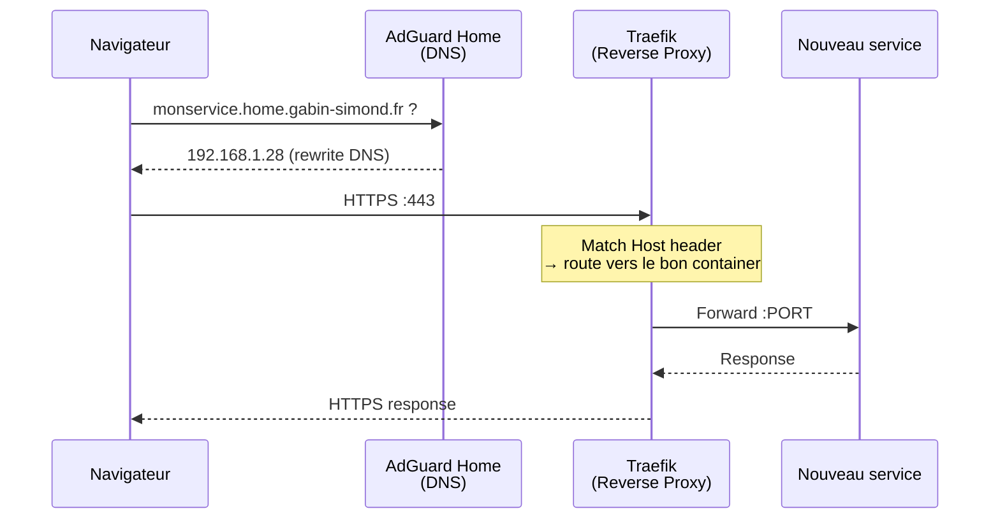

# Ajouter un nouveau service

Guide pas-a-pas pour déployer un nouveau service Docker avec un sous-domaine custom et HTTPS automatique.

## Prerequis

- Le service tourne en Docker
- Tu veux y acceder via `monservice.home.gabin-simond.fr` en HTTPS
- Traefik et AdGuard Home sont déjà en place

## Vue d'ensemble du flow



## Étape 1 — Ajouter le service dans docker-compose.yml

Ajouter le service dans `/mnt/ssd/config/docker-compose.yml` :

```yaml
  monservice:
    image: image/monservice:latest
    container_name: monservice
    restart: unless-stopped
    # ports:                          # Pas besoin d'exposer le port si uniquement via Traefik
    #   - "8080:8080"
    volumes:
      - monservice-data:/data         # Adapter selon le service
    networks:
      - proxy                         # IMPORTANT : doit etre sur le reseau proxy
    labels:
      - "traefik.enable=true"
      - "traefik.http.routers.monservice.rule=Host(`monservice.home.gabin-simond.fr`)"
      - "traefik.http.routers.monservice.entrypoints=websecure"
      - "traefik.http.services.monservice.loadbalancer.server.port=8080"  # Port interne du container
      - "traefik.http.routers.monservice.tls=true"
      - "traefik.http.routers.monservice.tls.certresolver=letencrypt"
```

!!! warning "Points importants"
    - Le service **doit** être sur le réseau `proxy` pour que Traefik le voie
    - Le `server.port` est le port **interne** du container, pas le port exposé
    - Pas besoin de `ports:` si l'acces se fait uniquement via Traefik
    - Remplacer `monservice` partout par le vrai nom du service

Si le service a besoin d'un volume, l'ajouter dans la section `volumes:` en bas du compose :

```yaml
volumes:
  monservice-data:
```

## Étape 2 — DNS rewrite dans AdGuard Home

Pour que `monservice.home.gabin-simond.fr` pointe vers le RPi **sans passer par Internet**, il faut un DNS rewrite dans AdGuard.

### Option A — Wildcard (recommandé)

Si tu as déjà un wildcard `*.home.gabin-simond.fr`, **rien a faire**. Tous les sous-domaines pointent déjà vers le RPi.

### Option B — Rewrite spécifique

Dans AdGuard Home → **Filtres** → **Reecritures DNS** → ajouter :

| Domaine | Réponse |
|---|---|
| `monservice.home.gabin-simond.fr` | `192.168.1.28` |

Ou dans la config (`user_rules` dans `AdGuardHome.yaml`) :

```text
||monservice.home.gabin-simond.fr^$dnsrewrite=192.168.1.28,client=192.168.1.0/24
||monservice.home.gabin-simond.fr^$dnsrewrite=100.97.239.90,client=100.64.0.0/10
```

!!! info "Pourquoi deux règles ?"
    AdGuard tourne en `network_mode: host` et voit les vraies IPs clients. LAN recoit l'IP locale, Tailscale recoit l'IP Tailscale. Voir [Comment fonctionne le DNS](../architecture/reseau.md#les-dns-rewrites-la-piece-cle) pour le détail.

## Étape 3 — Déployer

```bash
cd /mnt/ssd/config
docker compose up -d monservice
```

## Étape 4 — Vérifier

1. **DNS** — le domaine resout vers le RPi :
```bash
nslookup monservice.home.gabin-simond.fr 127.0.0.1
```

2. **HTTPS** — le certificat est valide :
```bash
curl -I https://monservice.home.gabin-simond.fr
```

3. **Traefik dashboard** — le router apparaît dans `http://IP:8080`

!!! tip "Premier acces"
    Le certificat Let's Encrypt peut prendre 30 secondes a être généré la première fois (DNS challenge Cloudflare). Si tu vois une erreur TLS, attends un peu et reessaie.

## Checklist rapide

- [ ] Service ajoute dans `docker-compose.yml` avec les labels Traefik
- [ ] Service sur le réseau `proxy`
- [ ] DNS rewrite dans AdGuard (ou wildcard déjà en place)
- [ ] `docker compose up -d`
- [ ] Test DNS (`nslookup`)
- [ ] Test HTTPS (`curl` ou navigateur)
- [ ] Commit le compose modifie dans `homelab-config`
