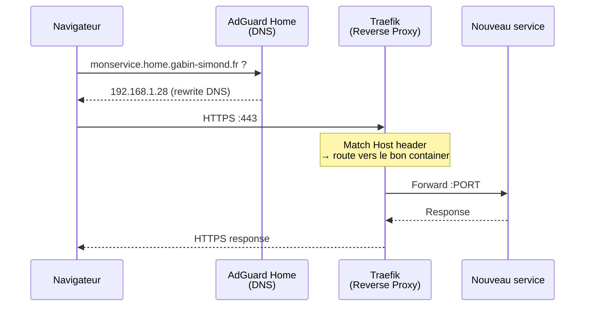

# Ajouter un nouveau service

Guide pas-a-pas pour déployer un nouveau service Docker avec un sous-domaine custom et HTTPS automatique.

## Prerequis

- Le service tourne en Docker
- Tu veux y acceder via `monservice.home.gabin-simond.fr` en HTTPS
- Traefik et AdGuard Home sont déjà en place

## Vue d'ensemble du flow


```mermaid
sequenceDiagram
    participant Client as Navigateur
    participant AG as AdGuard Home<br/>(DNS)
    participant TF as Traefik<br/>(Reverse Proxy)
    participant SVC as Nouveau service

    Client->>AG: monservice.home.gabin-simond.fr ?
    AG-->>Client: 192.168.1.28 (rewrite DNS)
    Client->>TF: HTTPS :443
    Note over TF: Match Host header<br/>→ route vers le bon container
    TF->>SVC: Forward :PORT
    SVC-->>TF: Response
    TF-->>Client: HTTPS response
```

## Étape 1 — Ajouter le service dans docker-compose.yml

Ajouter le service dans `/mnt/ssd/config/docker/docker-compose.yml` :

```yaml
  monservice:
    image: image/monservice:latest@sha256:<digest>   # epingle, voir plus bas
    container_name: monservice
    restart: unless-stopped
    # ports:                          # Pas besoin d'exposer le port si uniquement via Traefik
    #   - "8080:8080"
    volumes:
      - monservice-data:/data         # Adapter selon le service
    networks:
      - proxy                         # IMPORTANT : doit etre sur le reseau proxy
    labels:
      traefik.enable: "true"
      traefik.http.routers.monservice.rule: Host(`monservice.home.gabin-simond.fr`)
      traefik.http.routers.monservice.entrypoints: websecure
      traefik.http.routers.monservice.tls: "true"
      traefik.http.routers.monservice.tls.certresolver: letencrypt
      traefik.http.routers.monservice.tls.domains[0].main: "*.home.gabin-simond.fr"
      traefik.http.routers.monservice.tls.domains[0].sans: home.gabin-simond.fr
      traefik.http.routers.monservice.middlewares: crowdsec@file,authelia@docker,security-headers@file
      traefik.http.services.monservice.loadbalancer.server.port: "8080"   # port INTERNE
```

:::danger[La ligne `middlewares` n'est pas optionnelle]
Sans elle, le service est **joignable sans authentification** par quiconque atteint
Traefik. Les trois middlewares vont toujours ensemble :

| Middleware | Ce qu'il fait |
|---|---|
| `crowdsec@file` | refuse les IP bannies avant tout le reste |
| `authelia@docker` | ForwardAuth : pas de session valide, pas de backend |
| `security-headers@file` | HSTS, `X-Frame-Options`, etc. |

La seule raison légitime de s'en passer est que l'application **consomme** Authelia en
OIDC — un ForwardAuth casserait alors son flux, comme pour
[Forgejo et Outline](../services/authelia.md). Dans ce cas c'est un client OIDC qu'il
faut déclarer, pas une absence de protection.
:::

:::warning[Points importants]
- Le service **doit** être sur le réseau `proxy` pour que Traefik le voie
- Le `server.port` est le port **interne** du container, pas le port exposé
- Pas besoin de `ports:` si l'acces se fait uniquement via Traefik
- Remplacer `monservice` partout par le vrai nom du service
- Le certresolver s'écrit bien `letencrypt`, **sans le `s`** — c'est le nom déclaré dans
  `traefik.yml`, pas une faute de frappe à corriger
- **Épingler l'image par digest** : les 22 images du compose le sont. Relever le digest
  avec `docker image inspect <image> --format '{{index .RepoDigests 0}}'`
- Si le conteneur doit résoudre `*.home.gabin-simond.fr` (typiquement pour parler à
  Authelia en OIDC), lui ajouter `dns: 192.168.1.28`
:::

Si le service a besoin d'un volume, l'ajouter dans la section `volumes:` en bas du compose :

```yaml
volumes:
  monservice-data:
```

## Étape 2 — DNS rewrite dans AdGuard Home

Pour que `monservice.home.gabin-simond.fr` pointe vers le RPi **sans passer par Internet**, il faut un DNS rewrite dans AdGuard.

### Option A — Wildcard (recommandé)

Si tu as déjà un wildcard `*.home.gabin-simond.fr`, **rien a faire**. Tous les sous-domaines pointent déjà vers le RPi.

### Option B — Rewrite spécifique

Dans AdGuard Home → **Filtres** → **Reecritures DNS** → ajouter :

| Domaine | Réponse |
|---|---|
| `monservice.home.gabin-simond.fr` | `192.168.1.28` |

Ou dans la config (`user_rules` dans `AdGuardHome.yaml`) :

```text
||monservice.home.gabin-simond.fr^$dnsrewrite=192.168.1.28,client=192.168.1.0/24
||monservice.home.gabin-simond.fr^$dnsrewrite=100.97.239.90,client=100.64.0.0/10
```

:::info[Pourquoi deux règles ?]
AdGuard tourne en `network_mode: host` et voit les vraies IPs clients. LAN recoit l'IP locale, Tailscale recoit l'IP Tailscale. Voir [Comment fonctionne le DNS](../architecture/reseau.mdx#les-dns-rewrites-la-pièce-clé) pour le détail.
:::

## Étape 3 — Déployer

```bash
cd /mnt/ssd/config/docker
docker compose up -d monservice
```

:::note[Le compose vit dans `docker/`, pas à la racine du dépôt]
`/mnt/ssd/config/docker-compose.yml` n'existe pas. Un `docker compose` lancé depuis
`/mnt/ssd/config` ne trouve aucun fichier.

Et vérifier que les secrets sont descellés avant de démarrer : `.env` est un lien vers
`/run/homelab/.env`, sur tmpfs. Après un redémarrage sans descellement, les conteneurs
partent sans leurs variables — en silence.
:::

## Étape 4 — Vérifier

1. **DNS** — le domaine resout vers le RPi :
```bash
nslookup monservice.home.gabin-simond.fr 127.0.0.1
```

2. **HTTPS** — le certificat est valide :
```bash
curl -I https://monservice.home.gabin-simond.fr
```

3. **Traefik dashboard** — le router apparaît sur `https://traefik.home.gabin-simond.fr`.
   Pas sur `http://IP:8080` : le port 8080 n'est **pas publié** sur l'hôte, il ne sert
   qu'au healthcheck interne du conteneur.

4. **L'authentification mord bien** — sans session, on doit être redirigé, pas servi :
```bash
curl -s -o /dev/null -w '%{http_code}\n' https://monservice.home.gabin-simond.fr
# 302 -> Authelia a pris la main. 200 -> le service est EXPOSE, la ligne middlewares manque.
```

:::tip[Premier acces]
Le certificat Let's Encrypt peut prendre 30 secondes a être généré la première fois (DNS challenge Cloudflare). Si tu vois une erreur TLS, attends un peu et reessaie.
:::

## Checklist rapide

- [ ] Service ajoute dans `docker/docker-compose.yml`, image epinglee par digest
- [ ] Les trois middlewares sur le router (`crowdsec`, `authelia`, `security-headers`)
- [ ] Service sur le réseau `proxy`
- [ ] DNS rewrite dans AdGuard (ou wildcard déjà en place)
- [ ] `docker compose up -d`
- [ ] Test DNS (`nslookup`)
- [ ] Test HTTPS (`curl` ou navigateur)
- [ ] Test que l'auth mord : `curl -o /dev/null -w '%{http_code}'` doit rendre 302
- [ ] Commit le compose modifie dans `homelab-config`
