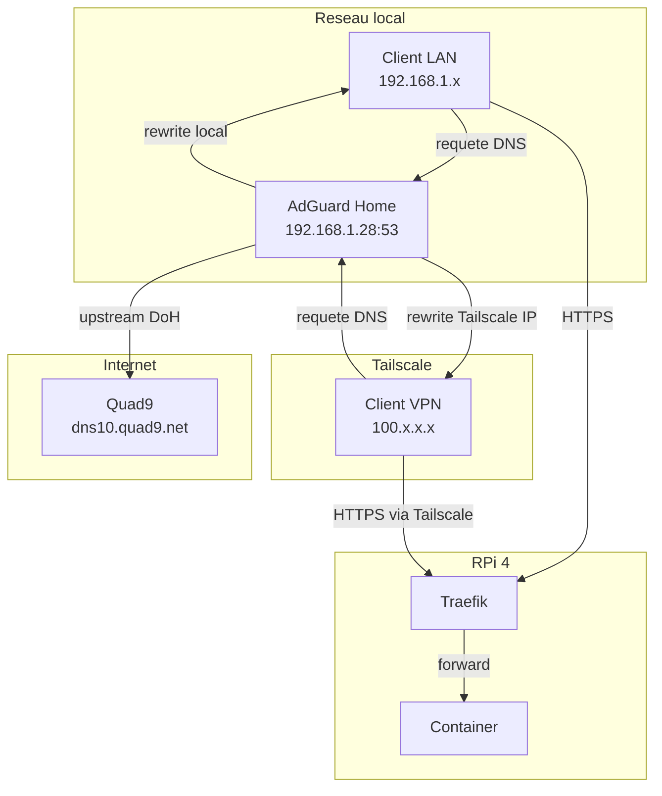
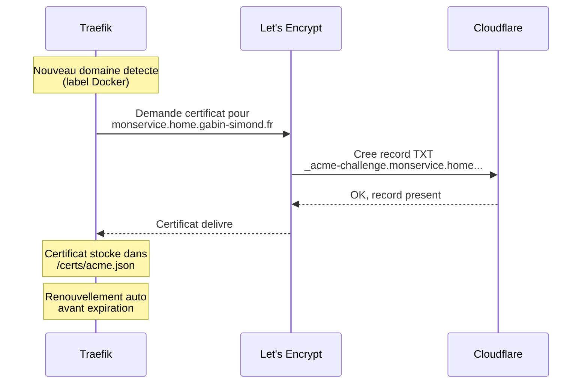

# Comment fonctionne le DNS

Explication du flow DNS complet, du navigateur jusqu'au service.

## Architecture DNS



## Les DNS rewrites (la piece cle)

AdGuard Home utilise des **regles de reecritures conditionnelles** dans `user_rules` pour rediriger les domaines internes vers le RPi **sans passer par Internet** :

```
||home.gabin-simond.fr^$dnsrewrite=192.168.1.28,client=192.168.1.0/24
||home.gabin-simond.fr^$dnsrewrite=100.97.239.90,client=100.64.0.0/10
```

### Que font ces regles ?

| Regle | Client vu par AdGuard | Reponse DNS | Pourquoi |
|---|---|---|---|
| 1ere | LAN (`192.168.1.0/24`) | `192.168.1.28` (IP locale) | Clients du reseau local |
| 2eme | Tailscale (`100.64.0.0/10`) | `100.97.239.90` (IP Tailscale) | Clients VPN distants |

!!! danger "Ne pas utiliser les DNS Rewrites statiques"
    La section **DNS Rewrites** d'AdGuard (Filters > DNS Rewrites) ne doit **pas** contenir d'entrees pour `*.home.gabin-simond.fr`.
    Les rewrites statiques sont appliquees **avant** les `user_rules` et ne supportent pas le filtrage par client.
    Elles ecraseraient les regles conditionnelles ci-dessus, renvoyant toujours l'IP LAN, meme aux clients Tailscale — rendant les services inaccessibles via VPN.

!!! success "AdGuard en `network_mode: host`"
    AdGuard tourne avec `network_mode: host` — il voit les **vraies IPs clients** (LAN et Tailscale), pas l'IP du bridge Docker.

    Avantages :

    - **2 regles DNS** au lieu de 4 — plus de bricolage avec le bridge Docker
    - **Stats par client** dans AdGuard — on voit quel device fait quelles requetes
    - **Reverse proxy** toujours actif via Traefik file provider (`dynamic/adguard.yml`)

### Wildcard `home.gabin-simond.fr`

La regle utilise `||home.gabin-simond.fr^` — c'est un **wildcard**. Ca matche :

- `home.gabin-simond.fr`
- `traefik.home.gabin-simond.fr`
- `adguard.home.gabin-simond.fr`
- `monservice.home.gabin-simond.fr`
- ... tout sous-domaine de `home.gabin-simond.fr`

**Resultat : pas besoin d'ajouter une regle DNS par service.** Tout nouveau service avec un sous-domaine `*.home.gabin-simond.fr` est automatiquement redirige.

## Flow complet d'une requete

=== "Depuis le LAN"

    ```
    1. Navigateur → adguard.home.gabin-simond.fr ?
    2. AdGuard → rewrite → 192.168.1.28 (regle client=192.168.1.0/24)
    3. Navigateur → HTTPS 192.168.1.28:443
    4. Traefik → match Host header → forward vers container adguard:3000
    5. Reponse ← chiffree TLS (certificat Let's Encrypt)
    ```

=== "Depuis Tailscale (distant)"

    ```
    1. Navigateur → adguard.home.gabin-simond.fr ?
    2. DNS → resolution publique ou AdGuard via Tailscale
    3. Navigateur → HTTPS 100.97.239.90:443 (via tunnel Tailscale)
    4. Traefik → match Host header → forward vers container adguard:3000
    5. Reponse ← chiffree TLS
    ```

## DNS upstream

Pour les domaines **non locaux** (tout sauf `*.home.gabin-simond.fr`), AdGuard forward vers :

| Upstream | Protocole | Adresse |
|---|---|---|
| Quad9 | DNS-over-HTTPS | `https://dns10.quad9.net/dns-query` |

Bootstrap DNS (pour resoudre `dns10.quad9.net` lui-meme) :

- `9.9.9.10`
- `149.112.112.10`

Mode : **load balance** entre les upstreams.

## TLS / Certificats



**Pourquoi le DNS challenge ?**

- Pas besoin d'exposer le port 80 sur Internet
- Fonctionne pour des domaines internes (pas accessibles depuis Internet)
- Cloudflare gere la zone DNS `gabin-simond.fr`
- Traefik utilise le token API Cloudflare (`CF_DNS_API_TOKEN`) pour creer/supprimer les records TXT automatiquement
