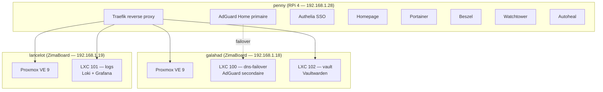

# Homelab

Documentation du homelab : architecture, services, securite et operations.

## Architecture actuelle



- **penny** (RPi 4) — appliance reseau : DNS, reverse proxy, SSO, VPN, monitoring
- **galahad** (ZimaBoard) — Proxmox VE 9 : Vaultwarden (LXC 102), DNS failover (LXC 100)
- **lancelot** (ZimaBoard) — Proxmox VE 9 : Loki + Grafana (LXC 101)

## Ou chercher quoi

| Je veux... | Aller a |
|---|---|
| Voir la liste des services et leurs URLs | [Services — Vue d'ensemble](services/index.md) |
| Comprendre le reseau et le DNS | [Reseau actuel](architecture/reseau.md) |
| Voir le hardware et les IPs | [Machines](architecture/hardware.md) |
| Comprendre la politique de securite | [Securite — Politique](securite/politique.md) |
| Savoir ce qui est harden | [Securite — Hardening](securite/hardening.md) |
| Restaurer apres un crash | [Break-glass](operations/break-glass.md) |
| Verifier les backups | [Backups](operations/backups.md) |
| Diagnostiquer un probleme | [Depannage](operations/depannage.md) |
| Ajouter un nouveau service | [Guide — Ajouter un service](guides/ajouter-service.md) |

## Naming

Chaque machine porte un nom de code du monde de l'espionnage. Voir le [casting complet](projet/about.md).

| Machine | Nom | Reference | Role |
|---|---|---|---|
| RPi 4 | **penny** | Miss Moneypenny (James Bond) | Appliance reseau |
| ZimaBoard #1 | **galahad** | Galahad (Kingsman) | Proxmox compute |
| ZimaBoard #2 | **lancelot** | Lancelot (Kingsman) | Proxmox compute |
| _Futur_ Minisforum | **luther** | Luther Stickell (Mission Impossible) | Compute + NAS |
| _Futur_ firewall | **fury** | Nick Fury (Marvel) | OPNsense |

## Organisation des fichiers (RPi 4)

```
/                           # SD Card (ext4, 64 Go)
├── /boot/firmware/         # Boot (config.txt, cmdline.txt)
└── / (rootfs)              # OS DietPi

/mnt/ssd/                   # SSD 480 Go (ext4, USB 3.0)
├── config/                 # Configs applicatives (bind mounts)
│   ├── docker-compose.yml  # Compose principal
│   ├── traefik/            # traefik.yml
│   ├── adguard/            # AdGuardHome.yaml
│   ├── homepage/           # settings, services, bookmarks...
│   └── beszel/
├── data/                   # Donnees persistantes
│   ├── beszel/             # Socket beszel
│   └── tailscale/          # State tailscale
└── docker/                 # Docker data-root (images, volumes, overlay2)
```
