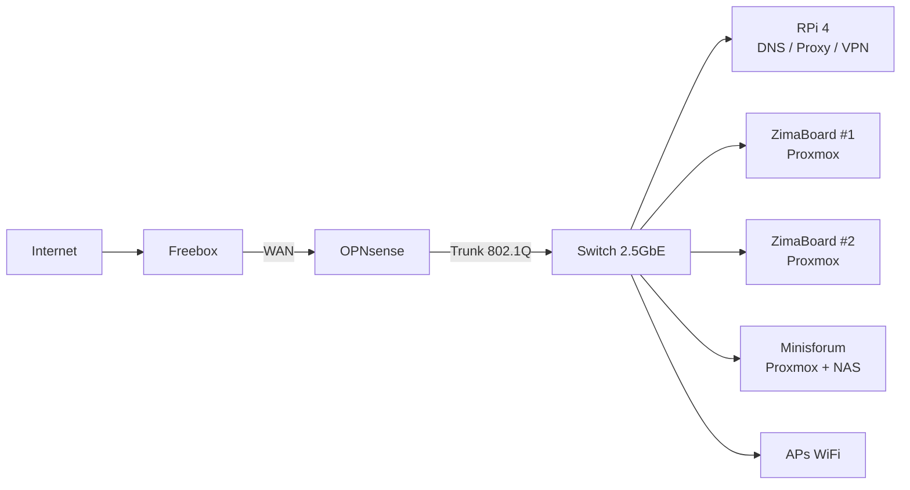
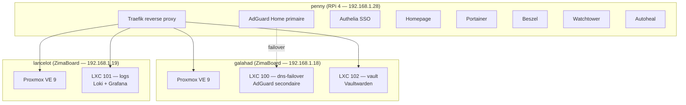

# Homelab

Documentation du homelab : architecture actuelle et cible.

## Vue d'ensemble

Un homelab base sur un **Raspberry Pi 4** (actuellement) avec une architecture cible multi-machines pour une maison renovee.



### Architecture actuelle



- **Raspberry Pi 4 (penny)** — appliance reseau (DNS, reverse proxy, SSO, VPN, monitoring)
- **DietPi** — distribution legere, optimisee headless
- **Docker** — tous les services containerises
- **SSD 480 Go** — stockage donnees via USB 3.0
- **2 ZimaBoards (galahad + lancelot)** — cluster Proxmox VE 9, LXC pour Vaultwarden, Grafana, DNS secondaire

### Architecture cible

- **3 noeuds Proxmox VE** — 2x ZimaBoard + 1x Minisforum N5 Max
- **Appliance OPNsense** — firewall dedie, segmentation VLANs
- **RPi 4** — DNS + reverse proxy (independant du cluster)
- **Cablage Cat 8** — infrastructure 2.5GbE

## Organisation des fichiers (RPi 4)

```
/                           # SD Card (ext4, 64 Go)
├── /boot/firmware/         # Boot (config.txt, cmdline.txt)
└── / (rootfs)              # OS DietPi

/mnt/ssd/                   # SSD 480 Go (ext4, USB 3.0)
├── config/                 # Configs applicatives (bind mounts)
│   ├── docker-compose.yml  # Compose principal
│   ├── traefik/            # traefik.yml
│   ├── adguard/            # AdGuardHome.yaml
│   ├── homepage/           # settings, services, bookmarks...
│   └── beszel/
├── data/                   # Donnees persistantes
│   ├── beszel/             # Socket beszel
│   └── tailscale/          # State tailscale
└── docker/                 # Docker data-root (images, volumes, overlay2)
```
