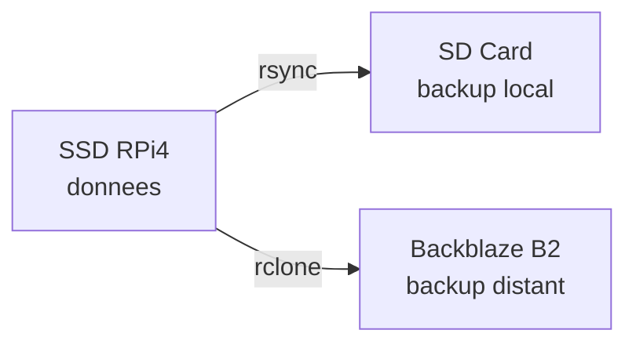
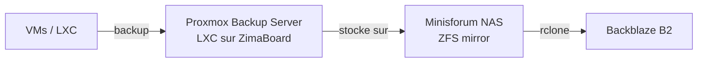

# Backups

!!! warning "En cours de mise en place"
    La strategie de backup n'est pas encore implementee. Cette page documente le plan prevu.

## Quoi sauvegarder

### Critique (perte = reconfiguration longue)

| Donnee | Emplacement | Methode |
|---|---|---|
| Configs applicatives | `/mnt/ssd/config/` | Deja versionne dans `homelab-config` (GitHub, prive) |
| Config systeme | boot, fstab, udev, sysctl | Deja versionne dans `homelab-config` |
| docker-compose.yml | `/mnt/ssd/config/` | Deja versionne |
| homelab_monitor.sh | `/root/` | Deja versionne |

### Important (perte = donnees perdues)

| Donnee | Emplacement | Methode prevue |
|---|---|---|
| AdGuard Home data | Docker volume `adguard-data` | Dump + rsync |
| Wallos DB | Docker volume `wallos-db` | Dump + rsync |
| Beszel data | Docker volume `beszel-data` | Dump + rsync |
| Portainer data | Docker volume `portainer-data` | Dump + rsync |
| Tailscale state | `/mnt/ssd/data/tailscale/` | rsync |

### Non critique (reconstructible)

- Images Docker — re-pullables avec `docker compose pull`
- Overlay2 / cache Docker — reconstruit automatiquement
- Logs — en tmpfs, ephemeres par design

## Strategie prevue

### Court terme (RPi 4 seul)

- Script cron qui dump les Docker volumes importants
- rsync vers la SD Card (backup local rapide)
- rclone vers Backblaze B2 (backup hors-site, ~0.005€/Go/mois)

### Long terme (cluster Proxmox)

- **Proxmox Backup Server** en LXC sur un ZimaBoard
- Backups incrementaux des VMs/LXC vers le NAS
- Replication hors-site vers Backblaze B2

## Regle 3-2-1

!!! info "Objectif"
    - **3** copies des donnees
    - **2** supports differents (SSD + cloud)
    - **1** copie hors-site (Backblaze B2)
