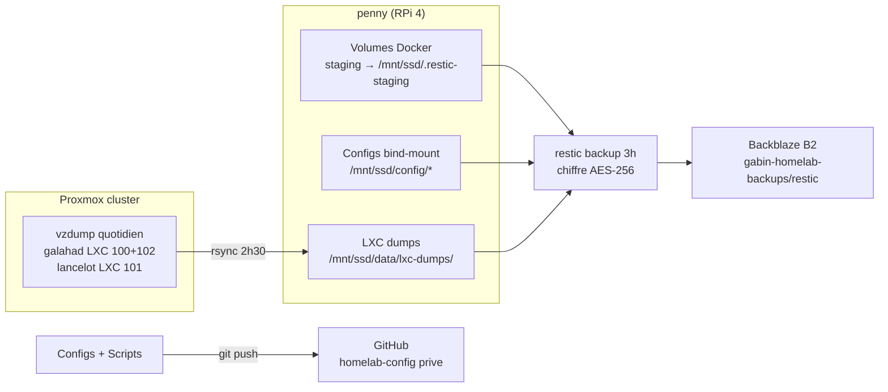
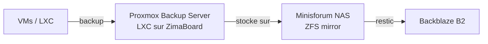

# Backups

## Architecture



**Chiffrement** : AES-256 cote client (restic). Les donnees quittent penny deja chiffrees.

**Regle 3-2-1 :**

- **3** copies : SSD (live) + LXC local (vzdump) + Backblaze B2 (restic chiffre)
- **2** supports : SSD/eMMC + cloud
- **1** copie hors-site : Backblaze B2

## Ce qui est sauvegarde

### Via Git (a chaque modification)

| Donnee | Repo | Visibilite |
|---|---|---|
| Configs applicatives (Traefik, AdGuard, Homepage, etc.) | `homelab-config` | Prive |
| Config systeme (boot, fstab, udev, sysctl, crontab) | `homelab-config` | Prive |
| Scripts (monitor, backup, vzdump, proxmox) | `homelab-config` | Prive |
| Templates Authelia (`.example`, sans secrets) | `homelab-config` | Prive |
| Documentation | `homelab-doc` | Public |

### Via restic (quotidien, 3h du matin)

**Volumes Docker (stages puis backup) :**

| Donnee | Volume | Criticite |
|---|---|---|
| Beszel (historique monitoring) | `config_beszel-data` | Faible |
| Portainer (config Docker) | `config_portainer-data` | Moyenne |

!!! info "Vaultwarden n'est plus un volume Docker"
    Migre vers LXC 102 sur galahad. Sauvegarde via vzdump quotidien (voir ci-dessous).

**Configs avec secrets :**

| Donnee | Chemin | Criticite |
|---|---|---|
| Authelia (DB SQLite + cle OIDC + config + secrets) | `/mnt/ssd/config/authelia/` | **Critique** |
| AdGuard (config avec rewrites) | `/mnt/ssd/config/adguard/` | Haute |
| Traefik (config + dynamic routes) | `/mnt/ssd/config/traefik/` | Haute |
| Homepage (dashboard config) | `/mnt/ssd/config/homepage/` | Faible |
| Scripts systeme | `/mnt/ssd/config/scripts/` | Moyenne |
| Boot config (cmdline, config.txt) | `/mnt/ssd/config/boot/` | Haute |
| System config (fstab, sysctl) | `/mnt/ssd/config/system/` | Haute |

**LXC dumps Proxmox :**

| LXC | Contenu | Host | Criticite |
|---|---|---|---|
| 100 (dns-failover) | AdGuard secondaire | galahad | Moyenne |
| 101 (logs) | Loki + Grafana | lancelot | Faible |
| 102 (vault) | Vaultwarden | galahad | **Critique** |

### Via vzdump (quotidien, 1h du matin)

Les LXC sont sauvegardes par `vzdump-daily.sh` sur chaque ZimaBoard :

- **1h00** : vzdump snapshot compresse (zstd) sur chaque node
- **2h30** : `lxc-dumps-pull.sh` tire les dumps vers penny via rsync
- **3h00** : `homelab_backup.sh` inclut les dumps dans le snapshot restic

Retention vzdump locale : 3 jours par node.

### Destinations

| Destination | Chemin | Retention | Chiffrement | Cout |
|---|---|---|---|---|
| Backblaze B2 (restic) | `gabin-homelab-backups/restic` | 7 daily / 4 weekly / 6 monthly | AES-256 client-side | Gratuit (<10 Go) |
| ZimaBoards (vzdump) | `/var/lib/vz/dump/` | 3 jours | Non | Gratuit |

## Ce qui n'est PAS sauvegarde (reconstructible)

| Donnee | Raison |
|---|---|
| Images Docker | `docker compose pull` |
| Cache Docker (overlay2) | Reconstruit automatiquement |
| Certificats TLS (Traefik) | Regeneres par Let's Encrypt |
| Logs | Ephemeres, pas critiques |
| Tailscale state | Re-auth suffit (`tailscale up`) |
| Proxmox config | Reinstallation via scripts (`proxmox-post-install.sh`) |

## Script homelab_backup.sh

**Execution** : cron quotidien a 3h (`0 3 * * *`)

**Fonctionnement** :

1. Verification preflight (`.restic-env` present, `restic` installe)
2. Stage chaque volume Docker vers `/mnt/ssd/.restic-staging/<label>/`
3. `restic backup` : staging + configs + LXC dumps → B2 (chiffre AES-256)
4. Nettoyage du staging
5. `restic forget` : retention 7 daily / 4 weekly / 6 monthly + prune
6. Notification ntfy (succes ou echec avec duree)

**Verification d'integrite** : `restic-check-monthly.sh` (1er du mois, 4h)

- Verification structure (indexes, packs)
- Verification 10% donnees aleatoires (detection bit rot)
- Alerte ntfy en cas d'echec

## Restauration

### Lister les snapshots

```bash
source /root/.restic-env
export RESTIC_PASSWORD RESTIC_REPOSITORY B2_ACCOUNT_ID B2_ACCOUNT_KEY
restic snapshots
```

### Restaurer un volume Docker

```bash
# Exemple : restaurer Beszel
source /root/.restic-env && export RESTIC_PASSWORD RESTIC_REPOSITORY B2_ACCOUNT_ID B2_ACCOUNT_KEY
restic restore latest --target /tmp/restore --include "/mnt/ssd/.restic-staging/beszel"

docker compose stop beszel
docker run --rm \
    -v config_beszel-data:/data \
    -v /tmp/restore/mnt/ssd/.restic-staging/beszel:/source:ro \
    alpine sh -c "rm -rf /data/* && cp -a /source/. /data/"
docker compose up -d beszel
rm -rf /tmp/restore
```

### Restaurer une config

```bash
# Exemple : restaurer Authelia
source /root/.restic-env && export RESTIC_PASSWORD RESTIC_REPOSITORY B2_ACCOUNT_ID B2_ACCOUNT_KEY
restic restore latest --target /tmp/restore --include "/mnt/ssd/config/authelia"

docker compose stop authelia
cp -a /tmp/restore/mnt/ssd/config/authelia/. /mnt/ssd/config/authelia/
docker compose up -d authelia
rm -rf /tmp/restore
```

### Restaurer Vaultwarden (LXC 102)

```bash
# Option A : depuis vzdump (plus rapide, local)
pct restore 102 /var/lib/vz/dump/vzdump-lxc-102-XXXX.tar.zst

# Option B : depuis restic (si vzdump indisponible)
source /root/.restic-env && export RESTIC_PASSWORD RESTIC_REPOSITORY B2_ACCOUNT_ID B2_ACCOUNT_KEY
restic restore latest --target /tmp/restore --include "/mnt/ssd/data/lxc-dumps"
# Puis pct restore depuis le dump recupere
```

### Restauration complete (nouveau RPi)

Voir [break-glass.md](break-glass.md) pour la procedure pas-a-pas.

1. Installer DietPi
2. Cloner `homelab-config` depuis GitHub
3. Suivre le README (copier boot, udev, fstab, network, docker)
4. Restaurer `.restic-env` depuis la cle USB chiffree
5. `restic restore latest` depuis B2
6. Restaurer les volumes et configs
7. Regenerer les secrets Authelia si necessaire (voir README)
8. `docker compose up -d`

## Credentials restic

```bash
# /root/.restic-env (chmod 600, gitignored)
RESTIC_PASSWORD=<mot-de-passe-chiffrement>
RESTIC_REPOSITORY=b2:gabin-homelab-backups:restic
B2_ACCOUNT_ID=<keyID>
B2_ACCOUNT_KEY=<applicationKey>
```

!!! danger "Ce fichier doit etre sur la cle USB chiffree"
    Sans `.restic-env`, les backups B2 sont illisibles. Perte de ce fichier = perte des backups.

Bucket `gabin-homelab-backups` sur Backblaze B2, region US West.
Application key limitee a ce bucket uniquement (read + write).

## Long terme (cluster Proxmox)



Quand le cluster sera en production :

- **Proxmox Backup Server** en LXC sur un ZimaBoard
- Backups incrementaux des VMs/LXC
- Stockage sur NAS (Minisforum, ZFS mirror)
- Replication hors-site vers Backblaze B2 via restic
