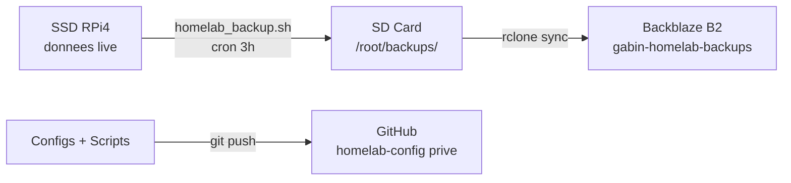
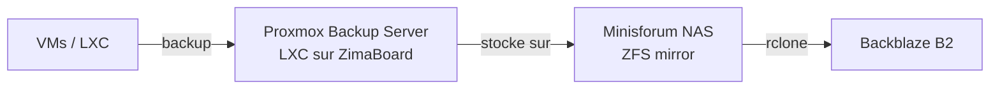

# Backups

## Architecture



**Regle 3-2-1 :**

- **3** copies : SSD (live) + SD card (backup local) + Backblaze B2 (cloud)
- **2** supports : SSD/SD + cloud
- **1** copie hors-site : Backblaze B2

## Ce qui est sauvegarde

### Via Git (a chaque modification)

| Donnee | Repo | Visibilite |
|---|---|---|
| Configs applicatives (Traefik, AdGuard, Homepage, etc.) | `homelab-config` | Prive |
| Config systeme (boot, fstab, udev, sysctl, crontab) | `homelab-config` | Prive |
| Scripts (monitor, backup, proxmox) | `homelab-config` | Prive |
| Templates Authelia (`.example`, sans secrets) | `homelab-config` | Prive |
| Documentation | `homelab-doc` | Public |

### Via homelab_backup.sh (quotidien, 3h du matin)

**Volumes Docker :**

| Donnee | Volume | Criticite |
|---|---|---|
| Vaultwarden (coffre mots de passe) | `config_vaultwarden-data` | **Critique** |
| Beszel (historique monitoring) | `config_beszel-data` | Faible |
| Wallos (abonnements) | `config_wallos-db` | Moyenne |
| Portainer (config Docker) | `config_portainer-data` | Moyenne |

**Configs avec secrets :**

| Donnee | Chemin | Criticite |
|---|---|---|
| Authelia (DB SQLite + cle OIDC + config) | `/mnt/ssd/config/authelia/` | **Critique** |
| AdGuard (config avec rewrites) | `/mnt/ssd/config/adguard/` | Haute |
| Traefik (config + dynamic routes) | `/mnt/ssd/config/traefik/` | Haute |

### Destinations

| Destination | Chemin / Bucket | Retention | Cout |
|---|---|---|---|
| SD card (local) | `/root/backups/` | 7 jours | Gratuit |
| Backblaze B2 (cloud) | `gabin-homelab-backups` | 7 jours (sync) | Gratuit (<10 Go) |

## Ce qui n'est PAS sauvegarde (reconstructible)

| Donnee | Raison |
|---|---|
| Images Docker | `docker compose pull` |
| Cache Docker (overlay2) | Reconstruit automatiquement |
| Certificats TLS (Traefik) | Regeneres par Let's Encrypt |
| Logs | Ephemeres, pas critiques |
| Tailscale state | Re-auth suffit (`tailscale up`) |
| Proxmox config | Reinstallation via scripts (`proxmox-post-install.sh`) |

## Script homelab_backup.sh

**Execution** : cron quotidien a 3h (`0 3 * * *`)

**Fonctionnement** :

1. Dump chaque volume Docker via `docker run alpine tar czf`
2. Archive chaque config bind-mount via `tar czf`
3. Nettoyage des backups > 7 jours
4. Sync vers Backblaze B2 via `rclone sync`
5. Notification ntfy (succes ou echec)

**Fichiers generes** (exemple) :

```
/root/backups/
  vaultwarden_20260409_030000.tar.gz    (12K)
  beszel_20260409_030000.tar.gz         (716K)
  wallos_20260409_030000.tar.gz         (12K)
  portainer_20260409_030000.tar.gz      (92K)
  authelia_config_20260409_030000.tar.gz (80K)
  adguard_config_20260409_030000.tar.gz  (4K)
  traefik_config_20260409_030000.tar.gz  (4K)
```

Taille totale : ~1 Mo/jour.

## Restauration

### Restaurer un volume Docker

```bash
# Exemple : restaurer Vaultwarden
docker compose stop vaultwarden
docker run --rm -v config_vaultwarden-data:/data -v /root/backups:/backup alpine \
    sh -c "rm -rf /data/* && tar xzf /backup/vaultwarden_XXXXXXXX_XXXXXX.tar.gz -C /data"
docker compose up -d vaultwarden
```

### Restaurer une config

```bash
# Exemple : restaurer Authelia
docker compose stop authelia
tar xzf /root/backups/authelia_config_XXXXXXXX_XXXXXX.tar.gz -C /mnt/ssd/config/
docker compose up -d authelia
```

### Restaurer depuis Backblaze B2

```bash
# Telecharger tous les backups depuis B2
rclone sync b2:gabin-homelab-backups/ /root/backups/
# Puis restaurer comme ci-dessus
```

### Restauration complete (nouveau RPi)

1. Installer DietPi
2. Cloner `homelab-config` depuis GitHub
3. Suivre le README (copier boot, udev, fstab, network, docker)
4. Installer rclone, configurer B2 (`rclone config`)
5. Telecharger les backups depuis B2
6. Restaurer les volumes et configs
7. Regenerer les secrets Authelia (voir README section "Reconstruction Authelia")
8. `docker compose up -d`

## Configuration rclone

```bash
# /root/.config/rclone/rclone.conf
[b2]
type = b2
account = <keyID>
key = <applicationKey>
```

Bucket `gabin-homelab-backups` sur Backblaze B2, region US West.
Application key limitee a ce bucket uniquement (read + write).

## Long terme (cluster Proxmox)



Quand le cluster sera en production :

- **Proxmox Backup Server** en LXC sur un ZimaBoard
- Backups incrementaux des VMs/LXC
- Stockage sur NAS (Minisforum, ZFS mirror)
- Replication hors-site vers Backblaze B2
