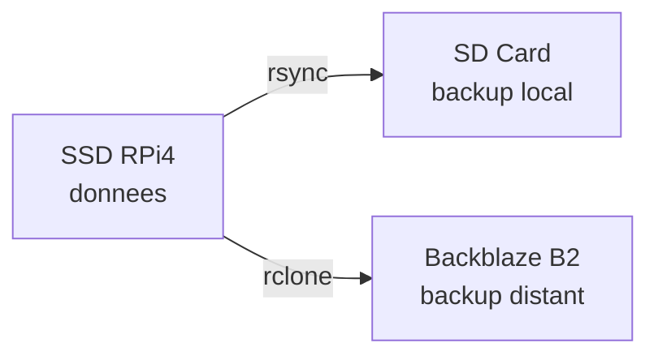
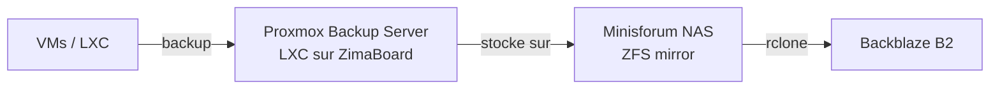

# Backups

## Etat actuel

### Ce qui est deja sauvegarde

| Donnee | Methode | Frequence |
|---|---|---|
| Configs applicatives | Git → GitHub (`homelab-config`, prive) | A chaque modification |
| Config systeme (boot, fstab, udev) | Git → GitHub | A chaque modification |
| Documentation | Git → GitHub (`homelab-doc`, public) | A chaque modification |
| Scripts (monitor, proxmox) | Git → GitHub | A chaque modification |

### Ce qui n'est pas encore sauvegarde

| Donnee | Emplacement | Risque |
|---|---|---|
| Volumes Docker (donnees applicatives) | `/mnt/ssd/docker/volumes/` | Perte si SSD defaillant |
| Authelia (DB + cle OIDC) | `/mnt/ssd/config/authelia/` | Reconfiguration SSO complete |
| Vaultwarden (coffre mots de passe) | Volume `vaultwarden-data` | **Perte de tous les credentials** |
| Beszel (historique monitoring) | Volume `beszel-data` | Perte historique (non critique) |
| Wallos (abonnements) | Volume `wallos-db` | Resaisie manuelle |
| Portainer (config Docker) | Volume `portainer-data` | Reconfiguration |
| Tailscale (state) | `/mnt/ssd/data/tailscale/` | Re-auth Tailscale |
| Proxmox (VMs/LXC) | eMMC ZimaBoards | Reinstallation |

!!! danger "Priorite : Vaultwarden"
    Le coffre Vaultwarden contient tous les mots de passe du homelab. C'est la donnee la plus critique a sauvegarder.

## Quoi sauvegarder — par priorite

### Critique

| Donnee | Volume / Chemin | Impact si perdu |
|---|---|---|
| Vaultwarden | `vaultwarden-data` | Tous les mots de passe perdus |
| Authelia config | `/mnt/ssd/config/authelia/` | SSO a reconfigurer, cles OIDC a regenerer |

### Important

| Donnee | Volume / Chemin | Impact si perdu |
|---|---|---|
| AdGuard data | `adguard-data` | Stats et logs DNS perdus |
| Wallos DB | `wallos-db` | Donnees abonnements perdues |
| Portainer data | `portainer-data` | Config Docker a refaire |
| Tailscale state | `/mnt/ssd/data/tailscale/` | Re-authentification |

### Non critique (reconstructible)

- Images Docker — `docker compose pull`
- Overlay2 / cache Docker — reconstruit automatiquement
- Beszel data — historique monitoring, pas vital
- Logs — ephemeres

## Strategie prevue

### Court terme (RPi 4 seul)

- Script cron qui dump les Docker volumes importants
- rsync vers la SD Card (backup local rapide)
- rclone vers Backblaze B2 (backup hors-site, ~0.005€/Go/mois)

### Long terme (cluster Proxmox)

- **Proxmox Backup Server** en LXC sur un ZimaBoard
- Backups incrementaux des VMs/LXC vers le NAS
- Replication hors-site vers Backblaze B2

## Regle 3-2-1

!!! info "Objectif"
    - **3** copies des donnees
    - **2** supports differents (SSD + cloud)
    - **1** copie hors-site (Backblaze B2)
