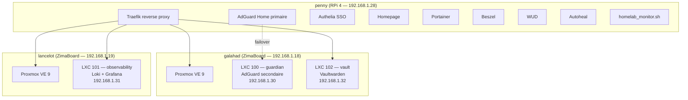

# Procedure Break-Glass

Document de reconstruction du homelab en cas d'incident majeur (incendie, foudre, defaillance materielle, corruption).

!!! danger "Ce document doit etre imprime et stocke avec la cle USB hors-ligne"
    En cas de destruction totale, l'acces a ce site sera perdu. Garder une copie papier ou PDF a jour.

---

## Objectifs de reprise

| Metrique | Cible | Justification |
|---|---|---|
| **RTO** (Recovery Time Objective) | 4h | Zero a services critiques operationnels |
| **RPO** (Recovery Point Objective) | 24h | Backup quotidien a 3h du matin |
| **Services critiques** | DNS, Vaultwarden, Traefik, Authelia | Tout le reste en depend |

---

## Architecture de reference

Connaitre l'architecture est indispensable pour savoir quoi restaurer et dans quel ordre.



### Dependances critiques (ordre de demarrage)

```
1. DNS          → AdGuard Home (penny ou guardian)
2. Reverse Proxy → Traefik (penny) — necessite CF_DNS_API_TOKEN
3. Passwords    → Vaultwarden (LXC 102 galahad) — PAS de dependance SSO
4. SSO          → Authelia (penny) — necessite secrets generes
5. Tout le reste → depend de 1-4
```

!!! info "Vaultwarden est volontairement isole du SSO"
    Il n'utilise PAS Authelia pour eviter une dependance circulaire. Il reste accessible meme si Authelia est en panne.

---

## Preparation AVANT l'incident

### Cle USB chiffree (mise a jour mensuelle)

!!! warning "Derniere MAJ : ==A REMPLIR==. Prochaine : ==A REMPLIR=="

Contenu requis :

- [ ] Export Bitwarden/Vaultwarden chiffre (master password imprime separement)
- [ ] Fichier `.env` complet (tokens Cloudflare, Tailscale, Backblaze, etc.)
- [ ] Fichier `.restic-env` (password restic + credentials Backblaze B2)
- [ ] Cles SSH privees (passphrase protegees)
- [ ] Snapshot du repo `homelab-config` (zip ou `git bundle`)
- [ ] Ce document en PDF

### Coffre physique (lieu separe)

- [ ] Master password Vaultwarden (memorise + papier)
- [ ] Master password cle USB
- [ ] Codes de recuperation TOTP
- [ ] Codes de recuperation YubiKey

### Comptes externes (doivent rester actifs)

| Compte | Usage | Verification |
|---|---|---|
| Backblaze B2 | Bucket `gabin-homelab-backups` | `source ~/.restic-env && restic snapshots` |
| Cloudflare | Zone `gabin-simond.fr`, token DNS:Edit | Dashboard Cloudflare |
| Tailscale | Tailnet, 3 machines | login.tailscale.com |
| GitHub | Repos `homelab-config` + `homelab-doc` | github.com/GabinSMD |
| ntfy.sh | Topic `gabin-homelab` | Notification test |

---

## Scenarios de panne

### Scenario 0 : Panne d'un seul LXC (guardian / vault / observability)

**Duree estimee** : 15-30 min | **Impact** : service concerne uniquement

=== "LXC 100 — guardian (AdGuard secondaire)"

    **Impact** : DNS secondaire indisponible. Le primaire (penny) prend tout le trafic. Aucune interruption visible.

    ```bash
    # Depuis galahad
    ssh gabins@pve1
    # Verifier l'etat
    pct status 100
    # Tenter un restart
    pct start 100
    # Si le LXC est corrompu : recreer depuis le template
    pct destroy 100
    pct create 100 local:vztmpl/debian-12-standard_*.tar.zst \
        --hostname guardian --memory 256 --cores 1 \
        --net0 name=eth0,bridge=vmbr0,ip=192.168.1.30/24,gw=192.168.1.254 \
        --unprivileged 1 --start 1
    # Installer AdGuard Home + Tailscale + restaurer config depuis git
    pct exec 100 -- bash -c "curl -s -S -L https://raw.githubusercontent.com/AdguardTeam/AdGuardHome/master/scripts/install.sh | sh -s -- -v"
    # Copier la config AdGuard depuis homelab-config
    ```

=== "LXC 102 — vault (Vaultwarden)"

    !!! danger "Impact critique : acces aux mots de passe perdu"
        S'assurer que l'app mobile Bitwarden est synchro avec les donnees recentes AVANT de detruire le LXC.

    ```bash
    ssh gabins@pve1
    pct status 102
    pct start 102
    # Si corrompu : verifier les backups d'abord
    source /root/.restic-env && restic snapshots  # verifier les backups disponibles
    # Recreer le LXC
    pct destroy 102
    pct create 102 local:vztmpl/debian-12-standard_*.tar.zst \
        --hostname vault --memory 256 --cores 1 \
        --net0 name=eth0,bridge=vmbr0,ip=192.168.1.32/24,gw=192.168.1.254 \
        --unprivileged 1 --start 1
    # Installer Docker + Vaultwarden, restaurer le volume
    ```

=== "LXC 101 — observability (Loki + Grafana)"

    **Impact** : pas de logs centralises ni dashboards. Aucun impact sur les autres services.

    ```bash
    ssh gabins@pve2
    pct status 101
    pct start 101
    # Si besoin : recreer et reconfigurer Grafana OIDC depuis Authelia
    ```

---

### Scenario 1 : penny mort, cluster Proxmox OK

**Duree estimee** : 1-2h | **Impact** : DNS primaire, Traefik, Authelia, Homepage — mais Vaultwarden reste UP

!!! tip "Bonne nouvelle"
    Vaultwarden (LXC 102) et AdGuard secondaire (LXC 100) restent operationnels. Les mots de passe et la resolution DNS de base continuent de fonctionner.

#### Phase 1 — Materiel (T+0 a T+15min)

1. **Acquerir le materiel de remplacement** :
   - Raspberry Pi 4 (8 Go RAM) + alimentation officielle 5.1V/3A
   - Carte SD 64 Go (ou recuperer l'existante si intacte)
   - SSD USB (ou recuperer l'existant)
2. **Flasher DietPi** sur la SD depuis un autre appareil ([dietpi.com](https://dietpi.com))

#### Phase 2 — OS de base (T+15min a T+30min)

```bash
# Premier boot : connexion console locale, mdp default DietPi
# Changer le password root immediatement
passwd

# Installer la cle SSH
mkdir -p ~/.ssh && chmod 700 ~/.ssh
# Copier la cle publique depuis la cle USB ou depuis GitHub
curl -s https://github.com/GabinSMD.keys >> ~/.ssh/authorized_keys
chmod 600 ~/.ssh/authorized_keys

# Configurer le SSD (si nouveau, formater en ext4 avec le meme UUID)
# Si SSD recupere : monter directement
mkdir -p /mnt/ssd
mount /dev/sda1 /mnt/ssd
```

#### Phase 3 — Restaurer les configs systeme (T+30min a T+45min)

```bash
# Cloner le repo config (ou restaurer depuis la cle USB)
cd /mnt/ssd
git clone https://github.com/GabinSMD/homelab-config.git config-repo

# Appliquer les configs systeme
cd /mnt/ssd/config-repo
cp boot/config.txt /boot/firmware/config.txt
cp boot/cmdline.txt /boot/firmware/cmdline.txt
cp udev/50-argon-ssd.rules /etc/udev/rules.d/
udevadm control --reload-rules
cp system/fstab /etc/fstab                         # Adapter UUID si SSD different
cp system/97-dietpi.conf /etc/sysctl.d/
cp system/99-sysctl.conf /etc/sysctl.conf
cp system/crontab /var/spool/cron/crontabs/root
cp network/interfaces /etc/network/interfaces       # IP 192.168.1.28
sysctl --system
```

#### Phase 4 — Docker + services (T+45min a T+1h30)

```bash
# Installer les paquets essentiels
dietpi-software install 162  # Docker
apt install -y fail2ban restic watchdog unattended-upgrades

# Configurer Docker
mkdir -p /etc/docker
cp docker/daemon.json /etc/docker/daemon.json
systemctl restart docker

# Preparer les configs applicatives
mkdir -p /mnt/ssd/config
cp -r adguard/ /mnt/ssd/config/adguard/
cp -r traefik/ /mnt/ssd/config/traefik/
cp -r homepage/ /mnt/ssd/config/homepage/

# Restaurer le .env depuis la cle USB (contient TOUS les tokens)
cp /media/usb/.env /mnt/ssd/config/.env

# Restaurer le .restic-env depuis la cle USB
cp /media/usb/.restic-env /root/.restic-env
chmod 600 /root/.restic-env

# Copier le docker-compose
cp docker/docker-compose.yml /mnt/ssd/config/docker-compose.yml

# Restaurer les volumes Docker depuis restic (B2, chiffre AES-256)
source /root/.restic-env
export RESTIC_PASSWORD RESTIC_REPOSITORY B2_ACCOUNT_ID B2_ACCOUNT_KEY

# Lister les snapshots disponibles
restic snapshots

# Restaurer les volumes stages dans le dernier snapshot
restic restore latest --target /tmp/restore --include "/mnt/ssd/.restic-staging"

# Injecter les donnees dans les volumes Docker
for vol in beszel wallos portainer; do
    docker volume create config_${vol}-data 2>/dev/null
    docker run --rm \
        -v config_${vol}-data:/data \
        -v /tmp/restore/mnt/ssd/.restic-staging/${vol}:/source:ro \
        alpine sh -c "cp -a /source/. /data/"
    echo "Restored: $vol"
done

rm -rf /tmp/restore
```

#### Phase 5 — Authelia (T+1h30 a T+1h45)

```bash
# Restaurer la config Authelia depuis restic ou regenerer les secrets
# (les configs bind-mount sont deja restaurees par restic dans /mnt/ssd/config/)
source /root/.restic-env && export RESTIC_PASSWORD RESTIC_REPOSITORY B2_ACCOUNT_ID B2_ACCOUNT_KEY
restic restore latest --target /tmp/restore --include "/mnt/ssd/config/authelia"
if [ -d /tmp/restore/mnt/ssd/config/authelia ]; then
    cp -a /tmp/restore/mnt/ssd/config/authelia/. /mnt/ssd/config/authelia/
    rm -rf /tmp/restore
    echo "Authelia restauree depuis restic"
else
    # Regenerer depuis les templates (cle USB pour les secrets)
    cp authelia/configuration.yml.example /mnt/ssd/config/authelia/configuration.yml
    cp authelia/users_database.yml.example /mnt/ssd/config/authelia/users_database.yml
    # Generer les secrets
    openssl rand -hex 32  # jwt_secret
    openssl rand -hex 32  # session_secret
    openssl rand -hex 32  # storage_key
    openssl rand -hex 32  # hmac_secret
    openssl genrsa -out /mnt/ssd/config/authelia/oidc.pem 4096
    # ATTENTION : si on regenere oidc.pem, il faut reconfigurer
    # tous les clients OIDC (Proxmox, Portainer, Grafana, Beszel)
    echo "SECRETS REGENERES — mettre a jour configuration.yml manuellement"
fi
```

#### Phase 6 — Reseau et verification (T+1h45 a T+2h)

```bash
# Installer et configurer Tailscale
curl -fsSL https://tailscale.com/install.sh | sh
tailscale up --authkey=<TS_AUTHKEY_DEPUIS_CLE_USB>
# Ou se connecter via login.tailscale.com si pas d'authkey

# Deployer le script monitoring
cp scripts/homelab_monitor.sh /root/homelab_monitor.sh
chmod +x /root/homelab_monitor.sh
cp scripts/homelab_backup.sh /root/homelab_backup.sh
chmod +x /root/homelab_backup.sh

# Lancer la stack
cd /mnt/ssd/config
docker compose up -d

# Verifier que restic fonctionne
source /root/.restic-env && export RESTIC_PASSWORD RESTIC_REPOSITORY B2_ACCOUNT_ID B2_ACCOUNT_KEY
restic snapshots  # doit lister les snapshots existants
```

#### Verification post-restauration penny

| Check | Commande | Attendu |
|---|---|---|
| SSD monte | `mount \| grep ssd` | `/mnt/ssd` en rw |
| ASPM off | `cat /sys/module/pcie_aspm/parameters/policy` | `[off]` |
| DNS primaire | `dig home.gabin-simond.fr @192.168.1.28` | `192.168.1.28` |
| Traefik HTTPS | `curl -sk https://home.gabin-simond.fr` | HTTP 200 ou redirect auth |
| Authelia | `curl -sk https://auth.home.gabin-simond.fr` | Page de login |
| Containers UP | `docker ps --format "table {{.Names}}\t{{.Status}}"` | Tous `Up` |
| Monitoring | `cat /var/lib/homelab_monitor/status` | Pas d'alerte |
| Tailscale | `tailscale status` | Connecte au tailnet |
| Backup restic | `source ~/.restic-env && restic snapshots \| tail -5` | Snapshots recents |

---

### Scenario 2 : Cluster Proxmox detruit (galahad + lancelot)

**Duree estimee** : 2-3h | **Impact** : Vaultwarden, DNS secondaire, Grafana, Proxmox UI

!!! warning "Vaultwarden est sur le cluster"
    Verifier l'acces a l'app mobile Bitwarden (sync offline) avant de commencer. Les tokens critiques doivent aussi etre sur la cle USB.

#### Phase 1 — Reinstaller Proxmox VE (T+0 a T+45min)

```bash
# Sur chaque ZimaBoard : boot depuis USB Proxmox VE 9
# IMPORTANT : patch eMMC avant installation
# Ctrl+Alt+F2 depuis l'installeur Proxmox, puis :
# (voir proxmox-fix-emmc.sh dans homelab-config/scripts/)

# Apres installation et reboot, appliquer le post-install depuis penny :
cd /mnt/ssd/homelab-config/scripts && python3 -m http.server 8888

# Sur galahad (192.168.1.18) :
wget -O- http://192.168.1.28:8888/proxmox-post-install.sh | bash

# Sur lancelot (192.168.1.19) :
wget -O- http://192.168.1.28:8888/proxmox-post-install.sh | bash
```

#### Phase 2 — Recreer le cluster (T+45min a T+1h)

```bash
# Sur galahad
pvecm create homelab

# Sur lancelot
pvecm add 192.168.1.18
# Mot de passe root de galahad requis

# Verifier
pvecm status
```

#### Phase 3 — Recreer les LXC (T+1h a T+2h)

=== "LXC 100 — guardian (galahad)"

    ```bash
    # Telecharger le template Debian 12
    pveam update
    pveam download local debian-12-standard_12.7-1_amd64.tar.zst

    # Creer le conteneur
    pct create 100 local:vztmpl/debian-12-standard_12.7-1_amd64.tar.zst \
        --hostname guardian --memory 256 --cores 1 \
        --net0 name=eth0,bridge=vmbr0,ip=192.168.1.30/24,gw=192.168.1.254 \
        --unprivileged 1 --start 1

    # Configurer
    pct exec 100 -- bash -c "
        apt update && apt install -y curl
        # Installer AdGuard Home
        curl -s -S -L https://raw.githubusercontent.com/AdguardTeam/AdGuardHome/master/scripts/install.sh | sh -s -- -v
        # Installer Tailscale
        curl -fsSL https://tailscale.com/install.sh | sh
        tailscale up
    "

    # Restaurer la config AdGuard depuis le repo
    pct push 100 /mnt/ssd/homelab-config/adguard/AdGuardHome.yaml \
        /opt/AdGuardHome/AdGuardHome.yaml
    pct exec 100 -- systemctl restart AdGuardHome

    # Deployer le script health check (rpi_watchdog.sh)
    ```

=== "LXC 102 — vault (galahad)"

    ```bash
    pct create 102 local:vztmpl/debian-12-standard_12.7-1_amd64.tar.zst \
        --hostname vault --memory 256 --cores 1 \
        --net0 name=eth0,bridge=vmbr0,ip=192.168.1.32/24,gw=192.168.1.254 \
        --unprivileged 1 --start 1

    pct exec 102 -- bash -c "
        apt update && apt install -y curl docker.io docker-compose
        # Deployer Vaultwarden
        mkdir -p /opt/vaultwarden
    "

    # Restaurer le volume Vaultwarden depuis B2
    source /root/.restic-env && export RESTIC_PASSWORD RESTIC_REPOSITORY B2_ACCOUNT_ID B2_ACCOUNT_KEY
    restic restore latest --target /tmp/restore --include "/mnt/ssd/.restic-staging/vaultwarden"
    # Copier les donnees restaurees vers le LXC
    pct push 102 /tmp/restore/mnt/ssd/.restic-staging/vaultwarden/ /opt/vaultwarden/data/ --recursive
    rm -rf /tmp/restore
    # Configurer le docker-compose pour Vaultwarden et demarrer
    ```

=== "LXC 101 — observability (lancelot)"

    ```bash
    # Sur lancelot
    pct create 101 local:vztmpl/debian-12-standard_12.7-1_amd64.tar.zst \
        --hostname observability --memory 512 --cores 2 \
        --net0 name=eth0,bridge=vmbr0,ip=192.168.1.31/24,gw=192.168.1.254 \
        --unprivileged 1 --start 1

    # Installer Loki + Grafana
    # Reconfigurer OIDC Grafana avec Authelia (client_id: grafana)
    # Les dashboards devront etre recrees (pas de backup des dashboards)
    ```

#### Phase 4 — Reconfigurer le SSO et les integrations (T+2h a T+2h30)

```bash
# Configurer Authelia OIDC pour Proxmox
pveum realm add authelia --type openid \
    --issuer-url https://auth.home.gabin-simond.fr \
    --client-id proxmox \
    --client-key <SECRET_DEPUIS_VAULTWARDEN> \
    --autocreate 1

# Token API pour Homepage
pveum user add homepage@pve
pveum aclmod / -user homepage@pve -role PVEAuditor
pveum user token add homepage@pve homepage --privsep=0

# Installer les agents Beszel sur chaque ZimaBoard
# (utiliser beszel-agent-compose.yml depuis homelab-config/scripts/)

# Installer Tailscale sur les ZimaBoards
curl -fsSL https://tailscale.com/install.sh | sh
tailscale up
```

#### Verification post-restauration cluster

| Check | Commande | Attendu |
|---|---|---|
| Cluster OK | `pvecm status` | Quorum OK, 2 nodes |
| LXC 100 UP | `pct status 100` | `running` |
| LXC 101 UP | `pct status 101` | `running` |
| LXC 102 UP | `pct status 102` | `running` |
| DNS secondaire | `dig home.gabin-simond.fr @192.168.1.30` | `192.168.1.28` |
| Vaultwarden | `curl -sk https://vault.home.gabin-simond.fr` | Page de login |
| OIDC Proxmox | Login via Authelia sur l'UI web | Session active |
| Grafana | `curl -sk https://logs.home.gabin-simond.fr` | Page de login |

---

### Scenario 3 : Tout detruit (penny + cluster)

**Duree estimee** : 4h + delai d'achat materiel

!!! danger "Prerequis absolus"
    - Acces au master password Vaultwarden (memoire ou coffre papier)
    - Cle USB chiffree avec `.env`, `.restic-env`, cles SSH
    - OU acces au compte GitHub (pour cloner `homelab-config`)
    - OU acces au compte Backblaze (pour telecharger les backups)

#### Strategie : paralleliser les restaurations

```mermaid
gantt
    title Reconstruction totale
    dateFormat HH:mm
    axisFormat %H:%M

    section Materiel
    Achat/recuperation RPi + SSD     :a1, 00:00, 30min
    Flash DietPi                     :a2, after a1, 15min

    section penny
    OS + configs systeme             :b1, after a2, 30min
    Docker + restauration volumes    :b2, after b1, 45min
    Authelia + verification          :b3, after b2, 30min

    section Cluster
    Install Proxmox galahad          :c1, after a2, 30min
    Install Proxmox lancelot         :c2, after a2, 30min
    Post-install + cluster           :c3, after c1, 15min
    LXC guardian + vault + obs       :c4, after c3, 45min
    SSO + integrations               :c5, after c4, 30min
```



#### Ordre de restauration

```
T+0     Achat/recuperation du materiel
        Flasher DietPi sur la SD card

T+0.5h  PARALLELISER :
        ├── penny : OS, configs, SSD (Phase 2-3 du Scenario 1)
        └── galahad + lancelot : Proxmox installer boot USB

T+1h    penny : Docker up, restauration volumes depuis B2
        galahad : post-install.sh, creation cluster

T+1.5h  penny : Authelia restauree, Traefik + DNS UP
        lancelot : rejoint le cluster

T+2h    LXC 100 (guardian) : AdGuard secondaire UP
        LXC 102 (vault) : Vaultwarden restaure depuis B2

T+2.5h  LXC 101 (observability) : Grafana + Loki
        SSO reconfigure : OIDC Proxmox + Portainer + Grafana

T+3h    Tests end-to-end (voir checklist ci-dessous)

T+3.5h  Agents Beszel + Tailscale sur tout le cluster
        Verification backup fonctionne (restic snapshots)

T+4h    OPERATIONNEL
```

#### Gestion de la dependance d'amorçage (bootstrap)

**Probleme** : Pour configurer Traefik, il faut le token Cloudflare. Ce token est dans Vaultwarden. Mais Vaultwarden est sur le cluster qu'on est aussi en train de reconstruire.

**Solution (3 niveaux de fallback)** :

1. **App mobile Bitwarden** : synchro offline, disponible immediatement
2. **Cle USB chiffree** : contient le `.env` avec `CF_DNS_API_TOKEN`, `TS_AUTHKEY`, et tous les tokens
3. **Coffre papier** : master password Vaultwarden → acces via un client Bitwarden sur un autre appareil, mais necessite que le LXC 102 soit deja restaure

**En pratique** : utiliser le `.env` de la cle USB pour demarrer penny independamment du cluster.

---

### Scenario 4 : Corruption Authelia (DB ou cle OIDC)

**Duree estimee** : 15-30 min | **Impact** : SSO indisponible, les services a ForwardAuth sont bloques

!!! note "Vaultwarden et AdGuard restent accessibles"
    Vaultwarden n'utilise pas Authelia. AdGuard utilise ForwardAuth mais reste fonctionnel en acces direct (`192.168.1.28:3000`).

```bash
# Verifier les logs
docker logs authelia --tail 50

# Option A : Restaurer depuis le dernier backup
docker compose stop authelia
source /root/.restic-env && export RESTIC_PASSWORD RESTIC_REPOSITORY B2_ACCOUNT_ID B2_ACCOUNT_KEY
restic restore latest --target /tmp/restore --include "/mnt/ssd/config/authelia"
cp -a /tmp/restore/mnt/ssd/config/authelia/. /mnt/ssd/config/authelia/
rm -rf /tmp/restore
docker compose up -d authelia

# Option B : Regenerer les secrets (si backup corrompu aussi)
# ATTENTION : cela invalide TOUS les clients OIDC existants
cd /mnt/ssd/homelab-config
cp authelia/configuration.yml.example /mnt/ssd/config/authelia/configuration.yml
cp authelia/users_database.yml.example /mnt/ssd/config/authelia/users_database.yml

# Generer les 4 secrets + cle OIDC
for secret in jwt session storage hmac; do
    echo "$secret: $(openssl rand -hex 32)"
done
openssl genrsa -out /mnt/ssd/config/authelia/oidc.pem 4096

# Regenerer les client secrets OIDC et les hasher
openssl rand -hex 32  # → secret clair pour le service
docker run --rm --entrypoint authelia authelia/authelia:latest \
    crypto hash generate pbkdf2 --password "<SECRET_CLAIR>"
# Mettre le hash dans configuration.yml, le secret clair dans le service

# Regenerer le hash du mot de passe utilisateur
docker run --rm --entrypoint authelia authelia/authelia:latest \
    crypto hash generate argon2 --password "<MOT_DE_PASSE>"

# Redemarrer et reconfigurer chaque client OIDC :
# - Proxmox : pveum realm modify authelia --client-key <NEW_SECRET>
# - Portainer : Settings > Authentication > OAuth > update secret
# - Grafana : variable d'environnement GF_AUTH_GENERIC_OAUTH_CLIENT_SECRET
# - Beszel : variable OIDC_SECRET dans l'environnement
docker compose up -d authelia
```

---

### Scenario 5 : Perte d'acces reseau (FAI, DNS externe, Cloudflare)

**Duree estimee** : variable | **Impact** : pas d'acces distant, certificats TLS non renouvelables

```bash
# Diagnostic
ping 1.1.1.1                           # Internet accessible ?
dig gabin-simond.fr @1.1.1.1           # DNS public fonctionne ?
curl -s https://api.cloudflare.com/     # Cloudflare accessible ?
tailscale status                        # Tailscale connecte ?

# Si Internet down :
# - Les services restent accessibles en LAN via IP directe
# - Les certificats TLS existants restent valides (90 jours Let's Encrypt)
# - Contacter le FAI (Free : 3244)

# Si Cloudflare down ou token revoque :
# - Generer un nouveau token API sur dashboard.cloudflare.com
# - Mettre a jour CF_DNS_API_TOKEN dans /mnt/ssd/config/.env
# - docker compose restart traefik

# Si Tailscale down :
# - Acces LAN uniquement
# - Re-authentifier : tailscale up --force-reauth
# - Si cle revoquee : login.tailscale.com > Machines > re-authorize
```

---

### Scenario 6 : Perte de cle SSH ou YubiKey

**Impact** : acces SSH compromis ou bloque

```bash
# Si cle SSH compromise (vol/fuite) :
# 1. Retirer la cle de TOUTES les machines
for host in homelab pve1 pve2; do
    ssh gabins@$host "sed -i '/<FINGERPRINT>/d' ~/.ssh/authorized_keys"
done

# 2. Generer une nouvelle paire
ssh-keygen -t ed25519 -C "homelab-$(date +%Y%m%d)"

# 3. Deployer la nouvelle cle
for host in homelab pve1 pve2; do
    ssh-copy-id -i ~/.ssh/id_ed25519.pub gabins@$host
done

# Si YubiKey perdue/defaillante :
# 1. Se connecter avec TOTP (backup) sur Authelia
# 2. Supprimer la YubiKey defaillante dans Authelia (user settings)
# 3. Enregistrer la YubiKey de remplacement
# 4. Revoquer les sessions actives par precaution
```

---

## Contacts critiques

| Provider | Raison | Contact |
|---|---|---|
| FAI (Free) | Panne Internet | 3244 |
| Backblaze B2 | Acces backups | help@backblaze.com |
| Cloudflare | Zone DNS bloquee | dashboard support |
| Tailscale | Tailnet issue | support@tailscale.com |
| YubiKey (Yubico) | Cle defaillante | support.yubico.com |
| DietPi | Bug OS | github.com/MichaIng/DietPi/issues |

---

## Checklist de verification finale

A executer apres **toute** restauration, quel que soit le scenario :

```bash
#!/bin/bash
# break-glass-verify.sh — a lancer depuis penny

echo "=== VERIFICATION POST-RESTAURATION ==="

echo -n "SSD monte rw : "
mount | grep -q "/mnt/ssd.*rw" && echo "OK" || echo "FAIL"

echo -n "ASPM off : "
cat /sys/module/pcie_aspm/parameters/policy | grep -q "\[off\]" && echo "OK" || echo "FAIL"

echo -n "DNS primaire : "
dig +short home.gabin-simond.fr @192.168.1.28 | grep -q "192.168.1.28" && echo "OK" || echo "FAIL"

echo -n "DNS secondaire : "
dig +short home.gabin-simond.fr @192.168.1.30 | grep -q "192.168.1.28" && echo "OK" || echo "FAIL"

echo -n "Traefik HTTPS : "
curl -sko /dev/null -w "%{http_code}" https://home.gabin-simond.fr | grep -qE "200|302" && echo "OK" || echo "FAIL"

echo -n "Authelia : "
curl -sko /dev/null -w "%{http_code}" https://auth.home.gabin-simond.fr | grep -qE "200|302" && echo "OK" || echo "FAIL"

echo -n "Vaultwarden : "
curl -sko /dev/null -w "%{http_code}" https://vault.home.gabin-simond.fr | grep -qE "200|302" && echo "OK" || echo "FAIL"

echo -n "Tailscale : "
tailscale status >/dev/null 2>&1 && echo "OK" || echo "FAIL"

echo -n "Docker containers : "
total=$(docker ps -q | wc -l)
healthy=$(docker ps --filter "status=running" -q | wc -l)
echo "$healthy/$total running"

echo -n "Backup B2 accessible : "
source /root/.restic-env && restic snapshots >/dev/null 2>&1 && echo "OK" || echo "FAIL"

echo -n "Temperature : "
temp=$(vcgencmd measure_temp | grep -oP '[0-9.]+')
echo "${temp}C $([ $(echo "$temp < 70" | bc) -eq 1 ] && echo 'OK' || echo 'WARN')"

echo "=== FIN ==="
```

---

## Tests de la procedure

La procedure doit etre testee **au moins une fois par an** sur un environnement jetable (spare RPi, VM locale, etc.).

| Date | Scenario | Duree reelle | Problemes rencontres | Actions correctives |
|---|---|---|---|---|
| 2026-04-13 | DR drill Vaultwarden | 7s | Aucun | — |
| — | Reconstruction complete penny | — | A faire | — |
| — | Reconstruction cluster | — | A faire | — |
| — | Scenario 3 (tout detruit) | — | A faire | — |
| — | Rotation secrets Authelia | — | A faire | — |

!!! tip "Nouveau test = nouveau apprentissage"
    Documenter chaque obstacle et chaque ecart par rapport au temps estime. Mettre a jour ce document apres chaque test.

---

## Maintenance de ce document

- **Frequence de revision** : a chaque changement d'architecture (nouveau service, nouveau LXC, migration)
- **Mise a jour cle USB** : mensuelle (premiere semaine du mois)
- **Test DR** : annuel minimum, trimestriel recommande
- **Responsable** : GabinSMD
