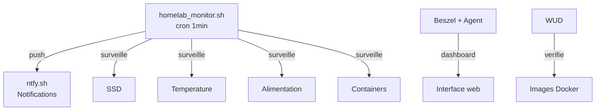

# Monitoring

## Vue d'ensemble



## homelab_monitor.sh

Script bash executé **chaque minute** via cron. Surveille :

| Check | Seuil | Alerte |
|---|---|---|
| SSD monte | `/mnt/ssd` absent | :octicons-alert-16: critique |
| SSD lisible | Erreur I/O | :octicons-alert-16: critique |
| SSD read-only | Remonte en ro | :octicons-alert-16: critique |
| USB errors dans dmesg | Disconnect/offline | :octicons-alert-16: haute |
| Temperature | > 70°C warning, > 80°C critique | :octicons-alert-16: variable |
| Alimentation | Throttling / under-voltage | :octicons-alert-16: haute |
| Docker daemon | Ne repond plus | :octicons-alert-16: critique |
| Containers | Stopped / unhealthy | :octicons-alert-16: haute |

### Deduplication des alertes

Le script utilise des fichiers d'etat dans `/var/lib/homelab_monitor/` :

- Une alerte n'est envoyee qu'**une seule fois** par incident
- Une notification **"resolved"** est envoyee quand le probleme disparait
- Pas de spam sur ntfy

### Configuration

```bash
NTFY_TOPIC="gabin-homelab"        # Topic ntfy (secret)
NTFY_SERVER="https://ntfy.sh"
TEMP_WARN=70                      # Seuil warning °C
TEMP_CRIT=80                      # Seuil critique °C
```

## Services de monitoring

| Service | Role | Acces |
|---|---|---|
| **Beszel** + agent | Monitoring systeme (CPU, RAM, disque, reseau) | Dashboard web |
| **WUD** | Surveillance mises a jour images Docker | Dashboard web |
| **homelab_monitor.sh** | Alertes critiques push (SSD, power, temp, Docker) | Notifications ntfy |
