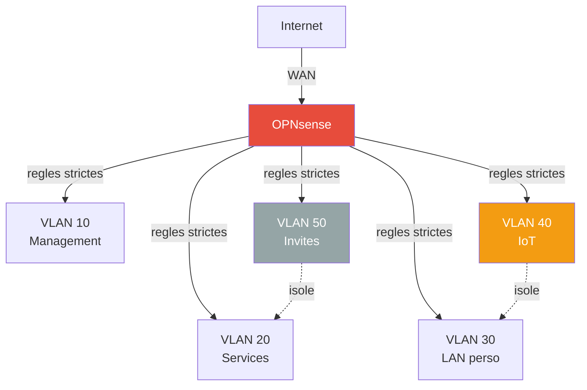

# Securite

Mesures de hardening appliquees sur le RPi 4 et principes pour l'infrastructure.

## Hardening DietPi / RPi 4

### Surface d'attaque reduite

| Mesure | Detail |
|---|---|
| WiFi desactive | Overlay `disable-wifi` dans config.txt |
| Bluetooth desactive | Pas de stack BT installee |
| HDMI desactive | `hdmi_ignore_hotplug=1`, `max_framebuffers=0` |
| Audio desactive | `dtparam=audio=off` |
| Services minimaux | DietPi n'installe que le strict necessaire |
| GPU minimal | 16 Mo — pas d'interface graphique |

### SSH

- Acces SSH actif (port 22)
- Authentification par cle recommandee
- `dietpi-kill_ssh` — service DietPi qui coupe les sessions SSH inactives

!!! tip "A faire"
    - [ ] Desactiver l'authentification par mot de passe SSH
    - [ ] Changer le port SSH (ou utiliser uniquement Tailscale pour l'acces distant)
    - [ ] Installer fail2ban

### Docker

Toutes les images Docker utilisent `security_opt: no-new-privileges:true` quand c'est supporte — empeche l'escalade de privileges dans les conteneurs.

### Acces distant

- **Tailscale** — acces VPN mesh, pas de port expose sur Internet
- **Traefik** — TLS sur tous les services internes (certificats Let's Encrypt)
- Pas de port forwarding sur la box FAI

## Architecture cible — securite reseau

### Segmentation VLANs

La segmentation en VLANs est la principale mesure de securite reseau prevue :

**Principe de moindre privilege** — chaque VLAN n'a acces qu'a ce dont il a strictement besoin. Voir la [page VLANs](../network/vlans.md) pour le detail des regles firewall.

### Points cles

- **IoT isole** — les objets connectes (cameras, capteurs) ne peuvent pas acceder au LAN personnel ni aux services
- **Invites isoles** — acces internet uniquement, aucune visibilite sur le reseau interne
- **Management restreint** — seul le VLAN 10 peut administrer les equipements
- **Firewall dedie** — pas de VM, bare-metal OPNsense pour eviter les SPOF

## Bonnes pratiques

!!! warning "Secrets"
    - Les variables d'environnement sensibles (tokens API, cles) sont dans un fichier `.env` **non versionne**
    - Le repo `homelab-config` est **prive** sur GitHub
    - Pas de secrets dans les labels Docker ou les fichiers de config committes
