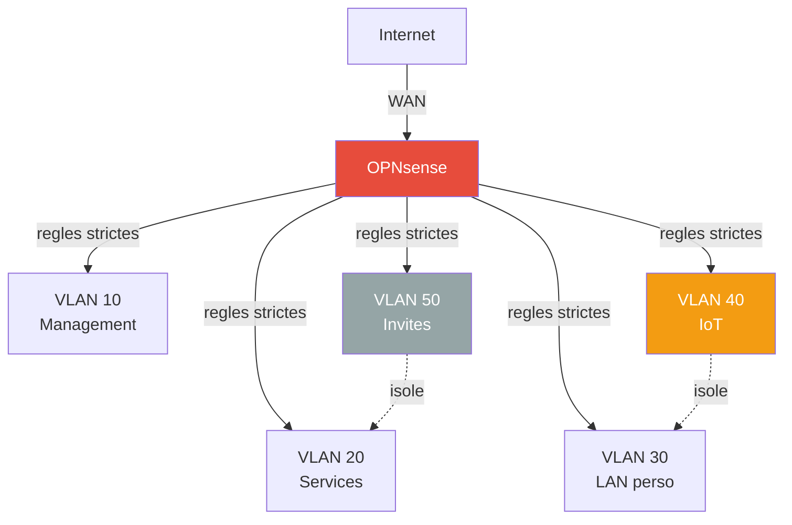

# Securite

Mesures de hardening appliquees et principes pour l'infrastructure.

## Politique de credentials

### Usernames

| Type de compte | Format | Exemple |
|---|---|---|
| Administrateur humain | `gabins` | Compte nominatif unique partout |
| Service automatise | `svc-<fonction>` | `svc-homepage`, `svc-backup` |
| Fallback OS | `root` | Pas modifiable, cle SSH uniquement |

- Jamais de compte `admin`, `gabin` ou `pi` : deviner un nom a peu de valeur mais simplifie les attaques automatisees.
- `gabins` (pas `gabin`) : legere variation pour casser les scripts qui ciblent le prenom exact.

### Mots de passe

| Niveau | Services | Longueur | Rotation |
|---|---|---|---|
| **Critique** | Proxmox root@pam, Authelia, Vaultwarden master, SSH, VPN | 32 caracteres | A la compromission |
| **Eleve** | AdGuard, Portainer, Traefik | 32 caracteres | A la compromission |
| **OIDC** | Secrets clients (Proxmox, Portainer, Beszel) | 64 caracteres hex | 12 mois max |

- Tous les mots de passe sont generes par `openssl rand -base64 48 | head -c 32`.
- Stockage exclusif dans Vaultwarden.
- Jamais de mot de passe en clair dans un script, un `.env` versionne, ou un message.

### Authentification forte

| Service | Methode |
|---|---|
| Authelia | TOTP obligatoire (policy `two_factor`) |
| Proxmox | OIDC via Authelia + TOTP sur root@pam |
| SSH | Cle Ed25519 uniquement (PasswordAuthentication no) |
| Vaultwarden | Master password + TOTP |
| Tailscale | WireGuard + identite SSO |

### Cycle de vie

- **Compromission** : compte desactive, mot de passe regenere, cles SSH revoquees, sessions terminees.
- **Audit** : revue trimestrielle des comptes actifs.
- **Break glass** : pas de compte dedie. Fallback = acces console physique + vault hors-ligne (export chiffre sur cle USB).

Voir aussi : [Naming des machines](../services/naming.md) pour les hostnames du pantheon.

## Authentification centralisee

### Authelia (SSO)

[Authelia](../services/authelia.md) fournit un portail d'authentification unique via OIDC :

| Service | Methode SSO |
|---|---|
| Proxmox VE (pve1, pve2) | OIDC natif (`authelia` realm, defaut) |
| Portainer | OAuth2 natif |
| Beszel | OIDC via PocketBase |

Les autres services (AdGuard, Wallos, WUD) conservent leur auth interne.

### Vaultwarden (mots de passe)

[Vaultwarden](../services/vaultwarden.md) stocke tous les credentials du homelab. Pas de SSO par design — c'est le filet de securite si Authelia tombe.

!!! tip "Bonne pratique"
    Tous les mots de passe services sont generes aleatoirement et stockes dans Vaultwarden. Aucun mot de passe reutilise entre services.

### Fallback

Chaque service critique conserve un acces de secours sans SSO :

| Service | Fallback |
|---|---|
| Proxmox | `root@pam` (acces console) |
| Portainer | Compte local admin |
| Beszel | Compte local admin |
| Vaultwarden | Master password (pas de SSO) |

## Hardening RPi 4 / DietPi

### Surface d'attaque reduite

| Mesure | Detail |
|---|---|
| WiFi desactive | Overlay `disable-wifi` dans config.txt |
| Bluetooth desactive | Pas de stack BT installee |
| HDMI desactive | `hdmi_ignore_hotplug=1`, `max_framebuffers=0` |
| Audio desactive | `dtparam=audio=off` |
| Services minimaux | DietPi n'installe que le strict necessaire |
| GPU minimal | 16 Mo — pas d'interface graphique |

### SSH (RPi + pve1 + pve2)

| Mesure | Detail |
|---|---|
| Authentification par cle uniquement | `PasswordAuthentication no` |
| Root par cle uniquement | `PermitRootLogin prohibit-password` |
| Max tentatives | `MaxAuthTries 3` |
| Port custom (RPi) | Port 2806 (pas 22) |
| X11 forwarding desactive | `X11Forwarding no` |

Fallback : Tailscale SSH reste disponible meme si OpenSSH est bloque.

### Firewall iptables (RPi)

Policy `INPUT DROP` — seuls les ports necessaires sont autorises :

| Port | Service | Acces |
|---|---|---|
| 2806 | SSH | Tous (cle requise) |
| 53 | DNS (AdGuard) | Tous |
| 80, 443 | HTTP/HTTPS (Traefik) | Tous |
| 3000 | AdGuard web UI | LAN + Tailscale uniquement |
| 8080 | Traefik dashboard | LAN + Tailscale uniquement |
| 9443, 8000 | Portainer | LAN + Tailscale uniquement |
| 3100 | Homepage | LAN + Tailscale uniquement |
| 8090 | Beszel | LAN + Tailscale uniquement |
| 3001 | WUD | LAN + Tailscale uniquement |
| 8282 | Wallos | LAN + Tailscale uniquement |
| 45876 | Beszel Agent | LAN + Tailscale uniquement |

Les interfaces Docker (`docker0`, `br-*`) et Tailscale (`tailscale0`) sont autorisees en INPUT et FORWARD.

Regles persistees via `iptables-persistent` (`/etc/iptables/rules.v4`).

### fail2ban

| Parametre | Valeur |
|---|---|
| Jail SSH | Port 2806, ban 1h apres 3 tentatives |
| IPs ignorees | `127.0.0.1/8`, `192.168.1.0/24`, `100.64.0.0/10` |

### Mises a jour automatiques

`unattended-upgrades` installe les correctifs de securite Debian automatiquement. Reboot auto a 4h du matin si necessaire (apres les backups a 3h).

### Docker

| Mesure | Detail |
|---|---|
| `no-new-privileges` | Global dans `daemon.json` + par service dans compose |
| `icc: false` | Inter-container communication desactivee sur le bridge par defaut |
| Docker socket en `ro` | Tous les containers montent `/var/run/docker.sock:ro` |
| Pas de ports directs | Tous les services passent par Traefik HTTPS (443), aucun port expose directement |
| Images a jour | `docker compose pull` + WUD surveille les nouvelles versions |

### Surface d'attaque RPi (ports ouverts)

| Port | Service | Acces |
|---|---|---|
| 53 | DNS (AdGuard) | Tous |
| 80 | HTTP → redirige 443 | Tous |
| 443 | HTTPS (Traefik, seul point d'entree) | Tous |
| 853 | DNS-over-TLS | Tous |
| 2806 | SSH (cle uniquement) | Tous |
| 3000 | AdGuard web UI | LAN + Tailscale |
| 45876 | Beszel Agent | LAN + Tailscale |

7 ports ouverts. Tous les autres services (Portainer, Beszel, Homepage, WUD, Wallos) sont accessibles **uniquement via Traefik HTTPS + Authelia 2FA**.

## Acces distant

### Tailscale (VPN mesh + SSH)

- Acces a tous les services via IP Tailscale — pas de port expose sur Internet
- Pas de port forwarding sur la Freebox
- ACLs dans la console Tailscale admin

**Tailscale SSH** actif sur les 3 machines (homelab, pve1, pve2) :

- Authentification via identite Tailscale (pas de cles SSH a gerer)
- Certificats a rotation automatique
- Aucun port 22 expose — tunnel WireGuard
- Mode `check` : validation navigateur a chaque connexion (MFA)
- Logs centralises dans la console Tailscale

```bash
# Connexion depuis n'importe quel device Tailscale
ssh root@homelab    # RPi 4
ssh root@pve1       # ZimaBoard 1
ssh root@pve2       # ZimaBoard 2
```

### TLS partout

- **Traefik** — certificats Let's Encrypt automatiques (DNS challenge Cloudflare) sur tous les services `*.home.gabin-simond.fr`
- **Proxmox** — accessible via Traefik (cert valide) + fallback IP:8006 (cert auto-signe)
- Pas de HTTP en clair expose

## Secrets

| Mesure | Detail |
|---|---|
| `.env` non versionne | Tokens API, credentials dans un fichier exclu de git |
| Repo prive | `homelab-config` est prive sur GitHub |
| Authelia config exclue | Secrets OIDC dans `.gitignore`, seuls les `.example` sont versionnes |
| Cle OIDC privee | `oidc.pem` exclue du repo |
| Pas de secrets dans les labels | Configs sensibles via env vars ou bind mounts |

## Architecture cible — securite reseau

### Segmentation VLANs

La segmentation en VLANs est la principale mesure de securite reseau prevue :



**Principe de moindre privilege** — chaque VLAN n'a acces qu'a ce dont il a strictement besoin. Voir la [page VLANs](../network/vlans.md) pour le detail des regles firewall.

### Points cles

- **IoT isole** — les objets connectes ne peuvent pas acceder au LAN personnel ni aux services
- **Invites isoles** — acces internet uniquement, aucune visibilite sur le reseau interne
- **Management restreint** — seul le VLAN 10 peut administrer les equipements
- **Firewall dedie** — bare-metal OPNsense pour eviter les SPOF

## Hardening Proxmox (pve1 + pve2)

| Mesure | Detail |
|---|---|
| SSH cles uniquement | `PermitRootLogin prohibit-password`, `PasswordAuthentication no` |
| fail2ban (pve1) | Jails SSH + Proxmox web (ban 1h / 3 tentatives) |
| rpcbind desactive | Service inutile masque sur les deux noeuds |
| unattended-upgrades (pve1) | Patches securite automatiques |
| Tailscale SSH | Acces alternatif sans port 22 expose |

!!! note "pve2 (Trixie / Debian 13)"
    fail2ban n'est pas encore disponible dans les repos Trixie. Le firewall Proxmox integre (`pve-firewall`) compense. A installer des que le paquet est disponible.

## Traefik — dashboard protege

Le dashboard Traefik (`traefik.home.gabin-simond.fr`) est protege par **Authelia ForwardAuth** :

- Toute requete vers le dashboard est redirigee vers Authelia pour authentification
- Le port 8080 n'est **plus expose** sur le host (uniquement interne pour le healthcheck)
- Le middleware `authelia@docker` est defini dans les labels du container Authelia

## Resume des mesures de securite

| Couche | Mesure | Machines |
|---|---|---|
| Reseau | Firewall iptables (INPUT DROP) | RPi |
| Reseau | Tailscale (pas de port forwarding) | Toutes |
| Reseau | Port 8080 ferme | RPi |
| Auth | SSH cles uniquement | Toutes |
| Auth | fail2ban | RPi, pve1 |
| Auth | Authelia SSO (OIDC) | Proxmox, Portainer, Beszel |
| Auth | Authelia ForwardAuth | Traefik dashboard |
| Auth | Vaultwarden (master password, pas SSO) | Independant |
| Systeme | unattended-upgrades | RPi, pve1 |
| Systeme | no-new-privileges (Docker) | RPi |
| Systeme | rpcbind desactive | pve1, pve2 |
| Systeme | Surface d'attaque reduite (WiFi, BT, HDMI off) | RPi |
| Reseau | sysctl hardening (rp_filter, SYN flood, source route, martians) | Toutes |
| Auth | SSH ports custom (RPi:2806, pve1:2807, pve2:2808) | Toutes |
| Chiffrement | TLS partout (Let's Encrypt) | RPi (Traefik) |
| Chiffrement | WireGuard (Tailscale) | Toutes |
| Auth | Authelia 2FA (TOTP) sur tous les services SSO | RPi |
| Reseau | Security headers HTTPS (HSTS, CSP, X-Frame, Permissions-Policy) | RPi (Traefik) |
| Systeme | Docker socket en read-only sur tous les containers | RPi |
| Systeme | Comptes inutilises verrouilles (nologin + locked) | RPi |
| Secrets | Permissions 600 sur .env et configs Authelia | RPi |
| Secrets | .env non versionne, secrets exclus de git | RPi |

## Firewall Proxmox

Actif au niveau cluster sur galahad et lancelot.

### Configuration

`/etc/pve/firewall/cluster.fw` (synchronise entre les nodes) :

```ini
[OPTIONS]
enable: 1
policy_in: DROP
policy_out: ACCEPT
policy_forward: ACCEPT

[RULES]
IN ACCEPT -p icmp -log nolog
IN ACCEPT -p tcp -dport 8006 -source 192.168.1.0/24 -log nolog
IN ACCEPT -p tcp -dport 8006 -source 100.64.0.0/10 -log nolog
IN ACCEPT -p tcp -dport 2807 -log nolog
IN ACCEPT -p tcp -dport 2808 -log nolog
IN ACCEPT -source 192.168.1.0/24 -p tcp -dport 3128 -log nolog
IN ACCEPT -i tailscale0 -log nolog
```

### Ce qui est ouvert

- **ICMP** : ping
- **8006** : interface web Proxmox, LAN + Tailscale uniquement
- **2807** (galahad), **2808** (lancelot) : SSH avec cle
- **3128** : cluster corosync
- **tailscale0** : interface entiere Tailscale autorisee

Tout le reste est DROP.

### Activation

```bash
# Sur chaque node
pve-firewall compile
pve-firewall start
pve-firewall status  # doit afficher "enabled/running"
```

## lancelot (Trixie) — protection brute-force

fail2ban et CrowdSec ne sont pas disponibles dans les repos Debian 13 (Trixie) au moment de l'installation. Defense en profondeur alternative :

- **PasswordAuthentication no** : pas de vecteur brute-force SSH (cle uniquement)
- **Port SSH custom** (2808) : evite les scanners automatises qui ciblent le port 22
- **MaxAuthTries 3** : limite les tentatives par connexion
- **Firewall Proxmox** : policy INPUT DROP, seuls les ports necessaires sont autorises
- **Unattended-upgrades** : patches de securite automatiques

fail2ban sera installe des qu'il sera disponible dans les repos Trixie (ou via backports).
