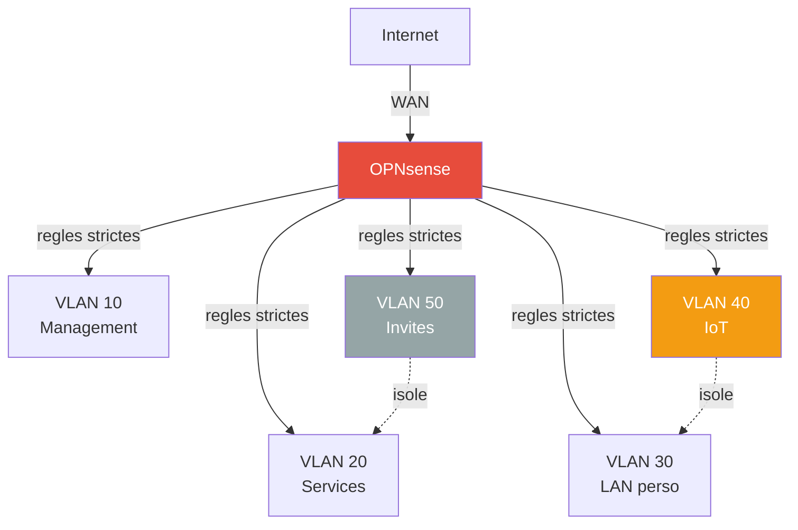

# Securite

Mesures de hardening appliquees et principes pour l'infrastructure.

## Authentification centralisee

### Authelia (SSO)

[Authelia](../services/authelia.md) fournit un portail d'authentification unique via OIDC :

| Service | Methode SSO |
|---|---|
| Proxmox VE (pve1, pve2) | OIDC natif (`authelia` realm, defaut) |
| Portainer | OAuth2 natif |
| Beszel | OIDC via PocketBase |

Les autres services (AdGuard, Wallos, WUD) conservent leur auth interne.

### Vaultwarden (mots de passe)

[Vaultwarden](../services/vaultwarden.md) stocke tous les credentials du homelab. Pas de SSO par design — c'est le filet de securite si Authelia tombe.

!!! tip "Bonne pratique"
    Tous les mots de passe services sont generes aleatoirement et stockes dans Vaultwarden. Aucun mot de passe reutilise entre services.

### Fallback

Chaque service critique conserve un acces de secours sans SSO :

| Service | Fallback |
|---|---|
| Proxmox | `root@pam` (acces console) |
| Portainer | Compte local admin |
| Beszel | Compte local admin |
| Vaultwarden | Master password (pas de SSO) |

## Hardening RPi 4 / DietPi

### Surface d'attaque reduite

| Mesure | Detail |
|---|---|
| WiFi desactive | Overlay `disable-wifi` dans config.txt |
| Bluetooth desactive | Pas de stack BT installee |
| HDMI desactive | `hdmi_ignore_hotplug=1`, `max_framebuffers=0` |
| Audio desactive | `dtparam=audio=off` |
| Services minimaux | DietPi n'installe que le strict necessaire |
| GPU minimal | 16 Mo — pas d'interface graphique |

### Docker

Toutes les images Docker utilisent `security_opt: no-new-privileges:true` quand c'est supporte — empeche l'escalade de privileges dans les conteneurs.

## Acces distant

### Tailscale (VPN mesh + SSH)

- Acces a tous les services via IP Tailscale — pas de port expose sur Internet
- Pas de port forwarding sur la Freebox
- ACLs dans la console Tailscale admin

**Tailscale SSH** actif sur les 3 machines (homelab, pve1, pve2) :

- Authentification via identite Tailscale (pas de cles SSH a gerer)
- Certificats a rotation automatique
- Aucun port 22 expose — tunnel WireGuard
- Mode `check` : validation navigateur a chaque connexion (MFA)
- Logs centralises dans la console Tailscale

```bash
# Connexion depuis n'importe quel device Tailscale
ssh root@homelab    # RPi 4
ssh root@pve1       # ZimaBoard 1
ssh root@pve2       # ZimaBoard 2
```

### TLS partout

- **Traefik** — certificats Let's Encrypt automatiques (DNS challenge Cloudflare) sur tous les services `*.home.gabin-simond.fr`
- **Proxmox** — accessible via Traefik (cert valide) + fallback IP:8006 (cert auto-signe)
- Pas de HTTP en clair expose

## Secrets

| Mesure | Detail |
|---|---|
| `.env` non versionne | Tokens API, credentials dans un fichier exclu de git |
| Repo prive | `homelab-config` est prive sur GitHub |
| Authelia config exclue | Secrets OIDC dans `.gitignore`, seuls les `.example` sont versionnes |
| Cle OIDC privee | `oidc.pem` exclue du repo |
| Pas de secrets dans les labels | Configs sensibles via env vars ou bind mounts |

## Architecture cible — securite reseau

### Segmentation VLANs

La segmentation en VLANs est la principale mesure de securite reseau prevue :



**Principe de moindre privilege** — chaque VLAN n'a acces qu'a ce dont il a strictement besoin. Voir la [page VLANs](../network/vlans.md) pour le detail des regles firewall.

### Points cles

- **IoT isole** — les objets connectes ne peuvent pas acceder au LAN personnel ni aux services
- **Invites isoles** — acces internet uniquement, aucune visibilite sur le reseau interne
- **Management restreint** — seul le VLAN 10 peut administrer les equipements
- **Firewall dedie** — bare-metal OPNsense pour eviter les SPOF
