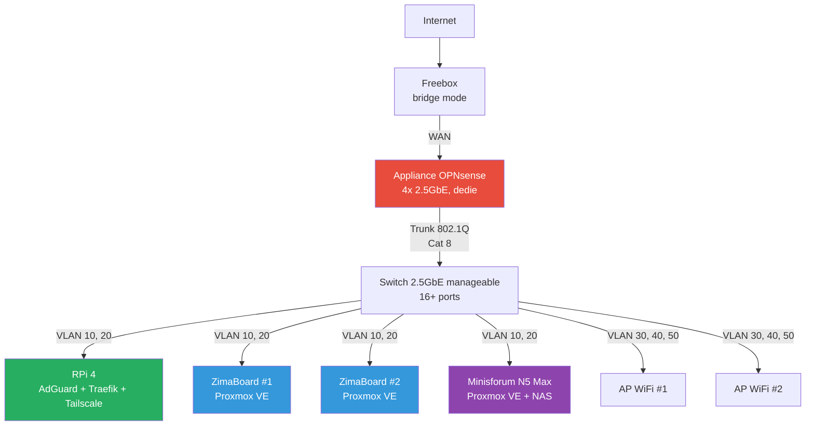

# Architecture cible

## Objectifs

- Segmentation reseau entreprise (VLANs, firewall)
- Infrastructure **2.5GbE** de bout en bout
- Separation des roles : reseau, compute, stockage
- Pas de SPOF sur les services critiques (DNS, firewall)

## Schema reseau

## Roles par machine

### Raspberry Pi 4 — Appliance reseau

!!! success "Independant du cluster"
    Si le cluster Proxmox tombe, le reseau continue de fonctionner.

- **AdGuard Home** — DNS principal + ad-blocking
- **Traefik** — reverse proxy + TLS auto
- **Tailscale** — VPN mesh distant
- **Beszel** — monitoring systeme
- **Homepage** — dashboard
- **Watchtower** — auto-update containers non-critiques + notif pour critiques

### Appliance OPNsense — Firewall dedie

Machine dediee bare-metal. Seul point de passage entre les VLANs et vers Internet.

| Port | Role |
|---|---|
| ETH0 | WAN (Freebox en bridge) |
| ETH1 | LAN trunk 802.1Q vers le switch |
| ETH2/ETH3 | Spare (DMZ, lien direct NAS, HA futur) |

Fonctions :

- Inter-VLAN routing avec regles firewall strictes
- DHCP server par VLAN
- OPNsense bare-metal pour la fiabilite

### ZimaBoard #1 + #2 — Compute

Deux noeuds Proxmox VE pour les services applicatifs en LXC/VM.

- Services legers : outils internes, dev, tests
- Proxmox Backup Server (en LXC sur un des deux)
- Avec le Minisforum → cluster Proxmox 3 noeuds (quorum natif)

### Minisforum N5 Max — Compute + Storage

Noeud Proxmox le plus puissant, double role.

- **NAS** — partage NFS/SMB vers les autres noeuds
- **Jellyfin** — media server avec transcodage hardware (Intel Quick Sync)
- **Services lourds** — VMs/LXC gourmands
- ZFS mirror recommande (minimum 2 disques)
