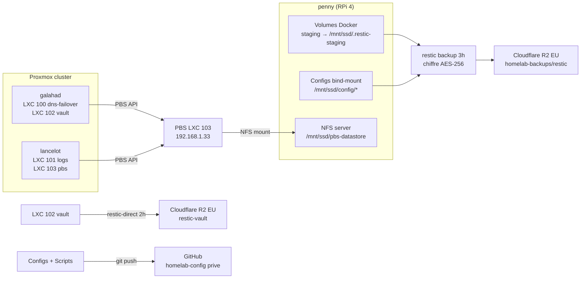

# Backups

## Architecture



**Chiffrement** : AES-256 côté client (restic pour penny + Vaultwarden). PBS chiffré au niveau datastore (AES-256-GCM).

**Règle 3-2-1 :**

- **3** copies : live (SSD/eMMC) + PBS local (penny SSD via NFS) + Cloudflare R2 EU (restic chiffré)
- **2** supports : SSD/eMMC + cloud
- **1** copie hors-site : Cloudflare R2 EU

---

## Proxmox Backup Server (PBS)

### Infrastructure

| Element | Détail |
|---|---|
| LXC | 103 "pbs" sur lancelot, unprivileged, Debian 13, IP 192.168.1.33 |
| Datastore "main" | `/mnt/datastore` (bind-mount depuis lancelot `/mnt/pbs-nfs`) |
| Stockage reel | NFS sur penny, export `/mnt/ssd/pbs-datastore` (65536 chunk dirs) |
| NFS export | `all_squash anonuid=100034` (UID mappe du LXC unprivileged) |
| UI | `backup.home.gabin-simond.fr` via Traefik → 192.168.1.33:8007 |
| Auth | Authelia OIDC realm "authelia" + comptes locaux break-glass |

### Comptes PBS

Voir [comptes.md](../securite/comptes.md) pour la convention complète.

| Compte | Rôle | Usage |
|---|---|---|
| `root@pam` | Superuser | Break-glass uniquement |
| `gabins@authelia` | Admin sur `/` | Login quotidien UI via OIDC 2FA |
| `gabins@pbs` | Admin sur `/` | Break-glass si Authelia down |
| `svc-pve-backup@pbs!pve` | DatastorePowerUser sur `/datastore/main` | Jobs backup PVE Datacenter |

### Backup des LXC via PBS

Les deux nodes PVE (galahad + lancelot) envoient leurs LXC directement au PBS via l'API native. Plus besoin de vzdump-daily.sh + rsync + pull vers penny.

| LXC | Contenu | Node PVE | Criticite |
|---|---|---|---|
| 100 (dns-failover) | AdGuard secondaire | galahad | Moyenne |
| 101 (logs) | Loki + Grafana | lancelot | Faible |
| 102 (vault) | Vaultwarden | galahad | **Critique** |
| 103 (pbs) | PBS lui-même | lancelot | Moyenne (reconstructible) |

!!! warning "vzdump hook temporaire"
    Les LXC sont backupes en mode `stop` (pas snapshot) car les rootfs sont sur stockage `local` (dir, pas ZFS). Le hook `/usr/local/bin/vzdump-permfix-hook.sh` corrige un bug de permissions sur `pct.conf` pour les LXC unprivileged. A supprimer quand les rootfs seront migres sur ZFS (mode snapshot natif).

### vzdump-permfix-hook.sh

Hook vzdump enregistré dans `/etc/vzdump.conf` sur galahad et lancelot :

```ini
# /etc/vzdump.conf
tmpdir: /tmp
script: /usr/local/bin/vzdump-permfix-hook.sh
```

Le hook lance un watcher en arriere-plan a `backup-start` qui surveillé l'apparition de `pct.conf` dans le tmpdir et corrige ses permissions (`chmod a+rX` dirs, `chmod a+r` fichiers) pour que `lxc-usernsexec` (UID 100000) puisse les lire.

---

## Restic-direct vers Cloudflare R2 (4 chaines parallel)

Chaque LXC critique a un backup `restic` indépendant direct vers R2, complementaire de PBS. Même si PBS (LXC 103) tombe, ces chaines continuent — path de survie en cas de lancelot down prolonge (cas 2026-04-19 : lancelot offline, PBS KO, mais ces backups ont tourne). Migration depuis Backblaze B2 effectuee 2026-05-11 ([r2-migration.md](r2-migration.md), [b2-cap-exceeded.md](b2-cap-exceeded.md)).

### Vue d'ensemble

| Repo R2 | Source | Script | Fréquence | Retention | Seuil freshness monitor |
|---------|--------|--------|-----------|-----------|-------------------------|
| `restic` | penny configs+volumes+pbs-datastore | `/root/homelab_backup.sh` | daily 03:00 | 7d/4w/6m | 30h |
| `restic-vault` | LXC 102 vaultwarden | `/usr/local/bin/vault-backup.sh` | **hourly** | 7d/4w/6m | **3h** |
| `restic-dnsfailover` | LXC 100 AdGuard secondaire | `/usr/local/bin/dnsfailover-backup.sh` | daily 02:30 | 7d/4w/6m | 30h |
| `restic-logs` | LXC 101 Grafana+Loki+Prometheus | `/usr/local/bin/logs-backup.sh` | daily 02:45 | 7d/4w/6m | 30h |

Master password restic partagé (RESTIC_PASSWORD dans `/root/.restic-env` sur chaque host/LXC). R2 bucket unique `homelab-backups`, sous-path distinct par repo.

### Vault — hourly pattern

| Element | Détail |
|---|---|
| Script | `/usr/local/bin/vault-backup.sh` dans LXC 102 |
| Cron | **Horaire** (snapshot SQLite atomic via `.backup` API) |
| Méthode | `.backup` vers `/var/backups/vault/db.sqlite3` (zero downtime) + `/opt/vaultwarden/` complet |
| Notification | ntfy (low OK, high FAIL) |

### DNS-failover / Logs — daily pattern

Même script structure, quotidien (nouveau 2026-04-19 pour fermer le SPOF "pas de backup si lancelot down" sur LXC 100 et 101). Scripts versionnes dans `homelab-config/system/lxc-scripts/`.

### Intégrité : restic-check-monthly.sh multi-repo

Cron penny `1er de chaque mois 04:00` : `restic check` (structure) + `restic check --read-data-subset=10%` (bit rot détection 10% random packs) sur les **4 repos**. Sur 10 mois, couvre ~100% de chaque repo.

Alerte ntfy haute si UN repo échoué (les autres continuent). Script : `scripts/restic-check-monthly.sh`.

### Freshness monitor

`homelab_monitor.sh / check_restic_repos_freshness` query R2 directement toutes les heures (cache 1h par repo) pour détecter si un cron silencieusement casse. Seuil par repo (vault 3h car hourly, autres 30h car daily).

---

## penny — restic vers R2

### Ce qui est sauvegarde

**Volumes Docker (stages puis backup) :**

| Donnée | Volume | Criticite |
|---|---|---|
| Beszel (historique monitoring) | `config_beszel-data` | Faible |
| Portainer (config Docker) | `config_portainer-data` | Moyenne |

**Configs avec secrets :**

| Donnée | Chemin | Criticite |
|---|---|---|
| Authelia (DB SQLite + clé OIDC + config + secrets) | `/mnt/ssd/config/authelia/` | **Critique** |
| AdGuard (config avec rewrites) | `/mnt/ssd/config/adguard/` | Haute |
| Traefik (config + dynamic routes) | `/mnt/ssd/config/traefik/` | Haute |
| Homepage (dashboard config) | `/mnt/ssd/config/homepage/` | Faible |
| Scripts système | `/mnt/ssd/config/scripts/` | Moyenne |
| Boot config (cmdline, config.txt) | `/mnt/ssd/config/boot/` | Haute |
| System config (fstab, sysctl) | `/mnt/ssd/config/system/` | Haute |

### Via Git (a chaque modification)

| Donnée | Repo | Visibilite |
|---|---|---|
| Configs applicatives (Traefik, AdGuard, Homepage, etc.) | `homelab-config` | Prive |
| Config système (boot, fstab, udev, sysctl, crontab) | `homelab-config` | Prive |
| Scripts (monitor, backup, vzdump, proxmox) | `homelab-config` | Prive |
| Templates Authelia (`.example`, sans secrets) | `homelab-config` | Prive |
| Documentation | `homelab-doc` | Public |

### Script homelab_backup.sh

**Exécution** : cron quotidien a 3h (`0 3 * * *`)

**Fonctionnement** :

1. Vérification preflight (`.restic-env` présent, `restic` installe)
2. Stage chaque volume Docker vers `/mnt/ssd/.restic-staging/<label>/`
3. `restic backup` : staging + configs → R2 (chiffré AES-256)
4. Nettoyage du staging
5. `restic forget` : retention 7 daily / 4 weekly / 6 monthly + prune
6. Notification ntfy (succès ou échec avec durée)

**Vérification d'intégrité** : `restic-check-monthly.sh` (1er du mois, 4h)

- Vérification structure (indexes, packs)
- Vérification 10% données aléatoires (détection bit rot)
- Alerte ntfy en cas d'échec

### Destinations

| Destination | Chemin | Retention | Chiffrement | Cout |
|---|---|---|---|---|
| Cloudflare R2 EU (restic penny) | `homelab-backups/restic` | 7d / 4w / 6m | AES-256 client-side | Gratuit (<10 Go) |
| Cloudflare R2 EU (restic vault) | `homelab-backups/restic-vault` | 7d / 4w / 6m | AES-256 client-side | Gratuit |
| PBS datastore "main" (NFS penny) | `/mnt/ssd/pbs-datastore` | Configurée dans PBS | AES-256-GCM | Gratuit |

---

## Ce qui n'est PAS sauvegarde (reconstructible)

| Donnée | Raison |
|---|---|
| Images Docker | `docker compose pull` |
| Cache Docker (overlay2) | Reconstruit automatiquement |
| Certificats TLS (Traefik) | Regeneres par Let's Encrypt |
| Logs | Ephemeres, pas critiques |
| Tailscale state | Re-auth suffit (`tailscale up`) |
| Proxmox config | Reinstallation via scripts (`proxmox-post-install.sh`) |
| PBS LXC 103 | Reconstructible (config + datastore sur NFS penny) |

---

## Restauration

### Restaurer un LXC depuis PBS

```bash
# Via l'UI PBS (backup.home.gabin-simond.fr) :
# 1. Selectionner le snapshot dans le datastore "main"
# 2. Bouton "Restore" → choisir le node PVE cible
#
# Via CLI PVE :
pvesh create /nodes/<node>/lxc -archive <PBS-backup-ID> -storage local
```

### Restaurer Vaultwarden depuis restic B2

```bash
# Depuis LXC 102 (ou un nouveau LXC)
source /root/.restic-env && export RESTIC_PASSWORD RESTIC_REPOSITORY B2_ACCOUNT_ID B2_ACCOUNT_KEY
restic restore latest --target /tmp/restore --tag vault
cp -a /tmp/restore/opt/vaultwarden/. /opt/vaultwarden/
# Restaurer le snapshot SQLite propre
cp /tmp/restore/var/backups/vault/db.sqlite3 /opt/vaultwarden/data/db.sqlite3
rm -rf /tmp/restore
systemctl restart vaultwarden
```

### Restaurer un volume Docker (penny)

```bash
source /root/.restic-env && export RESTIC_PASSWORD RESTIC_REPOSITORY B2_ACCOUNT_ID B2_ACCOUNT_KEY
restic restore latest --target /tmp/restore --include "/mnt/ssd/.restic-staging/beszel"

docker compose stop beszel
docker run --rm \
    -v config_beszel-data:/data \
    -v /tmp/restore/mnt/ssd/.restic-staging/beszel:/source:ro \
    alpine sh -c "rm -rf /data/* && cp -a /source/. /data/"
docker compose up -d beszel
rm -rf /tmp/restore
```

### Restaurer une config (penny)

```bash
source /root/.restic-env && export RESTIC_PASSWORD RESTIC_REPOSITORY B2_ACCOUNT_ID B2_ACCOUNT_KEY
restic restore latest --target /tmp/restore --include "/mnt/ssd/config/authelia"

docker compose stop authelia
cp -a /tmp/restore/mnt/ssd/config/authelia/. /mnt/ssd/config/authelia/
docker compose up -d authelia
rm -rf /tmp/restore
```

### Restauration complète (nouveau RPi)

Voir [break-glass.md](break-glass.md) pour la procédure pas-a-pas.

1. Installer DietPi
2. Cloner `homelab-config` depuis GitHub
3. Suivre le README (copier boot, udev, fstab, network, docker)
4. Restaurer `.restic-env` depuis la clé USB chiffrée
5. `restic restore latest` depuis B2
6. Restaurer les volumes et configs
7. Regenerer les secrets Authelia si nécessaire (voir README)
8. `docker compose up -d`

---

## Credentials restic

```bash
# /root/.restic-env (chmod 600, sealed dans system/secrets/restic-env.enc)
RESTIC_PASSWORD=<mot-de-passe-chiffrement>
RESTIC_REPOSITORY=s3:https://<account-id>.eu.r2.cloudflarestorage.com/homelab-backups/restic
AWS_ACCESS_KEY_ID=<r2-access-key-id>
AWS_SECRET_ACCESS_KEY=<r2-secret-access-key>
R2_ACCOUNT_ID=<account-id>
R2_BUCKET=homelab-backups
R2_ENDPOINT=https://<account-id>.eu.r2.cloudflarestorage.com
```

!!! danger "Ce fichier est scellé via sops + age + 2 YubiKeys (DR)"
    Source de vérité : `system/secrets/restic-env.enc`. Live runtime : `/root/.restic-env` (chmod 600, déchiffré via age key locale OU YubiKey). Perte de tous les age keys + plaintext = perte des backups (`RESTIC_PASSWORD` est nécessaire pour décrypter les snapshots restic même si tu re-créais les keys API R2).

Bucket `homelab-backups` sur Cloudflare R2 EU jurisdiction.
API token Cloudflare Object Read & Write scoped uniquement à ce bucket.

---

## Voir aussi

- [Comptes PBS](../securite/comptes.md#proxmox-backup-server-lxc-103) — convention comptes et tokens
- [Monitoring](monitoring.md) — checks backup freshness
- [Break-glass](break-glass.md) — procédure reconstruction d'urgence
