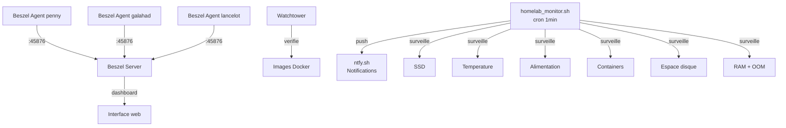

# Monitoring

## Vue d'ensemble



## homelab_monitor.sh

Script bash executé **chaque minute** via cron. Surveillé :

| Check | Seuil | Alerte |
|---|---|---|
| SSD monte | `/mnt/ssd` absent | :octicons-alert-16: critique |
| SSD lisible | Erreur I/O | :octicons-alert-16: critique |
| SSD read-only | Remonte en ro | :octicons-alert-16: critique |
| USB errors dans dmesg | Disconnect/offline | :octicons-alert-16: haute |
| Temperature | > 70°C warning, > 80°C critique | :octicons-alert-16: variable |
| Alimentation | Throttling / under-voltage | :octicons-alert-16: haute |
| Espace disque SD/SSD | > 80% warning, > 95% critique | :octicons-alert-16: variable |
| RAM + OOM kill | > 90% ou OOM détecté | :octicons-alert-16: critique |
| Docker daemon | Ne répond plus | :octicons-alert-16: critique |
| Containers | Stopped / unhealthy | :octicons-alert-16: haute |
| **Auto-repair docker** | Stack vide + daemon UP > 2 min | :octicons-alert-16: info (wrench) |
| **House alive** | Freebox injoignable TCP 80/443 | :octicons-alert-16: urgent |
| **Internet reach** | 1.1.1.1 + 9.9.9.9 TCP 53 KO | :octicons-alert-16: haute |
| **Cluster hosts** | galahad/lancelot ping + SSH port | :octicons-alert-16: urgent |
| **Logs stack** | Grafana + Loki HTTP 200 | :octicons-alert-16: haute |
| **AdGuard sync** | Canary rewrite secondaire | :octicons-alert-16: haute |
| **Restic freshness** | 4 repos B2 (3h vault, 30h autres) | :octicons-alert-16: urgent |
| **PBS health** | LXC 103 API :8007 | :octicons-alert-16: urgent |

### Cascade suppression (depuis 2026-04-19)

Quand une alerte parente explique plusieurs enfants, le monitor **supprimé** les alertes redondantes pour éviter le spam :

| Si | Alerte(s) supprimée(s) | Justification |
|---|---|---|
| `house-down` (Freebox ou internet KO) | `cluster-hosts` (galahad/lancelot), `logs-stack`, `pbs-down` | Pas joignable car la maison est down |
| `lancelot-down` | `logs-stack`, `pbs-down` | Les 2 LXC (101, 103) vivent sur lancelot |

Le log `(suppressed: parent-flag)` montre la suppression. Tu ne recois qu'**une** notification au lieu de 4 pour le même incident cause-racine.

### Auto-repair docker

`check_docker_autorepair` — si `docker info` OK + `docker ps -q` vide depuis > 2 min + pas de flag maintenance :

```bash
cd /mnt/ssd/config/docker && docker compose up -d
```

Circuit breaker : max 3 tentatives par 24h (compteur `/var/lib/homelab_monitor/autorepair-docker-attempts`). Au 4e, ntfy urgent "autorepair-capped" et stop (force enquête humaine). Opt-out : `touch /var/lib/homelab_monitor/maintenance` avant une maintenance planifiee.

Prouvé en live 2026-04-19 : stack down après recreation loki, auto-repair fire 172s après détection, 13 containers up. Voir log `/var/log/homelab_monitor.log` entry `AUTOREPAIR: docker compose up -d OK`.

### House signal (deadman complément HomePod)

`check_house` teste :
1. **Freebox** (192.168.1.254 TCP 80/443) — si KO = LAN segmente / Freebox crashee
2. **Internet** (1.1.1.1 et 9.9.9.9 TCP 53) — si Freebox OK mais ca KO = WAN down ISP

Combinaison avec la notif HomePod d'Apple permet de diagnostiquer sans acces Pi :

| Signal Pi | Notif HomePod | Diagnostic |
|---|---|---|
| Silence radio | Notif recue | **Coupure electrique** (Pi mort) |
| `internet-down` alert | Notif recue | **Coupure ISP** (Pi + Freebox UP, WAN KO) |
| `freebox-down` alert | Notif recue | **Freebox crashee** |
| Alerts normales | Pas de notif | **Problem homelab isolé** |

### Restic repos freshness (multi-repo)

`check_restic_repos_freshness` queries B2 directement pour les 4 repos backup :

| Repo | Seuil | Source |
|---|---|---|
| `restic` | 30h | penny daily (`homelab_backup.sh` @ 03:00) |
| `restic-vault` | **3h** | LXC 102 vaultwarden (`vault-backup.sh` **hourly**) |
| `restic-dnsfailover` | 30h | LXC 100 AdGuard (`dnsfailover-backup.sh` @ 02:30) |
| `restic-logs` | 30h | LXC 101 Grafana+Loki (`logs-backup.sh` @ 02:45) |

Cache 1h par repo pour ne pas faire 4 round-trips B2 chaque minute. Alerte ntfy `restic-<repo>-stale` si depassement.

### Deduplication des alertes

Le script utilisé des fichiers d'état dans `/var/lib/homelab_monitor/` :

- Une alerte n'est envoyée qu'**une seule fois** par incident
- Une notification **"resolved"** est envoyée quand le problème disparait
- Pas de spam sur ntfy

### Configuration

```bash
NTFY_TOPIC="<topic-randomise>"    # Topic ntfy (hex 32 chars, non public)
NTFY_SERVER="https://ntfy.sh"
TEMP_WARN=70                      # Seuil warning °C
TEMP_CRIT=80                      # Seuil critique °C
```

## Services de monitoring

| Service | Rôle | Acces |
|---|---|---|
| **Beszel** + agents | Monitoring système (CPU, RAM, disque, réseau) — penny, galahad, lancelot | Dashboard web |
| **Watchtower** | Auto-update non-critiques + notification mises a jour critiques via ntfy | Headless (pas de dashboard) |
| **homelab_monitor.sh** | Alertes critiques push (SSD, power, temp, Docker) | Notifications ntfy |
| **Watchdog BCM2835** | Reboot auto si kernel freeze (timeout 15s) | Hardware |
| **Autoheal** | Restart auto des containers Docker unhealthy | Container |
| **SSD auto-recovery** | Remount + fsck + restart Docker après déconnexion USB | Script (monitor) |
| **dns-failover health check** | Surveillé penny depuis galahad (ping + Traefik + DNS) | LXC 100 / ntfy |

## Architecture de résilience

Trois couches complementaires, chacune couvre des scénarios différents :

| Couche | Outil | Scénario | Action |
|---|---|---|---|
| 1. Monitoring | homelab_monitor.sh | SSD, temp, RAM, disque, containers | Alerte ntfy |
| 2. Auto-repair | Autoheal | Container unhealthy | Restart container |
| 3. Dernier recours | Watchdog hardware | Kernel freeze | Reboot complet |

!!! info "Pas de chevauchement"
    Le watchdog ne remplacé PAS le monitoring. Si le SSD se deconnecte, le kernel tourne toujours — le watchdog ne se déclenche pas. C'est `homelab_monitor.sh` qui alerte. Les trois couches sont complementaires.

## Dead-man-switch (negative space alerting)

Depuis 2026-06-03 (commit `5db3643`), quatre rules Grafana détectent l'**absence** de logs plutôt que leur présence.

### Pourquoi ce pattern

`homelab_monitor.sh` tourne **sur penny**. Si penny meurt, le moniteur meurt avec lui — et donc personne n'alerte. Observé concrètement entre le 2026-05-31 09:09 et le 2026-06-03 10:13 : 3 jours sans aucune alerte parce que penny était down.

Les rules Grafana classiques (`authelia-failures`, `traefik-5xx`, etc.) regardent toutes la *présence* d'événements anormaux :

```
sum(count_over_time({container="authelia"} |~ "auth fail" [15m])) > 10
```

Si authelia est down → 0 log → seuil pas franchi → silence. Catch-22 : on n'alerte que sur ce qui se passe, pas sur ce qui ne se passe plus.

### Le pattern

```yaml
expr: sum(count_over_time({host="X"}[10m])) or vector(0)
type: threshold
conditions:
  - evaluator: { params: [5], type: lt }
noDataState: Alerting
execErrState: OK
```

- `or vector(0)` : force le retour 0 si Loki ne trouve aucune stream pour le label (sinon NoData casse la reduce stage)
- `type: lt` : on alerte si **moins** de 5 events
- `noDataState: Alerting` : filet de secu si Loki renvoie NoData malgré tout (légitime)
- `execErrState: OK` : silence si Loki lui-même est en erreur

### Rules déployées

| UID | Window | Seuil | Severity |
|---|---|---|---|
| `alert-host-penny-silent` | 10min | < 5 logs | critical |
| `alert-host-galahad-silent` | 10min | < 5 logs | critical |
| `alert-host-lancelot-silent` | 10min | < 5 logs | critical |
| `alert-host-fish-silent` | 15min | < 5 logs | high |

YAML-provisioned dans `logs/grafana-provisioning/alerting/rules.yml`.

### Limite : Loki sur lancelot

Si **lancelot** tombe, Loki primary (LXC 101) tombe aussi → Grafana ne peut plus évaluer ses rules. Filets de secours :

1. **Loki replica sur penny** (port 3101) — reçoit toujours les writes Alloy via dual-write Alloy.
2. **healthchecks.io** sur penny `homelab_monitor.sh` — ping cloud chaque minute, fire ntfy externe à T+5min de silence. Indépendant du cluster.
3. **fish canary via Tailscale** (commit `fb56f53`) — `monitor.sh` check `fish.service` par IP Tailscale, bypass Loki.
