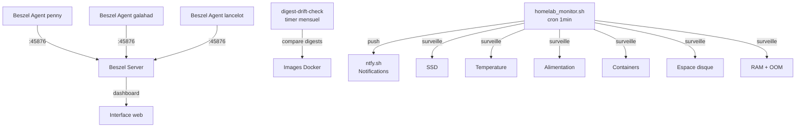

# Monitoring

## Vue d'ensemble


```mermaid
graph TD
    Script[homelab_monitor.sh<br/>cron 1min] -->|push| Ntfy[ntfy.sh<br/>Notifications]
    Beszel[Beszel Server] -->|dashboard| Web[Interface web]
    DD[digest-drift-check<br/>timer mensuel] -->|compare digests| Docker[Images Docker]
    
    Script -->|surveille| SSD[SSD]
    Script -->|surveille| Temp[Temperature]
    Script -->|surveille| Power[Alimentation]
    Script -->|surveille| Containers[Containers]
    Script -->|surveille| Disk[Espace disque]
    Script -->|surveille| RAM[RAM + OOM]

    Agent1[Beszel Agent penny] -->|:45876| Beszel
    Agent2[Beszel Agent galahad] -->|:45876| Beszel
    Agent3[Beszel Agent lancelot] -->|:45876| Beszel
```

## homelab_monitor.sh

Script bash executé **chaque minute** via cron. Surveillé :

| Check | Seuil | Alerte |
|---|---|---|
| SSD monte | `/mnt/ssd` absent | ⚠️ critique |
| SSD lisible | Erreur I/O | ⚠️ critique |
| SSD read-only | Remonte en ro | ⚠️ critique |
| USB errors dans dmesg | Disconnect/offline | ⚠️ haute |
| **SMART SSD** (horaire) | CRC errors ↑ (câble/bridge suspect) haute ; realloc/pending/uncorr ↑ (NAND) urgente ; temp > 65°C | ⚠️ variable |
| Temperature | > 70°C warning, > 80°C critique | ⚠️ variable |
| Alimentation | Throttling / under-voltage | ⚠️ haute |
| Espace disque SD/SSD | > 80% warning, > 95% critique | ⚠️ variable |
| RAM + OOM kill | > 90% ou OOM détecté | ⚠️ critique |
| Docker daemon | Ne répond plus | ⚠️ critique |
| Containers | Stopped / unhealthy | ⚠️ haute |
| **Auto-repair docker** | Stack vide + daemon UP > 2 min | ⚠️ info (wrench) |
| **House alive** | Freebox injoignable TCP 80/443 | ⚠️ urgent |
| **Internet reach** | 1.1.1.1 + 9.9.9.9 TCP 53 KO | ⚠️ haute |
| **Cluster hosts** | galahad/lancelot ping + SSH port | ⚠️ urgent |
| **Logs stack** | Grafana + Loki HTTP 200 | ⚠️ haute |
| **AdGuard sync** | Canary rewrite secondaire | ⚠️ haute |
| **Restic freshness** | 4 repos R2 (3h vault, 30h autres) | ⚠️ urgent |
| **PBS health** | LXC 103 API :8007 | ⚠️ urgent |

### Cascade suppression (depuis 2026-04-19)

Quand une alerte parente explique plusieurs enfants, le monitor **supprimé** les alertes redondantes pour éviter le spam :

| Si | Alerte(s) supprimée(s) | Justification |
|---|---|---|
| `house-down` (Freebox ou internet KO) | `cluster-hosts` (galahad/lancelot), `logs-stack`, `pbs-down` | Pas joignable car la maison est down |
| `lancelot-down` | `logs-stack`, `pbs-down` | Les 2 LXC (101, 103) vivent sur lancelot |

Le log `(suppressed: parent-flag)` montre la suppression. Tu ne recois qu'**une** notification au lieu de 4 pour le même incident cause-racine.

### Auto-repair docker

`check_docker_autorepair` — si `docker info` OK + `docker ps -q` vide depuis > 2 min + pas de flag maintenance :

```bash
cd /mnt/ssd/config/docker && docker compose up -d
```

Circuit breaker : max 3 tentatives par 24h (compteur `/var/lib/homelab_monitor/autorepair-docker-attempts`). Au 4e, ntfy urgent "autorepair-capped" et stop (force enquête humaine). Opt-out : `touch /var/lib/homelab_monitor/maintenance` avant une maintenance planifiee.

Prouvé en live 2026-04-19 : stack down après recreation loki, auto-repair fire 172s après détection, 13 containers up. Voir log `/var/log/homelab_monitor.log` entry `AUTOREPAIR: docker compose up -d OK`.

:::note[La garde de maintenance était inerte jusqu'au 2026-08-31]
Le contrôle testait `/var/lib/homelab_monitor/maintenance`, alors que
`homelab-maintenance.sh` écrit `/run/homelab/maintenance-until`. Personne
n'écrivait le fichier surveillé : l'opt-out ne fonctionnait pas depuis son ajout
en avril, et l'auto-repair pouvait donc relancer la pile en pleine maintenance
planifiée. Découvert par accident, en ouvrant une vraie fenêtre pour tester
autre chose. Les deux mécanismes sont désormais honorés.

La méthode qui l'a révélé vaut d'être retenue : ne pas tester une garde en
fabriquant sa condition à la main (`touch le_fichier_attendu`) mais en
**déclenchant le vrai mécanisme** que l'opérateur utilise. Le premier prouve
qu'on lit un fichier ; seul le second prouve qu'on lit le bon.
:::

### Reprise du stack après un décrochage SSD {#reprise-ssd}

Deux mécanismes ajoutés le 2026-08-30, après un incident où le SSD a décroché
deux fois et laissé **19 conteneurs sur 24** debout — un état que ni
`check_docker_autorepair` (qui ne vise que le stack *entièrement* vide) ni
`check_docker` (qui se contente d'alerter) ne couvrait.

`revive_docker` — la recovery SSD **déclarait** le redémarrage de Docker sans le
vérifier : `SSD RECOVERY: SUCCESS ... Docker restarted` à 21:14:21, puis
`docker-down` à 21:14:22. Deux causes cumulées :

- `systemctl start docker` est un **no-op** quand l'unité a atteint sa limite de
  redémarrages (« Start request repeated too quickly »). Il faut lever le
  compteur par `systemctl reset-failed docker.service docker.socket` d'abord.
- Rien ne vérifiait que le daemon répondait : un `sleep 10`, puis un log de
  succès.

La fonction fait donc `reset-failed` **avant** `start`, deux passes, et ne rend
un succès que si `docker info` a réellement répondu. Un succès non vérifié est un
mensonge, et celui-là a coûté une nuit de pile à moitié à terre.

`check_containers_restart` — relance les conteneurs arrêtés quand le stack est
*partiel*. Volontairement `docker start` et **jamais** `docker compose up -d` :
`/mnt/ssd/config` est la production (monté `watch: true` dans Traefik), on ne
recrée pas des conteneurs depuis le checkout courant sans le demander. Garde-fous :

- délai de confirmation de 2 min, pour ne pas courir contre un `compose up` ou un
  redémarrage manuel ;
- disjoncteur de 3 relances glissantes par conteneur et par 24 h — au-delà, on
  laisse l'alerte `containers-stopped` faire son travail plutôt que de boucler
  sur un conteneur cassé ;
- exclusions : `IGNORE_STOPPED`, les résidus `<12hex>_<nom>` d'une recréation, et
  l'état `restarting` (le conteneur réessaie déjà seul).

Pas de redémarrage automatique de la machine en dernier recours : si Docker ne
revient pas, alerte `ssd-recovery-docker-failed` en urgent et on s'arrête.
Redémarrer une machine seule sur un défaut matériel intermittent est un mauvais
échange.

Tests : `scripts/tests/ssd-recovery-docker.test.sh`, 27 assertions, chaque garde
vérifiée par mutation. C'est ce qui a rattrapé un délai de confirmation non
couvert — le test sortait par la branche « témoin absent » sans jamais atteindre
le contrôle des 120 s. Validé à chaud : un conteneur arrêté puis relancé par la
vraie fonction contre le vrai Docker.

### House signal (deadman complément HomePod)

`check_house` teste :
1. **Freebox** (192.168.1.254 TCP 80/443) — si KO = LAN segmente / Freebox crashee
2. **Internet** (1.1.1.1 et 9.9.9.9 TCP 53) — si Freebox OK mais ca KO = WAN down ISP

Combinaison avec la notif HomePod d'Apple permet de diagnostiquer sans acces Pi :

| Signal Pi | Notif HomePod | Diagnostic |
|---|---|---|
| Silence radio | Notif recue | **Coupure electrique** (Pi mort) |
| `internet-down` alert | Notif recue | **Coupure ISP** (Pi + Freebox UP, WAN KO) |
| `freebox-down` alert | Notif recue | **Freebox crashee** |
| Alerts normales | Pas de notif | **Problem homelab isolé** |

### Restic repos freshness (multi-repo)

`check_restic_repos_freshness` interroge directement le backend restic — Cloudflare R2 EU depuis le 2026-05-11 — pour les 4 repos backup :

| Repo | Seuil | Source |
|---|---|---|
| `restic` | 30h | penny daily (`homelab_backup.sh` @ 03:00) |
| `restic-vault` | **3h** | LXC 102 vaultwarden (`vault-backup.sh` **hourly**) |
| `restic-dnsfailover` | 30h | LXC 100 AdGuard (`dnsfailover-backup.sh` @ 02:30) |
| `restic-logs` | 30h | LXC 101 Grafana+Loki (`logs-backup.sh` @ 02:45) |

Cache 1h par repo pour ne pas faire 4 round-trips R2 chaque minute. Alerte ntfy `restic-<repo>-stale` si depassement.

### Deduplication des alertes

Le script utilisé des fichiers d'état dans `/var/lib/homelab_monitor/` :

- Une alerte n'est envoyée qu'**une seule fois** par incident
- Une notification **"resolved"** est envoyée quand le problème disparait
- Pas de spam sur ntfy

### Configuration

```bash
NTFY_TOPIC="<topic-randomise>"    # Topic ntfy (hex 32 chars, non public)
NTFY_SERVER="https://ntfy.sh"
TEMP_WARN=70                      # Seuil warning °C
TEMP_CRIT=80                      # Seuil critique °C
```

## Services de monitoring

| Service | Rôle | Acces |
|---|---|---|
| **Beszel** + agents | Monitoring système (CPU, RAM, disque, réseau) — penny, galahad, lancelot | Dashboard web |
| **digest-drift-check** | Notifie quand l'amont `:latest` dépasse le digest `@sha256` épinglé — n'applique **rien**, la mise à jour reste une décision | Timer mensuel / ntfy |
| **homelab_monitor.sh** | Alertes critiques push (SSD, power, temp, Docker) | Notifications ntfy |
| **Watchdog BCM2835** | Reboot auto si kernel freeze (timeout 15s) | Hardware |
| **Autoheal** | Restart auto des containers Docker unhealthy | Container |
| **SSD auto-recovery** | Remount + fsck + restart Docker après déconnexion USB | Script (monitor) |
| **dns-failover health check** | Surveillé penny depuis galahad (ping + Traefik + DNS) | LXC 100 / ntfy |

## Contrôles planifiés (timers penny)

Inventaire relevé sur la machine le **2026-08-29** (`systemctl list-timers`). Tout ce qui
tourne en planifié sur penny est ici ; les entrées sans lien n'ont pas de page dédiée et
le tableau fait référence.

| Timer | Cadence | Ce qu'il fait |
|---|---|---|
| `homelab-backup` | 03:00 | Sauvegarde restic vers R2 — voir [backups](backups.md) |
| `pbs-datastore-sync` | 03:30 | Sync du datastore PBS vers R2 via rclone — voir [backups](backups.md) |
| `aide-check` | 04:30 | Intégrité des fichiers système (AIDE) — voir [roadmap sécurité](../securite/roadmap.md) |
| `security-updates` | 05:40 | Applique les mises à jour de sécurité (politique unattended-upgrades) |
| `firefly-echeances` | 06:15 | Échéances de prêt Firefly III (capital / intérêts / assurance) — voir [Firefly III](../services/firefly.md) |
| `firefly-post-import` | 06:30 | Post-traitement des imports Firefly III (virements internes, mensualités) |
| `backup-coverage-check` | 06:45 | Quels invités Proxmox n'ont **pas** de sauvegarde récente |
| `repo-drift-check` | 07:10 | Vérifie que le déployé dans la LXC 101 correspond encore au dépôt |
| `backup-freshness-check` | 09:30 | Dead-man-switch sur la fraîcheur des dépôts restic |
| `control-drift-check` | toutes les 6 h (00:09) | Vérifie que les contrôles homelab sont réellement en place sur les 3 hôtes |
| `guardrail-liveness` | toutes les 6 h (00:34) | Vérifie que chaque garde-fou a parlé récemment (un garde-fou muet ne se distingue pas d'un garde-fou content) |
| `lxc-disk-check` | toutes les 6 h (02:06) | Remplissage des rootfs LXC sur les deux nœuds PVE |
| `pz-backup` | toutes les 6 h | Sauvegarde de la save Project Zomboid — voir [zomboid](../services/zomboid.md) |
| `ci-health-check` | toutes les 30 min | Témoin sur l'état de la CI des dépôts homelab — voir [ci-runner](../services/ci-runner.md) |
| `outillage-health-check` | toutes les 30 min | Disponibilité de l'outillage (Pulse, Grafana, PBS, Portainer…) |
| `pz-disk-check` | horaire | Espace disque du serveur Project Zomboid |
| `apt-listbugs` | horaire | Nettoie les préférences apt-listbugs qui bloquaient unattended-upgrades |
| `lynis-notify` | dimanche 05:00 | Audit lynis de penny + notification ntfy zéro-bruit |
| `lynis-remote-audit` | dimanche 06:00 | Audit lynis des nœuds PVE, en pull depuis penny |
| `trivy-scan` | dimanche 06:00 | Scan de vulnérabilités des images Docker qui tournent |
| `restic-check-monthly` | le 1er, 04:00 | Contrôle d'intégrité des dépôts restic (multi-repo R2) |
| `digest-drift-check` | le 1er, 05:00 | Écart entre `:latest` amont et le digest épinglé — voir [décisions](../projet/decisions.md) |
| `restic-drill-monthly` | le 1er, 05:00 | Drill de restauration (4 dépôts + datastore PBS) — voir [DR drill](dr-drill-scenario-1.md) |

`homelab_monitor.sh` n'est pas dans ce tableau : il tourne en **cron chaque minute**, pas en
timer. Les timers ci-dessus sont les contrôles qui coûtent trop cher pour tourner à la minute.

:::note[Pourquoi des timers et pas du cron]
`Persistent=true` rattrape un passage manqué après une coupure ou un redémarrage. Le drill
du 2026-06-01 avait été **sauté en silence** parce qu'il était en cron : la machine dormait
à l'heure dite et personne ne l'a su. Voir [fiabilisation du drill](../projet/journal/2026-06-11-fiabilisation-drill-restauration.md).
:::

## Architecture de résilience

Trois couches complementaires, chacune couvre des scénarios différents :

| Couche | Outil | Scénario | Action |
|---|---|---|---|
| 1. Monitoring | homelab_monitor.sh | SSD, temp, RAM, disque, containers | Alerte ntfy |
| 2. Auto-repair | Autoheal | Container unhealthy | Restart container |
| 3. Dernier recours | Watchdog hardware | Kernel freeze | Reboot complet |

:::info[Pas de chevauchement]
Le watchdog ne remplacé PAS le monitoring. Si le SSD se deconnecte, le kernel tourne toujours — le watchdog ne se déclenche pas. C'est `homelab_monitor.sh` qui alerte. Les trois couches sont complementaires.
:::

## Dead-man-switch (negative space alerting)

Depuis 2026-06-03 (commit `5db3643`), quatre rules Grafana détectent l'**absence** de logs plutôt que leur présence.

### Pourquoi ce pattern

`homelab_monitor.sh` tourne **sur penny**. Si penny meurt, le moniteur meurt avec lui — et donc personne n'alerte. Observé concrètement entre le 2026-05-31 09:09 et le 2026-06-03 10:13 : 3 jours sans aucune alerte parce que penny était down.

Les rules Grafana classiques (`authelia-failures`, `traefik-5xx`, etc.) regardent toutes la *présence* d'événements anormaux :

```
sum(count_over_time({container="authelia"} |~ "auth fail" [15m])) > 10
```

Si authelia est down → 0 log → seuil pas franchi → silence. Catch-22 : on n'alerte que sur ce qui se passe, pas sur ce qui ne se passe plus.

### Le pattern

```yaml
expr: sum(count_over_time({host="X"}[10m])) or vector(0)
type: threshold
conditions:
  - evaluator: { params: [5], type: lt }
noDataState: Alerting
execErrState: OK
```

- `or vector(0)` : force le retour 0 si Loki ne trouve aucune stream pour le label (sinon NoData casse la reduce stage)
- `type: lt` : on alerte si **moins** de 5 events
- `noDataState: Alerting` : filet de secu si Loki renvoie NoData malgré tout (légitime)
- `execErrState: OK` : silence si Loki lui-même est en erreur

### Rules déployées

| UID | Window | Seuil | Severity |
|---|---|---|---|
| `alert-host-penny-silent` | 10min | < 5 logs | critical |
| `alert-host-galahad-silent` | 10min | < 5 logs | critical |
| `alert-host-lancelot-silent` | 10min | < 5 logs | critical |
| `alert-host-sucre-silent` | 15min | < 5 logs | high |

YAML-provisioned dans `logs/grafana-provisioning/alerting/rules.yml`.

### Limite : Loki sur lancelot

Si **lancelot** tombe, Loki primary (LXC 101) tombe aussi → Grafana ne peut plus évaluer ses rules. Filets de secours :

1. **Loki replica sur penny** (port 3101) — reçoit toujours les writes Alloy via dual-write Alloy.
2. **healthchecks.io** sur penny `homelab_monitor.sh` — ping cloud chaque minute, fire ntfy externe à T+5min de silence. Indépendant du cluster.
3. **sucre canary via Tailscale** (commit `fb56f53`) — `monitor.sh` check `sucre.service` par IP Tailscale, bypass Loki.
