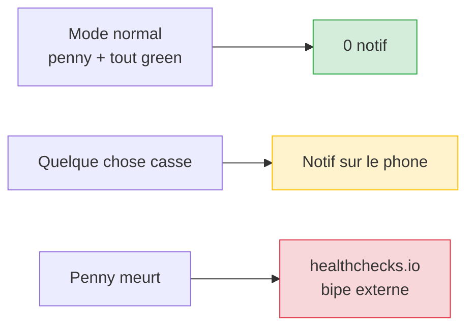
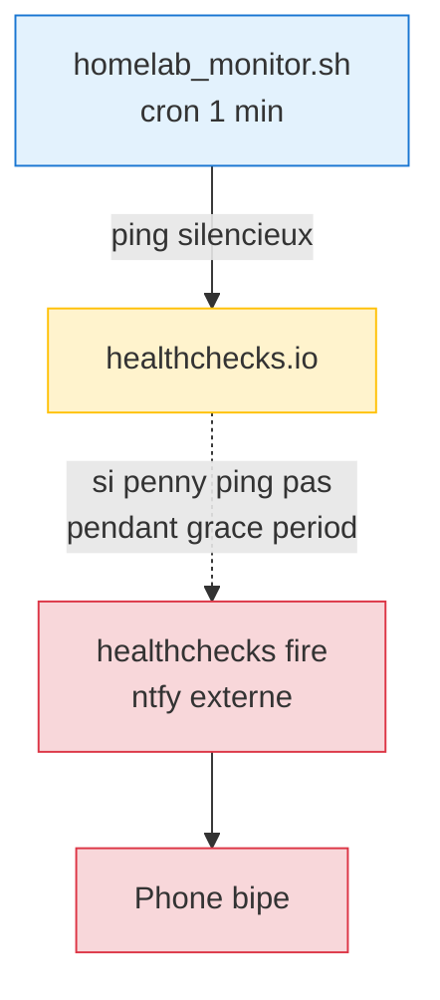

# Notification hygiene — mode "uniquement quand ne va pas"

Pas un sujet glamour mais critique : **un homelab qui bipe trop = un homelab dont les vrais signaux passent inaperçus**. Au bout d'un mois de "Backup OK" quotidien, tu silences le ntfy et tu rates le vrai "Backup FAILED".

Cette page documenté le mode opérationnel actuel (depuis 2026-05-04) : **silence sur les success, signal uniquement sur les pannes**, avec un canary externe pour distinguer "tout va bien" de "penny est mort".

## Principe



## Ce qui est silencié (mode "boring runs silent")

| Source | Avant | Maintenant |
|--------|-------|-----------|
| `homelab_monitor.sh` heartbeat / 6h | "penny heartbeat alive..." | Silent (file `/var/lib/homelab_monitor/heartbeat` update local) |
| `homelab_backup.sh` | "Backup OK Snapshot: X GiB" | Silent (lisible dans `restic snapshots latest`) |
| `vault-backup.sh` (LXC 102) | "Vault backup OK" | Silent |
| `logs-backup.sh` (LXC 101) | "logs backup OK" | Silent |
| `dnsfailover-backup.sh` (LXC 100) | "dns-failover backup OK" | Silent |
| `restic-check-monthly.sh` | "Restic check OK" mensuel | Silent |
| `restic-drill-monthly.sh` | "DR drill OK" mensuel | Silent |
| `lynis-weekly.sh` | "Lynis: penny score X/100" pour score >= 70 | Silent (notifie uniquement si échec ou score < 70) |
| `homelab_monitor` `clear_alert()` | "Homelab Resolved : X is back to normal" | Silent (state file disparaît, logge dans `$LOGFILE`) |
| Watchtower | "Maj auto OK : autoheal" quotidien | Silent (level=warn, template sans `.Updated`) |
| AdGuard 02:00 desync (faux positif PBS backup window) | "AdGuard desync → Resolved 1 min plus tard" | Silent (whitelist 02:00-02:05) |
| Loki/Grafana 02:30 | "DOWN → Resolved" pareil | Silent (whitelist 02:30-02:35) |
| CT log monitor | "134 new cert(s)" hebdo | Silent sauf nouveau sous-domaine jamais vu |

## Ce qui reste — vrai signal

- Backup FAILED (main, vault, logs, dns-failover, restic-check, DR-drill)
- Lynis échec ou score < 70
- Containers DOWN (hors window backup PBS)
- SSD disconnect / recovery
- fail2ban bans IP
- AdGuard desync hors window backup
- Fish DOWN (canary Tailscale via `homelab_monitor.check_fish_service`)
- Fish drafter PR créé sur signal réel inconnu
- CT log nouveau sous-domaine (potentiel takeover)
- Watchtower échec maj OU container marqué `monitor-only` avec nouvelle version

## Healthchecks.io — le canary externe

Le silence des success crée un trade-off : **silence côté ntfy = penny vivant OK… ou penny mort.** Indistinguable côté phone.

Solution : ping externe.



### Setup one-shot

1. Créer un compte free sur https://healthchecks.io (free tier 20 checks)
2. New check :
   - Period **5 min**
   - Grace **10 min**
   - Notification : ntfy webhook ou email
3. Copier l'URL du check (`https://hc-ping.com/<UUID>`) sur penny :
   ```bash
   echo 'https://hc-ping.com/<UUID>' > /etc/homelab/healthchecks-url
   chmod 0600 /etc/homelab/healthchecks-url
   ```

`homelab_monitor.sh` ping silencieusement à chaque tick (1 min). Si fichier absent → ping skipped sans erreur (no-op safe).

### Alerte

Quand penny stoppe de pinger > 10 min :
- healthchecks.io passe le check de "up" → "down"
- Notification fire (email + ntfy webhook configurable)
- Tu sais que penny est mort, pas juste que "rien à signaler"

## Logs persistents (post-DietPi RAMlog fix)

DietPi a `INDEX_LOGGING=-1` qui truncate `/var/log/*` chaque heure xx:17 via `/etc/cron.hourly/dietpi`. Sur SSD c'est inutile, et ça empêche le forensic post-incident.

**Fix appliqué 2026-05-04** : les logs des scripts homelab pointent maintenant vers `/mnt/ssd/log-homelab/` (SSD persistent, hors tmpfs DietPi) :

| Script | Log file persistent |
|--------|---------------------|
| `homelab_monitor.sh` | `/mnt/ssd/log-homelab/homelab_monitor.log` |
| `homelab_backup.sh` | `/mnt/ssd/log-homelab/homelab_backup.log` |
| `ct-log-monitor.sh` | `/mnt/ssd/log-homelab/ct-monitor.log` |
| `lynis-weekly.sh` | copie `/var/log/lynis*` vers `/mnt/ssd/log-homelab/` post-run |

`/var/log/*` reste tmpfs DietPi (intentionnel pour les services système). Seuls les logs homelab sont dur-disque.

## Vérification rapide

```bash
# Penny vivant + heartbeat récent ?
ls -la /var/lib/homelab_monitor/heartbeat
date -d @"$(cat /var/lib/homelab_monitor/heartbeat)"

# Healthchecks pinged récemment ?
grep -c "homelab_monitor.sh" /var/log/syslog 2>/dev/null

# Logs persistents OK ?
ls -la /mnt/ssd/log-homelab/

# Dernière notif fail2ban / monitor (si elle a fired) ?
tail -50 /mnt/ssd/log-homelab/homelab_monitor.log | grep ALERT
```

## Pourquoi 2 topics ntfy

Voir [Fish observability](../architecture/fish-observability.md) — c'est lié au callback flow Approve/Deny du drafter fish. Topic 1 = boring critical, Topic 2 = fish proposals avec callbacks. Phone subscribe les 2 = un seul inbox unifié pour le user.

## Réactiver une notification

Si tu trouves qu'un silence va trop loin (e.g., tu veux "Lynis OK score X/100" pour le rassurance hebdo), il suffit de retirer le `SHOULD_NOTIFY=false` ou la garde dans le script concerné. Tous les changements sont commités sur `homelab-config`, easy revert.
