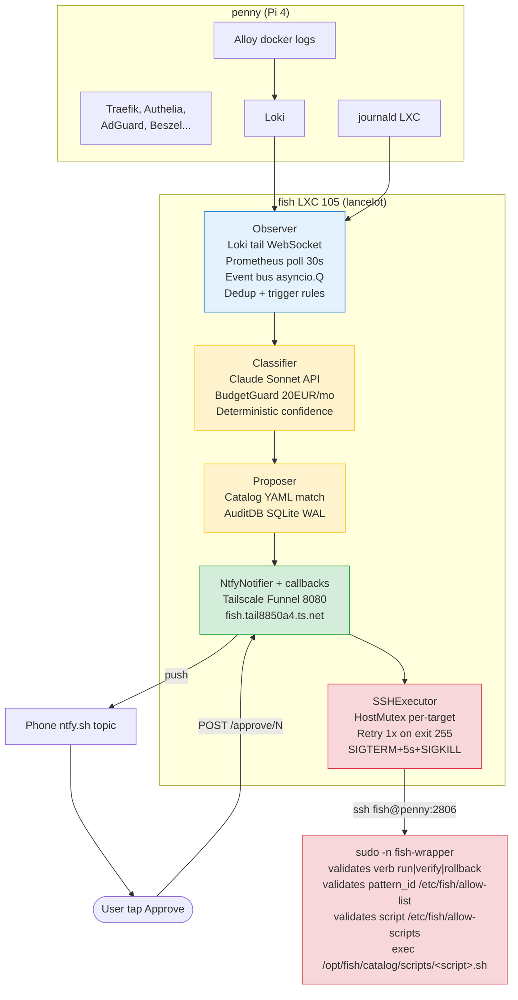

# fish — SRE perso

> **Intelligence calme, observé, exécuté, repare.**

`fish` est l'assistant SRE perso du homelab. Un bot qui surveillé les logs/metriques,
reconnait les incidents connus, propose un fix par notification, et exécuté
après approbation humaine. Nomme d'après Scofield (Prison Break).

## État (2026-04-20)

**MVP livre et prouvé en production.** Premier cycle end-to-end valide :

- 🔔 iPhone buzz → **Approve** tap
- ⏱ **3 secondes** plus tard fish a repare homepage via SSH
- 📊 AuditDB SQLite log propre : classifier + proposal + exécution

**15 commits** sur `homelab-config/fish/` ce jour, **163 tests verts**, 0 regression.

## Architecture

## Stack technique

- **Langage** : Python 3.14, `uv`-managed, async/await throughout
- **LLM** : Claude Sonnet 4.6 via API (wrappable vers Ollama local futur)
- **DB** : SQLite WAL mode + FK enforced, via `aiosqlite`
- **Notifier** : ntfy.sh public (topic obscur) + Tailscale Funnel pour callbacks
- **Exec** : SSH forced-command + `sudo` + wrapper validator + sudoers restreint
- **Runtime** : LXC 105 unprivileged sur lancelot, Debian 13, systemd, sops-sealed secrets

## Composants

### Observer
Tail Loki (WebSocket `/loki/api/v1/tail`) + poll Prometheus (30s) + event bus
asyncio avec dedup LRU (10 000 event_ids) et trigger rules fenêtre-glissante.

### Classifier
Wrapper `LLMProvider` abstrait. Implémentation Claude : POST /v1/messages,
retry fallback Opus si JSON malforme, `BudgetGuard` SQLite track cout
mensuel EUR (pricing Sonnet $3/$15 Mtok). **Confidence deterministe** =
`len(match_signals) / len(pattern.required_signals)`, pas de LLM self-report.

### Catalog
YAML schema pydantic, 5 patterns seed depuis les mémoires d'incidents :
- `beszel-oidc-reset` — PocketBase resetting `meta.appURL` post-restart
- `docker-compose-stopped-post-reboot` — `unless-stopped` ne restart pas après `docker compose down`+reboot
- `pmxcfs-ro-post-recovery` — `/etc/pve` RO après recovery corosync (fix : restart pve-cluster)
- `dockerd-sigbus-loop` — log-driver journald SIGBUS sur ARM (fix : swap vers json-file)
- `apt-security-updates-pending` — apt upgrades non appliques

Chaque pattern déclaré : required_signals, target_host, fix_script,
timeout_s, verify_script, on_failure (rollback ou escalate).

### Proposer
Orchestre le cycle observé → classify → propose → wait approval → exec.
Decouple `proposal.status` (decision humaine) de `execution.status`
(résultat technique). Dry-run mode pour valider avant premier exec reel.

### NtfyNotifier
POST ntfy.sh avec `X-Actions` Approve/Deny. Callbacks recus via
Tailscale Funnel → fish aiohttp :8080. Confirmation buzz après 1er click
pour feedback visuel. Re-clicks gated (handler 200 "already decided").

### SSHExecutor
Acquire mutex → audit start → ssh fix → ssh verify → rollback/escalate
sur fail → audit finish → release mutex. Timeout SIGTERM+5s+SIGKILL.
Retry 1x sur exit 255 (ssh connection error). shlex.quote partout,
jamais `shell=True`.

### AuditDB
5 tables : `incidents`, `proposals`, `action_locks`, `executions`,
`notif_sent` + `llm_usage` (owned by BudgetGuard). PRAGMA `foreign_keys=ON`
enforced via `AuditDB.connect()` helper. stdout/stderr truncated 64 KiB.

## Sécurité (Option B)

Architecture choisie via `/plan-eng-review` 2026-04-20 :

- User dedie **`fish`** sur chaque host cible (séparation bot/humain → audit propre)
- SSH via port **2806** real sshd, pas Tailscale SSH (évite bypass transparent)
- Key `fish-to-penny` en `authorized_keys` avec `command="sudo -n /usr/local/bin/fish-wrapper"` + `from="192.168.1.0/24,100.64.0.0/10"` + no-port-forwarding
- Sudoers : `fish ALL=(root) NOPASSWD: /usr/local/bin/fish-wrapper` uniquement
- Wrapper = security boundary : verbe + pattern_id + script dans allow-lists sinon deny + log syslog
- **Blast radius** : attacker sur fish LXC peut exec uniquement les scripts du catalog. Catalog git-tracke.

## Cout

**Claude API Sonnet 4.6** = ~0.005-0.007€ par event classifie.
Avec le filtre `detected_level=~"error|warn|warning|critical|fatal"` + deny
`fail2ban|monitor` (bruit), homelab reel produit **~1-5€/mois**. BudgetGuard hard-stop
20€/mois par sécurité. 4.6€ depenses pendant tout le développement.

## Design decisions

- **Claude API first, Ollama swap plus tard** : `LLMProvider` abstract permet swap quand Minisforum "luther" arrivera.
- **Catalog-gated exec (jamais improvise)** : LLM produit un `pattern_id` OU `UNKNOWN_INCIDENT`, executor prend le script depuis catalog. Zero remote code exec du LLM.
- **Approval humain obligatoire par defaut** : `promote_to_autoexec_after: 3` permet plus tard auto-exec après N successes, mais chaque pattern decide.
- **FK enforced partout** : attrape les bugs d'ordre d'insertion en dev (CEO review catch), pas en prod.
- **Rate limiter per (host, service)** : empeche un flood de logs de brûler le budget Claude.
- **Tailscale Funnel pour callbacks** : callback URL public HTTPS sans Cloudflare Tunnel + sans port forward box.

## Incident bundle UNKNOWN_INCIDENT

Quand aucun pattern match, fish ne dit pas juste "je sais pas". Workflow :

1. Bundle complet sauvegarde dans `/var/lib/fish/incidents/{event_id}.json` (logs + metriques + docker state + classification reasoning)
2. Notification ntfy discrete "UNKNOWN sur {host}, bundle at X"
3. Gabin lit le bundle, ecrit manuellement un pattern YAML dans `homelab-config/fish/catalog/`, push
4. Fish hot-reload (SIGHUP) → pattern disponible pour prochains incidents similaires

C'est le **compound mechanism** : chaque incident novel ajoute un pattern. Catalog grandit avec l'exploitation reelle.

## Roadmap

### v1 (livre 2026-04-20)
- [x] Observer pipeline (Loki + Prom + event bus)
- [x] Classifier Claude + BudgetGuard
- [x] Catalog 5 patterns seed
- [x] AuditDB SQLite + FK
- [x] HostMutex per-target
- [x] NtfyNotifier + callback server
- [x] SSHExecutor + wrapper + sudoers
- [x] Premier exec live sur penny (homepage restart en 3s)
- [x] Phone→click→auto-exec full loop

### v1.5 (livre 2026-05-04)
- [x] fish main wire vers vrais incidents observer — Step B `homelab_monitor` push to Loki (commit `2dad768`)
- [x] Sops-seal la clé SSH fish-to-penny — sealed dans `/etc/fish/ssh_keys/fish-to-penny.enc`, plaintext shred 2026-05-04
- [x] systemd fish.service survive reboot LXC — `fish-unseal.service` + `fish.service` enabled
- [ ] Replicate Option B sur galahad + lancelot — bloque par soak fish week 8 reeval
- [ ] Grafana dashboard "fish activity" — proposals/jour, approval rate, success rate, cost/mois
- [x] Alertmanager route "fish down" → ntfy direct — canary Tailscale dans `homelab_monitor.check_fish_service`, commit `fb56f53`

### v2 — W5 UNKNOWN_INCIDENT auto-drafter (livre 2026-04-30)
- [x] UNKNOWN_INCIDENT auto-draft pattern YAML — drafter shipped, dedup 7j, race-protected, failed-block actif
- [x] Step A : promote_to_autoexec_after 1 sur `docker-compose-stopped-post-reboot` (commit `2dad768`) — premier vrai pattern auto-exec en prod
- [ ] Ollama local quand Minisforum "luther" arrive — backup LLM si budget Claude API explose
- [ ] Home Assistant intégration (voice : "fish, repare le homelab")
- [ ] Scribe mode : observé shell history → propose auto-runbooks

### v3 — après soak semaine 8 (mi-juin 2026), decision data-driven
- [ ] Multi-step reasoning (chain de patterns A→B fallback)
- [ ] Learning loop sur outcomes (auto-promote pattern après N successes)
- [ ] Dynamic args choice (LLM decide args fix script vs hardcode YAML)
- [ ] Pivot Hybrid si signal/noise <50% (Alertmanager + scripts + LLM réservé UNKNOWN)

## Repo

- Code : `homelab-config/fish/` (prive)
- Design doc complet : `~/.gstack/projects/GabinSMD-homelab-doc/root-main-design-fish-*.md`
- Deploy artifacts : `homelab-config/fish/deploy/` (systemd units, wrapper, sudoers template)
