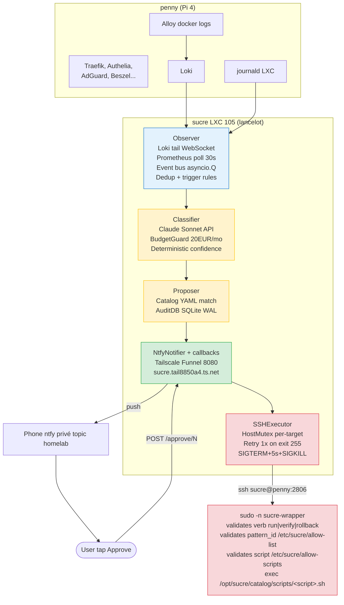

# sucre — SRE perso

:::note[Renommage 2026-07-06]
Anciennement **fish**. Renommé **sucre** le 2026-07-06 — le nom « Fish » est réservé au futur assistant général du homelab. Toutes les références (user SSH, services systemd, chemins, labels Loki, node Tailscale) ont été migrées.
:::

> **Intelligence calme, observé, exécuté, repare.**

`sucre` est l'assistant SRE perso du homelab. Un bot qui surveillé les logs/metriques,
reconnait les incidents connus, propose un fix par notification, et exécuté
après approbation humaine. Nomme d'après Scofield (Prison Break).

:::danger[Arrêté et désactivé depuis le 2026-08-25]
`sucre.service` ne tourne plus. La détection est passée à **Pulse Patrol**
(LXC 106 sur galahad). Le LXC 105 et sa base `audit.db` sont conservés, rien
n'a été supprimé : `systemctl enable --now sucre` et décommenter la ligne
`check_sucre_service` de `homelab_monitor.sh` suffisent à revenir en arrière.

Tout ce qui suit décrit l'architecture telle qu'elle a été livrée. Le bilan
chiffré et les raisons de l'arrêt sont dans la section
[Bilan et arrêt](#bilan-et-arrêt) en fin de page.
:::

## État à la livraison (2026-04-20)

**MVP livre et prouvé en production.** Premier cycle end-to-end valide :

- 🔔 iPhone buzz → **Approve** tap
- ⏱ **3 secondes** plus tard sucre a repare homepage via SSH
- 📊 AuditDB SQLite log propre : classifier + proposal + exécution

**15 commits** sur `homelab-config/sucre/` ce jour, **163 tests verts**, 0 regression.

## Architecture

## Stack technique

- **Langage** : Python 3.14, `uv`-managed, async/await throughout
- **LLM** : Claude Sonnet 4.6 via API (wrappable vers Ollama local futur)
- **DB** : SQLite WAL mode + FK enforced, via `aiosqlite`
- **Notifier** : ntfy self-hosté privé (topic `homelab`, token write-only dédié, URL tailnet `penny.tail8850a4.ts.net` — migré de ntfy.sh public le 2026-06-11) + Tailscale pour callbacks
- **Exec** : SSH forced-command + `sudo` + wrapper validator + sudoers restreint
- **Runtime** : LXC 105 unprivileged sur lancelot, Debian 13, systemd, sops-sealed secrets

## Composants

### Observer
Tail Loki (WebSocket `/loki/api/v1/tail`) + poll Prometheus (30s) + event bus
asyncio avec dedup LRU (10 000 event_ids) et trigger rules fenêtre-glissante.

### Classifier
Wrapper `LLMProvider` abstrait. Implémentation Claude : POST /v1/messages,
retry fallback Opus si JSON malforme, `BudgetGuard` SQLite track cout
mensuel EUR (pricing Sonnet $3/$15 Mtok). **Confidence deterministe** =
`len(match_signals) / len(pattern.required_signals)`, pas de LLM self-report.

### Catalog
YAML schema pydantic, 6 patterns (5 seed depuis les mémoires d'incidents + 1 drafté par sucre) :
- `beszel-oidc-reset` — PocketBase resetting `meta.appURL` post-restart
- `docker-compose-stopped-post-reboot` — `unless-stopped` ne restart pas après `docker compose down`+reboot
- `pmxcfs-ro-post-recovery` — `/etc/pve` RO après recovery corosync (fix : restart pve-cluster)
- `dockerd-sigbus-loop` — log-driver journald SIGBUS sur ARM (fix : swap vers json-file)
- `apt-security-updates-pending` — apt upgrades non appliques
- `adguard-desync` — secondaire DNS desync du primaire (fix : `/root/adguard-sync.sh`) — drafté par sucre, mergé 2026-06-25

Chaque pattern déclaré : required_signals, target_host, fix_script,
timeout_s, verify_script, on_failure (rollback ou escalate),
`promote_to_autoexec_after` (null = approbation manuelle perpetuelle).

### Drafter (auto-proposition de patterns, W5)
Quand un incident ne matche AUCUN pattern, sucre peut **drafter** un nouveau pattern via LLM et l'ouvrir en **PR** sur `homelab-config` (jamais auto-merge — review humaine obligatoire des scripts fix/verify). Garde-fous (durcis 2026-06-25, issue #26) :

- **Dédup open-PR** — pas de re-draft tant qu'une PR sucre est ouverte pour la même `incident_key` (sans fenêtre temporelle).
- **Skip services auto-restart** — pas de pattern "restart X" pour un service à `Restart=always` (ex `alloy.service`, déjà couvert par systemd).
- **Pré-filtre anti-bruit** — lignes bénignes connues (stats HAProxy, warnings dnsproxy…) écartées avant tout appel LLM.
- **`promote_to_autoexec_after` forcé à `null`** — un draft ne s'auto-promeut jamais en auto-exec.

### Proposer
Orchestre le cycle observé → classify → propose → wait approval → exec.
Decouple `proposal.status` (decision humaine) de `execution.status`
(résultat technique). Dry-run mode pour valider avant premier exec reel.

### NtfyNotifier
POST ntfy privé (Bearer token) avec `X-Actions` Approve/Deny. Callbacks recus via
Tailscale Funnel → sucre aiohttp :8080. Confirmation buzz après 1er click
pour feedback visuel. Re-clicks gated (handler 200 "already decided").

### SSHExecutor
Acquire mutex → audit start → ssh fix → ssh verify → rollback/escalate
sur fail → audit finish → release mutex. Timeout SIGTERM+5s+SIGKILL.
Retry 1x sur exit 255 (ssh connection error). shlex.quote partout,
jamais `shell=True`.

### AuditDB
5 tables : `incidents`, `proposals`, `action_locks`, `executions`,
`notif_sent` + `llm_usage` (owned by BudgetGuard). PRAGMA `foreign_keys=ON`
enforced via `AuditDB.connect()` helper. stdout/stderr truncated 64 KiB.

## Sécurité (Option B)

Architecture choisie via `/plan-eng-review` 2026-04-20 :

- User dedie **`sucre`** sur chaque host cible (séparation bot/humain → audit propre)
- SSH via port **2806** real sshd, pas Tailscale SSH (évite bypass transparent)
- Key `sucre-to-penny` en `authorized_keys` avec `command="sudo -n /usr/local/bin/sucre-wrapper"` + `from="192.168.1.0/24,100.64.0.0/10"` + no-port-forwarding
- Sudoers : `sucre ALL=(root) NOPASSWD: /usr/local/bin/sucre-wrapper` uniquement
- Wrapper = security boundary : verbe + pattern_id + script dans allow-lists sinon deny + log syslog
- **Blast radius** : attacker sur sucre LXC peut exec uniquement les scripts du catalog. Catalog git-tracke.

## Cout

**Claude API Sonnet 4.6** = ~0.005-0.007€ par event classifie.
Avec le filtre `detected_level=~"error|warn|warning|critical|fatal"` + deny
`fail2ban|monitor` (bruit), homelab reel produit **~1-5€/mois**. BudgetGuard hard-stop
20€/mois par sécurité. 4.6€ depenses pendant tout le développement.

## Design decisions

- **Claude API first, Ollama swap plus tard** : `LLMProvider` abstract permet swap quand Minisforum "luther" arrivera.
- **Catalog-gated exec (jamais improvise)** : LLM produit un `pattern_id` OU `UNKNOWN_INCIDENT`, executor prend le script depuis catalog. Zero remote code exec du LLM.
- **Approval humain obligatoire par defaut** : `promote_to_autoexec_after: 3` permet plus tard auto-exec après N successes, mais chaque pattern decide.
- **FK enforced partout** : attrape les bugs d'ordre d'insertion en dev (CEO review catch), pas en prod.
- **Rate limiter per (host, service)** : empeche un flood de logs de brûler le budget Claude.
- **Tailscale Funnel pour callbacks** : callback URL public HTTPS sans Cloudflare Tunnel + sans port forward box.

## Incident bundle UNKNOWN_INCIDENT

Quand aucun pattern match, sucre ne dit pas juste "je sais pas". Workflow :

1. Bundle complet sauvegarde dans `/var/lib/sucre/incidents/{event_id}.json` (logs + metriques + docker state + classification reasoning)
2. Notification ntfy discrete "UNKNOWN sur {host}, bundle at X"
3. Gabin lit le bundle, ecrit manuellement un pattern YAML dans `homelab-config/sucre/catalog/`, push
4. Sucre hot-reload (SIGHUP) → pattern disponible pour prochains incidents similaires

C'est le **compound mechanism** : chaque incident novel ajoute un pattern. Catalog grandit avec l'exploitation reelle.

## Roadmap

### v1 (livre 2026-04-20)
- [x] Observer pipeline (Loki + Prom + event bus)
- [x] Classifier Claude + BudgetGuard
- [x] Catalog 5 patterns seed
- [x] AuditDB SQLite + FK
- [x] HostMutex per-target
- [x] NtfyNotifier + callback server
- [x] SSHExecutor + wrapper + sudoers
- [x] Premier exec live sur penny (homepage restart en 3s)
- [x] Phone→click→auto-exec full loop

### v1.5 (livre 2026-05-04)
- [x] sucre main wire vers vrais incidents observer — Step B `homelab_monitor` push to Loki (commit `2dad768`)
- [x] Sops-seal la clé SSH sucre-to-penny — sealed dans `/etc/sucre/ssh_keys/sucre-to-penny.enc`, plaintext shred 2026-05-04
- [x] systemd sucre.service survive reboot LXC — `sucre-unseal.service` + `sucre.service` enabled
- [ ] Replicate Option B sur galahad + lancelot — bloque par soak sucre week 8 reeval
- [ ] Grafana dashboard "sucre activity" — proposals/jour, approval rate, success rate, cost/mois
- [x] Alertmanager route "sucre down" → ntfy direct — canary Tailscale dans `homelab_monitor.check_sucre_service`, commit `fb56f53`

### v2 — W5 UNKNOWN_INCIDENT auto-drafter (livre 2026-04-30)
- [x] UNKNOWN_INCIDENT auto-draft pattern YAML — drafter shipped, dedup 7j, race-protected, failed-block actif
- [x] Step A : promote_to_autoexec_after 1 sur `docker-compose-stopped-post-reboot` (commit `2dad768`) — premier vrai pattern auto-exec en prod
- [ ] Ollama local quand Minisforum "luther" arrive — backup LLM si budget Claude API explose
- [ ] Home Assistant intégration (voice : "sucre, repare le homelab")
- [ ] Scribe mode : observé shell history → propose auto-runbooks

### v3 — après soak semaine 8 (mi-juin 2026), decision data-driven
- [ ] Multi-step reasoning (chain de patterns A→B fallback)
- [ ] Learning loop sur outcomes (auto-promote pattern après N successes)
- [ ] Dynamic args choice (LLM decide args fix script vs hardcode YAML)
- [ ] Pivot Hybrid si signal/noise <50% (Alertmanager + scripts + LLM réservé UNKNOWN)

## Repo

- Code : `homelab-config/sucre/` (prive)
- Design doc complet : `~/.gstack/projects/GabinSMD-homelab-doc/root-main-design-sucre-*.md`
- Deploy artifacts : `homelab-config/sucre/deploy/` (systemd units, wrapper, sudoers template)

## Bilan et arrêt

Mesuré sur `audit.db`, du 2026-04-30 au 2026-08-25 — quatre mois de production.

| Ce qui a été mesuré | Valeur |
|---|---|
| Incidents observés | 4 795 |
| Appels au modèle | 4 936 |
| Coût | **29,70 €** |
| Exécutions réelles | **0** |
| Propositions sans fiche (`no_match` / `UNKNOWN_INCIDENT`) | 4 768 sur 4 881 |
| Part du budget dépensée sur ces propositions | **94 %**, soit 27,88 € |

Les 113 vrais appariements — 84 `docker-compose-stopped-post-reboot`, 23
`traefik-docker-provider-eof`, 5 `adguard-desync`, 1 `pmxcfs-ro-post-recovery` —
sont tous restés en `dry_run`.

### Pourquoi c'est arrêté

Deux défauts séparables, aucun des deux lié à l'idée elle-même.

Le **coût** est un mauvais ordre d'opérations : le filtrage par catalogue devait
précéder l'appel au modèle, pas le suivre. La **valeur nulle** est un frein qu'on
n'a jamais relâché — le `dry_run` n'a jamais été levé.

Mais ce qui tranche n'est ni l'un ni l'autre. C'est que les pannes qui ont
réellement coûté cher dans ce homelab sont des **sauvegardes muettes, des
défauts de fraîcheur et des dérives de configuration** — et que sucre, déclenché
par les logs, ne pouvait structurellement pas les voir. Un observateur de logs ne
détecte pas une absence.

### Ce que l'arrêt a laissé derrière lui

Trois témoins surveillaient sucre. Les couper fait partie de l'arrêt, et l'un des
trois a résisté.

La sonde `check_sucre_service` de `homelab_monitor.sh` avait déjà envoyé un
« sucre DOWN » sur un arrêt volontaire avant d'être neutralisée le jour même.

Les deux règles Grafana `alert-sucre-llm-unavailable` et `alert-host-sucre-silent`
ont été retirées de `rules.yml`… sans disparaître. **Le provisioning Grafana ne
supprime jamais une règle absente du fichier** : il faut la nommer dans un bloc
`deleteRules`. Elles ont donc continué de s'évaluer, et
`alert-host-sucre-silent` — un dead-man-switch sur un service volontairement mort
— a envoyé **38 notifications en 24 heures, 60 % du trafic du topic ntfy**, avant
d'être vraiment supprimée le 2026-08-26. La recette est dans
[Grafana → retirer une règle d'alerte](../services/grafana.md#retirer-une-règle-dalerte).

Détail qui explique le battement : Alloy tournait encore dans le LXC 105, donc des
logs sporadiques frôlaient le seuil dans les deux sens. Un dead-man-switch sur une
machine allumée mais vidée de son service ne reste pas allumé, **il clignote** —
et chaque transition est une notification.

### Le remplaçant coûte plus cher que l'original

Mesuré sur `/opt/pulse/data/ai_usage_history.json`, sur les 17 heures qui ont
suivi l'activation de l'IA de Pulse le 2026-08-25 à 15h43.

| Usage | Appels | Coût |
|---|---|---|
| `discovery` | 147 | 4,38 $ |
| `patrol` | 5 | 1,92 $ |
| **Total** | **152** | **6,30 $** |

475 000 tokens d'entrée et 157 000 de sortie, intégralement en `claude-opus-5`
(5 $ / 25 $ le million). Au rythme observé : **~8,80 $/jour, ~265 $/mois**.

sucre a été arrêté pour 29,70 € sur quatre mois, soit ~7,40 €/mois. Patrol tourne
à environ **trente-cinq fois ce montant, par mois**, et 70 % part dans
`discovery` — un scan récurrent toutes les six heures — et non dans la détection
de pannes. Le remplaçant reproduit le défaut exact de l'original, appeler le
modèle avant tout filtrage, à plus grande échelle.

:::warning[BYOK ne veut pas dire gratuit]
Patrol en « Watch only » est présenté comme sans frais parce qu'il utilise ta
propre clé Anthropic. C'est ta facture, pas celle de l'éditeur. Le premier levier
est de couper ou d'espacer `discovery` (`discoveryEnabled` dans
`/opt/pulse/data/system.json`), pas de toucher à `patrol`.
:::

Une réserve sur ces chiffres : ils couvrent la première journée après activation
et n'ont pas été recoupés avec la facturation Anthropic. À revérifier avant toute
décision.
