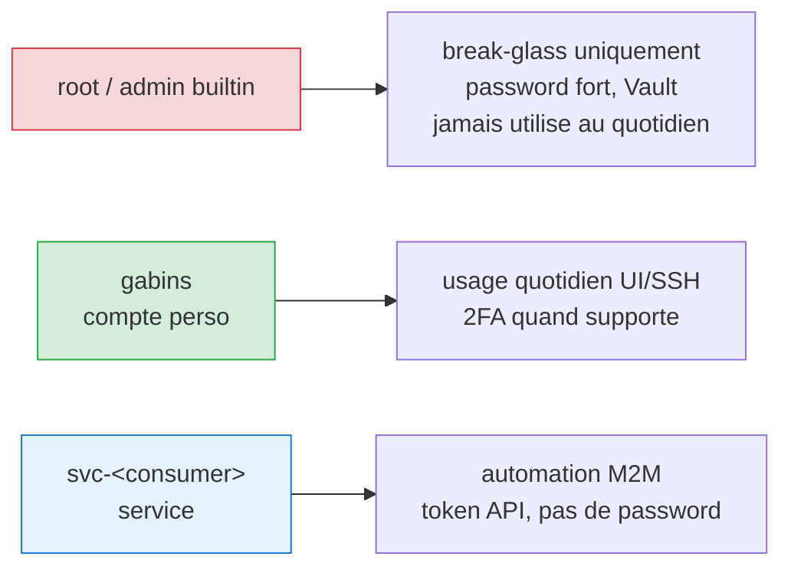

# Convention comptes et service accounts

Standards de création, naming et gestion des comptes pour chaque couche du homelab.

Pour la politique credentials (mots de passe, rotation, stockage) : [politique.md](politique.md).
Pour le hardening technique par host : [hardening.md](hardening.md).

---

## Principe général

Chaque service a **3 niveaux d'acces** :



**Règle d'or** : si un humain se connecte, c'est `gabins`. Si une machine se connecte, c'est `svc-<consumer>`. Root ne sert qu'en urgence.

---

## Matrice par type de système

### Machines physiques (penny, galahad, lancelot)

| Compte | Naming | Auth | Usage |
|--------|--------|------|-------|
| root (OS) | `root` | Password fort (Vault) + SSH interdit (`PermitRootLogin no`) | Break-glass via console physique ou `sudo -i` |
| Admin perso | `gabins` | Clé SSH Ed25519 + sudo NOPASSWD | Quotidien SSH, administration |
| Service | N/A | Pas de service account OS — les services tournent en containers | — |

**SSH** : port custom (2806/2807/2808), clé uniquement, `MaxAuthTries 3`.
**Root SSH** : toujours `no`. Acces root = `ssh gabins@host` puis `sudo -i`.
**Tailscale SSH** : mode `check` (MFA navigateur) quand activé.

### Proxmox VE (galahad, lancelot)

| Compte | Naming | Auth | Usage |
|--------|--------|------|-------|
| root@pam | `root@pam` | Password fort (Vault) | Break-glass, opérations cluster (pvecm) |
| Admin perso | `gabins@authelia` | OIDC Authelia (two_factor) | Quotidien UI PVE |
| Service Homepage | `homepage@pve!homepage` | Token API (PVEAuditor) | Widget Homepage |
| Service futur | `svc-<consumer>@pve!<tokenname>` | Token API (rôle minimum) | Automation |

**root@pam** : inevitable sur Proxmox (opérations cluster, API interne). Garder actif, password fort, ne jamais l'utiliser pour le login UI quotidien.
**Realm** : `@authelia` pour humains (OIDC SSO), `@pve` pour service accounts (tokens API natifs).

### Authelia (SSO / IdP)

| Compte | Naming | Auth | Usage |
|--------|--------|------|-------|
| Admin/user | `gabins` | Password Argon2id + TOTP + WebAuthn FIDO2 | Source de vérité auth |
| Clients OIDC | `client_id: <service>` | Client secret (PBKDF2 hash dans config, plain dans Vault) | SSO pour Proxmox, Portainer, Grafana, Beszel |

**Pas de root** : Authelia n'a pas de concept root. `gabins` est le seul user, protégé par 2FA.
**Pas de service account** : les clients OIDC sont des "applications", pas des users.

### Proxmox Backup Server (LXC 103)

| Compte | Naming | Auth | Usage |
|--------|--------|------|-------|
| root@pam | `root@pam` | Password fort (Vault) | Break-glass |
| Admin perso | `gabins@pbs` | Password + TOTP | Quotidien UI PBS |
| Service PVE backup | `svc-pve-backup@pbs!pve` | Token API (DatastorePowerUser) | PVE Datacenter → PBS |
| Service futur | `svc-<consumer>@pbs!<tokenname>` | Token API (rôle minimum) | Automation future |

**Realm** : `@pbs` pour tout (realm interne PBS, pas PAM). Évite de créer des users Linux inutiles.
**root@pam** : garder actif (requis pour certaines opérations CLI `proxmox-backup-manager`).

### Containers Docker (penny)

| Compte | Naming | Auth | Usage |
|--------|--------|------|-------|
| Service inter-container | N/A | Pas de comptes — Docker socket-proxy limité l'API | — |
| Portainer admin | `gabins` | OIDC Authelia (fallback: password local Vault) | UI Portainer |
| Portainer service | N/A | Token API Portainer si besoin automation | — |

**Docker n'a pas de comptes** : l'isolation est au niveau réseau (bridge `proxy` / `socket`) + capabilities (`cap_drop: ALL`).
**Portainer** : admin via OIDC Authelia. Le compte local `gabins` est un break-glass si Authelia tombe.

### LXC applicatifs (dns-failover, vault, logs)

| Compte | Naming | Auth | Usage |
|--------|--------|------|-------|
| root (LXC) | `root` | Password fort (Vault) ou login désactivé | `pct enter` depuis l'hyperviseur |
| Admin perso | `gabins` | Clé SSH Ed25519 | SSH direct si besoin debug |
| Service app | Dépend de l'app | — | — |

**Unprivileged** : toujours sauf contrainte technique (cf. PBS LXC 103 si le bug tar persiste).
**SSH dans les LXC** : optionnel. `pct enter` depuis l'hyperviseur est souvent suffisant. SSH direct utile pour penny → LXC (scripts backup, monitoring).

### Services web (Grafana, Beszel, AdGuard)

| Service | Admin perso | Service account | Break-glass |
|---------|-------------|-----------------|-------------|
| Grafana | `gabins@authelia` (OIDC, GrafanaAdmin) | N/A | Admin désactivé en DB (volontaire) |
| Beszel | `gabins@authelia` (OIDC, one_factor) | N/A | Superuser `/_/` (PocketBase) |
| AdGuard | `gabins` (ForwardAuth Authelia) | N/A | bcrypt local `gabins` |
| Homepage | ForwardAuth Authelia (transparent) | Tokens API (PVE, Beszel, AdGuard) dans `.env` | N/A |
| Vaultwarden | Master password + TOTP | N/A | Hors Authelia (pas de dépendance circulaire) |

---

## Convention de naming

### Comptes humains

```text
<prenom><initiale_nom>
```

Exemple : `gabins` (Gabin S.)

- Un seul compte humain par personne, partout
- Jamais `admin`, `pi`, `user` → cibles de brute-force
- Même login sur toutes les couches (SSH, Proxmox, Authelia, PBS, Grafana)

### Service accounts

```text
svc-<consumer>-<function>@<realm>
```

Exemples :
- `svc-pve-backup@pbs` → PVE qui backup vers PBS
- `svc-homepage@pve` → Homepage qui lit l'API PVE (actuel : `homepage@pve`, a migrer)
- `svc-grafana-oidc` → client OIDC Grafana dans Authelia

**Consumer** = le service qui UTILISÉ le compte (pas le service qui l'HEBERGE).
**Function** = ce qu'il fait (`backup`, `monitor`, `read`, `push`).
**Realm** = scope d'auth (`@pbs`, `@pve`, `@pam`).

### Tokens API

```text
<user>!<tokenname>
```

Exemples :
- `svc-pve-backup@pbs!pve` → token `pve` du service account `svc-pve-backup@pbs`
- `homepage@pve!homepage` → token `homepage` du user `homepage@pve`

**Tokenname** = court, decrit l'usage ou le consumer.
Un user peut avoir **plusieurs tokens** (un par consumer différent, ou un par environnement).

### Clients OIDC (Authelia)

```text
client_id: <service-name>
```

Exemples : `proxmox`, `portainer`, `grafana`, `beszel`

Pas de prefix `svc-` : les clients OIDC ne sont pas des "users" mais des "applications" dans le modèle Authelia.

---

## Quand créer quoi — arbre de decision

```mermaid
flowchart TD
    Start([Nouveau service<br/>a integrer ?])

    Start --> Q1{Humain se connecte<br/>a l'UI/SSH ?}
    Q1 -->|Oui| H[Utiliser le compte<br/>'gabins' existant]
    H --> H1{OIDC ?}
    H1 -->|Oui| HO[Configurer client Authelia]
    H1 -->|ForwardAuth| HF[Middleware Authelia devant]
    H1 -->|Sinon| HP[Password local fort Vault<br/>+ TOTP si supporte]

    Q1 -->|Non| Q2{Machine/service<br/>vers autre service ?}
    Q2 -->|Oui| M["Creer service account<br/>svc-&lt;consumer&gt;-&lt;function&gt;@&lt;realm&gt;"]
    M --> M1{Capacités ?}
    M1 -->|Token API| MT[Generer token<br/>pas password]
    M1 -->|OIDC client| MO[Client Authelia]
    M1 -->|Sinon| MP[Password de service<br/>.env Vault]

    Q2 -->|Non| Q3{Break-glass<br/>requis ?}
    Q3 -->|Service critique| BC[root/@pam actif<br/>password fort Vault<br/>OBLIGATOIRE]
    Q3 -->|Non-critique| BN[Optionnel]

    Q3 -->|Aucun| End[Pas de compte a creer<br/>Isolation reseau suffit]

    style Start fill:#e3f2fd,stroke:#1976d2
    style H fill:#d4edda,stroke:#28a745
    style M fill:#fff3cd,stroke:#ffc107
    style BC fill:#f8d7da,stroke:#dc3545
    style End fill:#e2e3e5,stroke:#6c757d
```

---

## Stockage dans Vaultwarden — convention

Chaque secret = **1 item Login** dans Vaultwarden avec :

| Field standard | Contenu |
|----------------|---------|
| Name | `<Service> — <user> (<role/usage>)` |
| URI | URL du service |
| Username | Login complet (`svc-pve-backup@pbs!pve`) |
| Password | Password ou token value |
| Folder | `Homelab/<categorie>` |

| Custom field | Contenu |
|-------------|---------|
| Type | `API Token`, `OIDC Client`, `User Password`, `SSH Key` |
| Scope | Rôle + path (`DatastorePowerUser on /datastore/main`) |
| Used by | Service consumer (`PVE Datacenter Storage 'pbs'`) |
| Created | Date ISO (`2026-04-15`) |
| Rotation | Période (`12 months`) |
| Next rotation | Date ISO (`2027-04-15`) |

**Folders Vaultwarden** :

```text
Homelab/
├── Authelia/
│   ├── OIDC/          → client secrets (proxmox, portainer, grafana, beszel)
│   └── Internals/     → jwt, session, storage, hmac secrets
├── OS-Infra/
│   ├── SSH/           → cles SSH par machine
│   ├── Backup/        → PBS tokens, restic passwords, B2 credentials
│   └── Break-glass/   → root@pam passwords (urgence)
└── Externals/         → Cloudflare, Tailscale, B2, ntfy
```

---

## Rotation

| Type | Période | Procédure |
|------|---------|-----------|
| Passwords humains | A la compromission | Changer + update Vault |
| Tokens API | 12 mois max | Delete token + regenerate + update consumer + update Vault |
| Clients OIDC | 12 mois max | `openssl rand -hex 32` + hash pbkdf2 + update Authelia + update service + update Vault |
| SSH keys | Par appareil, a la compromission | `ssh-keygen` + deploy + revoke ancienne |
| Break-glass (root) | 24 mois max | `passwd` + update Vault |

---

## Voir aussi

- [Politique credentials](politique.md) — modèle de menace, mots de passe, inventaire secrets
- [Hardening](hardening.md) — mesures techniques par couche
- [Break-glass](../operations/break-glass.md) — procédure de reconstruction d'urgence
