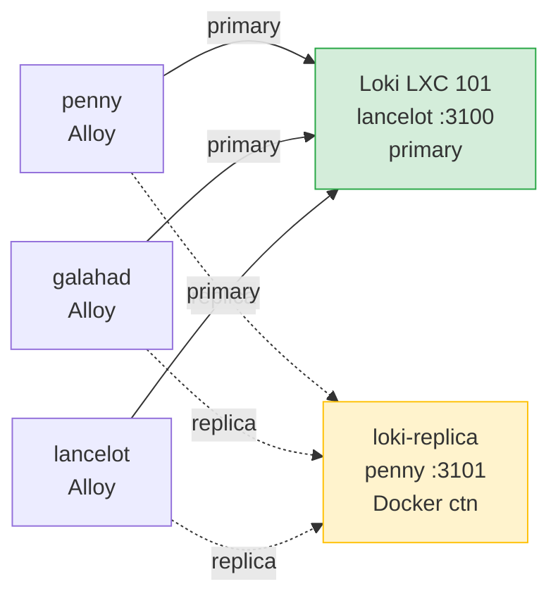

# Alloy + Loki — log shipping HA

Pipeline observability : les 3 hosts shipent leurs logs (journald + docker + fichiers) vers **deux** instances Loki, pour survivre a la perte d'une.

## Architecture



**Depuis 2026-04-19** : galahad + lancelot ecrivent aussi vers la replica (avant, seul penny le faisait).

## Hosts avec Alloy

| Host | Paquet | Config | Sources collectees |
|------|--------|--------|-------------------|
| penny | `alloy` apt | `/etc/alloy/config.alloy` | journald + docker sockets + Traefik access.log + autres fichiers |
| galahad | `alloy` apt | `/etc/alloy/config.alloy` | journald + auditd (si present) |
| lancelot | `alloy` apt | `/etc/alloy/config.alloy` | journald + auditd (si present) |

**LXC 100/102/103** : pas d'Alloy. Logs uniquement locaux, perdus si le LXC meurt (avant restauration). Trade-off accepte : vault a son backup restic, PBS ne log pas grand chose, dns-failover pareil.

## Loki instances

| Instance | Host | Rôle | Retention |
|----------|------|------|-----------|
| primary | LXC 101 sur lancelot, port 3100 | Canonical, scrape par Grafana | 30 jours |
| replica | container `loki-replica` sur penny, port 3101 | Backup / query si primary KO | 30 jours |

Replica tourne dans le stack Docker penny (compose : `loki-replica` service). Image pinnee `grafana/loki:latest@sha256:73e905...`.

## Pattern dual-write

Chaque Alloy host definit 2 sinks + forward a chaque source :

```alloy
loki.write "default" {
  endpoint { url = "http://192.168.1.31:3100/loki/api/v1/push" }
  external_labels = { host = "<hostname>" }
}

loki.write "replica" {
  endpoint { url = "http://192.168.1.28:3101/loki/api/v1/push" }
  external_labels = { host = "<hostname>" }
}

loki.source.journal "system" {
  forward_to = [loki.write.default.receiver, loki.write.replica.receiver]
  ...
}
```

Alloy a un WAL interne : si un Loki est down, les chunks sont bufferises localement et rejoues au retour.

## Vérification

### Labels recus par chaque Loki

```bash
# primary
curl -sG http://192.168.1.31:3100/loki/api/v1/label/host/values
# {"status":"success","data":["galahad","lancelot","penny"]}

# replica
curl -sG http://192.168.1.28:3101/loki/api/v1/label/host/values
# {"status":"success","data":["galahad","lancelot","penny"]}
```

Les deux doivent montrer les 3 hosts.

### Alloy service actif

```bash
systemctl is-active alloy   # sur chaque host
# active
```

## DR : re-provisioning d'un host

Configs Alloy versionnees dans `homelab-config/system/alloy/<host>.alloy`.

```bash
# Sur un host reinstalle
apt install -y alloy
cp <host>.alloy /etc/alloy/config.alloy
systemctl enable --now alloy
```

## Impact fix Docker log-driver (2026-04-19)

Docker penny est passe de `journald` a `json-file` log-driver (cf `operations/depannage.md` section "Docker daemon crash loop"). Consequence : **avant**, docker logs arrivaient via journald → Alloy les captait via `loki.source.journal`. **Après**, docker logs sont dans `/var/lib/docker/containers/*/*-json.log` — Alloy a une source `loki.source.docker` qui lit via socket Docker API, fonctionne idem.

Les logs pre-switch (avant 2026-04-19 17:17) sont dans journald encore, queryables avec filter `unit="docker.service"` OU `CONTAINER_NAME=...` (Docker les taguait).

## Dashboards Grafana

4 dashboards CrowdSec + `Homelab Overview` + `Auth & Securite` + `Traefik Access` + `Logs Explorer` provisionnes via `logs/grafana-provisioning/dashboards/` (LXC 101). Acces : `logs.home.gabin-simond.fr` (Authelia OIDC GrafanaAdmin).

## Alerting Grafana

Contact point ntfy configuré. Règles :
- Authelia auth failures
- fail2ban bans
- Traefik 5xx rate
- auditd sudo events

Topic ntfy hex 32 chars (`ae8fcbd...`), partagé avec `homelab_monitor.sh` (même canal, categories distinctes par title).
