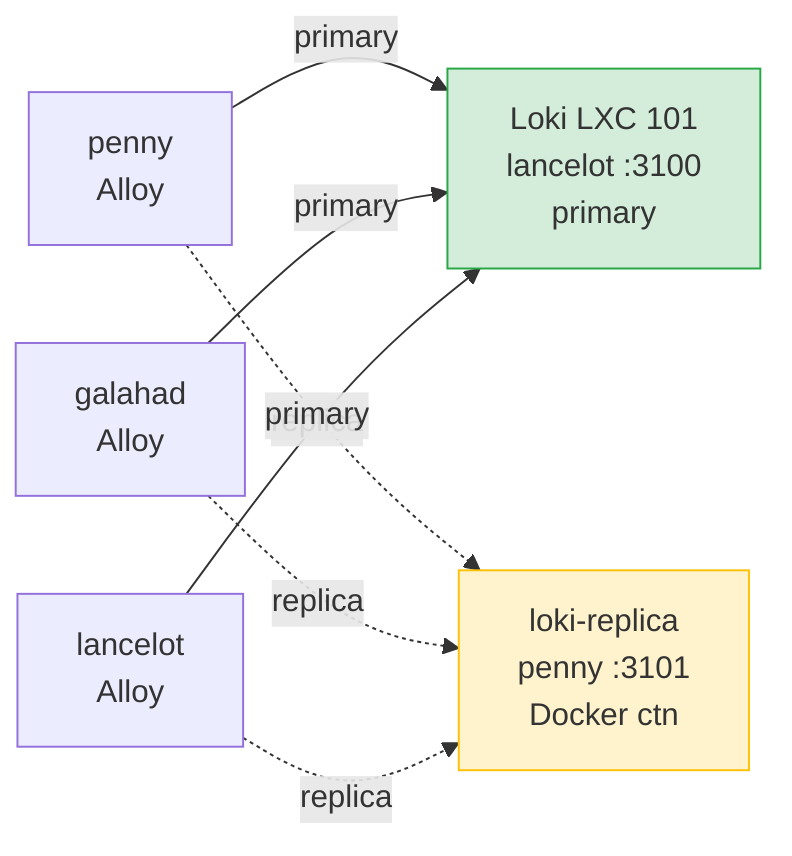

# Alloy + Loki — log shipping HA

Pipeline observability : les 3 hosts shipent leurs logs (journald + docker + fichiers) vers **deux** instances Loki, pour survivre a la perte d'une.

## Architecture


```mermaid
flowchart LR
    P[penny<br/>Alloy]
    G[galahad<br/>Alloy]
    L[lancelot<br/>Alloy]

    LP[Loki LXC 101<br/>lancelot :3100<br/>primary]
    LR[loki-replica<br/>penny :3101<br/>Docker ctn]

    P -->|primary| LP
    P -.replica.-> LR
    G -->|primary| LP
    G -.replica.-> LR
    L -->|primary| LP
    L -.replica.-> LR

    style LP fill:#d4edda,stroke:#28a745
    style LR fill:#fff3cd,stroke:#ffc107
```

**Depuis 2026-04-19** : galahad + lancelot ecrivent aussi vers la replica (avant, seul penny le faisait).

## Hosts avec Alloy

| Host | Paquet | Config | Sources collectees |
|------|--------|--------|-------------------|
| penny | `alloy` apt | `/etc/alloy/config.alloy` | journald + docker sockets + Traefik access.log + autres fichiers |
| galahad | `alloy` apt | `/etc/alloy/config.alloy` | journald + auditd (si présent) |
| lancelot | `alloy` apt | `/etc/alloy/config.alloy` | journald + auditd (si présent) |

### Les dix LXC, depuis le 2026-09-02

| LXC | Hôte | Sources |
|---|---|---|
| 100 dns-failover | galahad | journald |
| 101 logs | lancelot | journald + Docker (sauf le conteneur `loki`) |
| 102 vault | galahad | journald + Docker (`vaultwarden`) |
| 103 pbs | lancelot | journald |
| 104 zomboid | galahad | journald |
| 105 sucre | lancelot | journald (antérieur) |
| 106 pulse | galahad | journald + Docker (`pulse`, filtré) |
| 107 waterline | galahad | journald |
| 108 ci-runner | lancelot | journald seulement |
| 109 finance | galahad | journald + Docker (ajouté le 2026-08-24) |

:::note[Cette page disait le contraire jusqu'au 2026-09-02 — voici pourquoi il a changé]
La version précédente actait : « LXC 100/102/103 : pas d'Alloy. Trade-off
accepté : vault a son backup restic, PBS ne log pas grand chose, dns-failover
pareil. » Le compromis a été renversé, sur trois constats.

**Un backup n'est pas une observation.** Restic protège les *données* de
Vaultwarden. Il ne dit rien d'une série de tentatives d'authentification, d'un
redémarrage en boucle ni d'une erreur de déchiffrement — et c'est le coffre à
mots de passe.

**« PBS ne log pas grand chose » a été démenti.** Le 2026-07-06, `rpc.nfsd` a
rendu ENOMEM en silence dans le LXC 103, le montage NFS est resté pendu et le
proxy PBS est parti en D-state. Tout cela s'est écrit dans un journal que
personne ne pouvait lire à distance. Même histoire pour Pulse, mort 3 jours et
demi sans témoin.

**Le seul invité observé était le seul à l'arrêt.** Avant la bascule, Loki
voyait 5 sources sur 13, et la seule LXC qui expédiait en plus de finance était
`sucre` — dont le service est arrêté depuis le 2026-08-25.

Le coût réel s'est avéré être le volume, pas le principe : un seul conteneur
(`pulse`) produisait à lui seul plus de lignes que les trois hôtes réunis. La
réponse est le filtrage par niveau, pas le renoncement à la source. Pour
revenir en arrière sur un invité : `pct exec <id> -- systemctl disable --now
alloy`.
:::

### Ce qui n'est délibérément pas collecté

| Source | Pourquoi |
|---|---|
| conteneurs de job du `ci-runner` | un conteneur éphémère par job de CI : les collecter noierait Loki à chaque push, et les logs de job sont déjà dans Forgejo. Seul le runner lui-même est suivi — enregistrement perdu, jeton refusé, service mort. |
| conteneur `loki` du LXC 101 | Loki journalise ses push refusés. Lui renvoyer ces lignes lui en fait écrire d'autres : une erreur passagère s'auto-alimenterait. Le journald du LXC garde la trace côté systemd. |
| `level=info` de `pulse` | mesuré le 2026-09-02 : 61 lignes/minute, ~88 000/jour pour ce seul conteneur — « Starting background polling », « No alerts needed cleanup ». `warn` et au-delà passent. |
| `Temperature collection using direct SSH` de `pulse` | un avertissement d'état répété 12 fois par minute, jamais actionnable. Après ces deux filtres : de 61 à environ 5 lignes/minute. |

## Loki instances

| Instance | Host | Rôle | Retention |
|----------|------|------|-----------|
| primary | LXC 101 sur lancelot, port 3100 | Canonical, scrape par Grafana | 30 jours |
| replica | container `loki-replica` sur penny, port 3101 | Backup / query si primary KO | 30 jours |

Replica tourne dans le stack Docker penny (compose : `loki-replica` service). Image pinnee `grafana/loki:latest@sha256:73e905...`.

## Pattern dual-write

Chaque Alloy host definit 2 sinks + forward a chaque source :

```alloy
loki.write "default" {
  endpoint { url = "http://192.168.1.31:3100/loki/api/v1/push" }
  external_labels = { host = "<hostname>" }
}

loki.write "replica" {
  endpoint { url = "http://192.168.1.28:3101/loki/api/v1/push" }
  external_labels = { host = "<hostname>" }
}

loki.source.journal "system" {
  // penny uniquement : journald est en Storage=volatile (RAM), Alloy doit lire
  // /run/log/journal et PAS /var/log/journal (tronque par dietpi-logclear -> SIGBUS).
  path       = "/run/log/journal"
  forward_to = [loki.write.default.receiver, loki.write.replica.receiver]
  ...
}
```

:::warning[penny : journal en RAM (volatile)]
Sur penny (DietPi RAMlog), journald est en `Storage=volatile` et Alloy lit `/run/log/journal` via `path`. Sans ca, `dietpi-logclear` tronque le `system.journal` mmap'd a chaque :17 → SIGBUS d'Alloy. Detail : `operations/depannage.md` → "Alloy crashe a chaque :17" et `projet/decisions.md` → "Journald penny : volatile". galahad/lancelot gardent le journald par defaut.
:::

Alloy a un WAL interne : si un Loki est down, les chunks sont bufferises localement et rejoues au retour.

## Vérification

### Labels recus par chaque Loki

```bash
# primary
curl -sG http://192.168.1.31:3100/loki/api/v1/label/host/values
# replica
curl -sG http://192.168.1.28:3101/loki/api/v1/label/host/values
```

Les deux doivent montrer **13 sources** : les 3 hôtes et les 10 LXC.

Un label présent ne prouve pourtant rien sur le présent — il survit à la
rétention. Ce qui compte est le débit :

```bash
curl -sG http://192.168.1.28:3101/loki/api/v1/query \
  --data-urlencode 'query=sum by (host, job) (count_over_time({job=~"journald|docker"}[10m]))'
```

Une source absente de cette réponse est soit muette, soit débranchée, et rien
dans `systemctl is-active` ne fera la différence.

`control-drift-check` fait la vérification symétrique toutes les six heures :
chaque LXC dont une config existe dans `system/alloy/` doit avoir un `alloy`
actif. Voir le [journal du 2026-09-02](../projet/journal/2026-09-02-angles-morts-observabilite.md)
pour le piège rencontré en l'écrivant — `ssh` dans un `while read` ne contrôlait
qu'un invité sur dix, en rendant un verdict vert.

### Alloy service actif

```bash
systemctl is-active alloy   # sur chaque host
# active
```

## DR : re-provisioning d'un host

Configs Alloy versionnees dans `homelab-config/system/alloy/<host>.alloy`.

```bash
# Sur un host reinstalle
apt install -y alloy
cp <host>.alloy /etc/alloy/config.alloy
systemctl enable --now alloy
```

## Impact fix Docker log-driver (2026-04-19)

Docker penny est passe de `journald` a `json-file` log-driver (cf `operations/depannage.md` section "Docker daemon crash loop"). Consequence : **avant**, docker logs arrivaient via journald → Alloy les captait via `loki.source.journal`. **Après**, docker logs sont dans `/var/lib/docker/containers/*/*-json.log` — Alloy a une source `loki.source.docker` qui lit via socket Docker API, fonctionne idem.

Les logs pre-switch (avant 2026-04-19 17:17) sont dans journald encore, queryables avec filter `unit="docker.service"` OU `CONTAINER_NAME=...` (Docker les taguait).

## Dashboards Grafana

4 dashboards CrowdSec + `Homelab Overview` + `Auth & Securite` + `Traefik Access` + `Logs Explorer` provisionnes via `logs/grafana-provisioning/dashboards/` (LXC 101). Acces : `logs.home.gabin-simond.fr` (Authelia OIDC GrafanaAdmin).

## Alerting Grafana

Contact point ntfy configuré. Règles :
- Authelia auth failures
- fail2ban bans
- Traefik 5xx rate
- auditd sudo events

Topic ntfy hex 32 chars (`ae8fcbd...`), partagé avec `homelab_monitor.sh` (même canal, categories distinctes par title).
