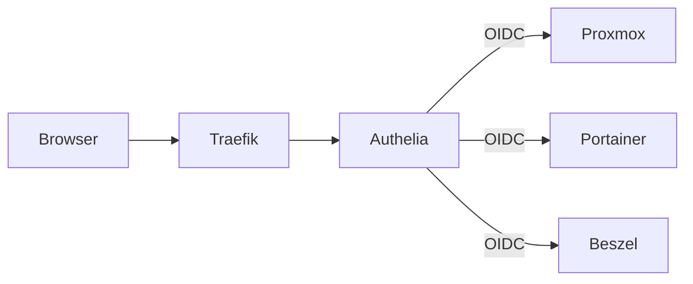

# Authelia (SSO)

Authelia fournit un portail d'authentification unique (SSO) pour les services du homelab.

## Acces

| | |
|---|---|
| URL | `https://auth.home.gabin-simond.fr` |
| Port interne | 9091 |
| Image | `authelia/authelia:latest` |

## Architecture



## Services integres (OIDC)

| Service | Client ID | Methode |
|---|---|---|
| Proxmox VE | `proxmox` | OpenID Connect natif |
| Portainer | `portainer` | OAuth2 natif |
| Beszel | `beszel` | OIDC natif |

Les autres services (AdGuard, Homepage, Wallos, WUD) conservent leur authentification propre.

## Configuration Proxmox

Sur un noeud du cluster :

```bash
pveum realm add authelia --type openid \
  --issuer-url https://auth.home.gabin-simond.fr \
  --client-id proxmox \
  --client-key <CLIENT_SECRET> \
  --username-claim preferred_username \
  --autocreate
```

## Configuration Portainer

Dans Portainer > Settings > Authentication > OAuth :

| Champ | Valeur |
|---|---|
| Provider | Custom |
| Client ID | `portainer` |
| Client Secret | `<CLIENT_SECRET>` |
| Authorization URL | `https://auth.home.gabin-simond.fr/api/oidc/authorization` |
| Access Token URL | `https://auth.home.gabin-simond.fr/api/oidc/token` |
| Resource URL | `https://auth.home.gabin-simond.fr/api/oidc/userinfo` |
| User Identifier | `preferred_username` |

## Configuration Beszel

Dans Beszel > Settings > Auth providers > OpenID Connect :

| Champ | Valeur |
|---|---|
| Client ID | `beszel` |
| Client Secret | `<CLIENT_SECRET>` |
| Display name | `Authelia` |
| Auth URL | `https://auth.home.gabin-simond.fr/api/oidc/authorization` |
| Token URL | `https://auth.home.gabin-simond.fr/api/oidc/token` |
| User API URL | `https://auth.home.gabin-simond.fr/api/oidc/userinfo` |

## Fichiers

| Fichier | Emplacement | Versionne |
|---|---|---|
| `configuration.yml` | `/mnt/ssd/config/authelia/` | Non (secrets) — `.example` dans le repo |
| `users_database.yml` | `/mnt/ssd/config/authelia/` | Non (hashes) — `.example` dans le repo |
| `oidc.pem` | `/mnt/ssd/config/authelia/` | Non (cle privee) |
| `db.sqlite3` | `/mnt/ssd/config/authelia/` | Non (donnees) |

## Regenerer les secrets

```bash
# Secrets Authelia
openssl rand -hex 32  # jwt_secret, session_secret, storage_key, hmac_secret

# Cle OIDC
openssl genrsa -out oidc.pem 4096

# Secret client OIDC
openssl rand -hex 32  # genere le secret en clair
# Puis hasher pour Authelia :
docker run --rm --entrypoint authelia authelia/authelia:latest \
  crypto hash generate pbkdf2 --password "<SECRET>"

# Hash mot de passe utilisateur
docker run --rm --entrypoint authelia authelia/authelia:latest \
  crypto hash generate argon2 --password "<MOT_DE_PASSE>"
```
