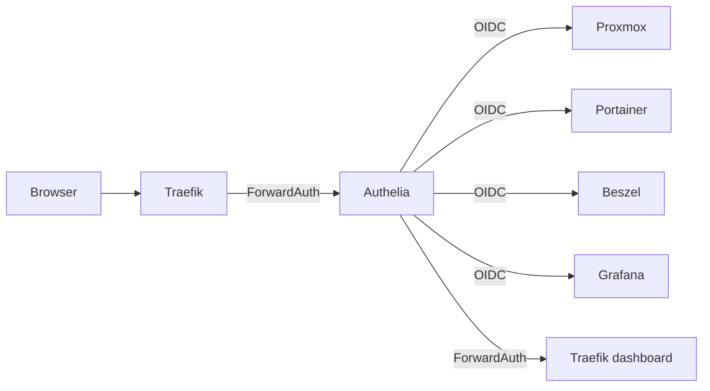

# Authelia (SSO)

Portail d'authentification unique (SSO) + MFA pour les services du homelab.

## Acces

| | |
|---|---|
| URL | `https://auth.home.gabin-simond.fr` |
| Port interne | 9091 |
| Image | `authelia/authelia:latest` |

## Architecture



## Clients OIDC configures

| Service | Client ID | Policy | PKCE | Consent |
|---|---|---|---|---|
| Proxmox VE (galahad + lancelot) | `proxmox` | `two_factor` | — | `pre-configured` (1y) |
| Portainer | `portainer` | `two_factor` | — | `pre-configured` (1y) |
| Grafana | `grafana` | `two_factor` | S256 | `pre-configured` (1y) |
| Beszel | `beszel` | `one_factor` | S256 | `pre-configured` (1y) |

`consent_mode: pre-configured` evite le consent screen a chaque login (1 acceptation = 1 an de validite).

## ForwardAuth middleware

Pour les services sans OIDC natif :

- Traefik dashboard (`traefik.home.gabin-simond.fr`)
- AdGuard (`adguard.home.gabin-simond.fr`) — **a faire**
- Homepage (`home.gabin-simond.fr`) — **a faire**

Middleware declare via label sur le container Authelia :
```
traefik.http.middlewares.authelia.forwardAuth.address=http://authelia:9091/api/authz/forward-auth
```

## MFA

| Methode | Statut |
|---|---|
| TOTP | Active (`issuer: Homelab`, period 30s, skew 1) |
| WebAuthn FIDO2 | Active — 2 YubiKeys enregistrees (`attachment: cross-platform`) |

Policy par defaut : `two_factor`. Beszel est en `one_factor` car c'est pas un enjeu securite critique (monitoring readonly).

## Configuration Proxmox

```bash
# Sur un node du cluster
pveum realm add authelia --type openid \
  --issuer-url https://auth.home.gabin-simond.fr \
  --client-id proxmox \
  --client-key <CLIENT_SECRET> \
  --username-claim preferred_username \
  --autocreate

# ACL Administrator pour gabins@authelia
pveum acl modify / --user gabins@authelia --role Administrator
```

## Configuration Portainer

**Settings > Authentication > OAuth** :

| Champ | Valeur |
|---|---|
| Provider | Custom |
| Client ID | `portainer` |
| Authorization URL | `https://auth.home.gabin-simond.fr/api/oidc/authorization` |
| Access Token URL | `https://auth.home.gabin-simond.fr/api/oidc/token` |
| Resource URL | `https://auth.home.gabin-simond.fr/api/oidc/userinfo` |
| User Identifier | `preferred_username` |

## Configuration Grafana

Via env vars dans `/opt/observability/docker-compose.yml` sur LXC 101 :

```yaml
GF_AUTH_DISABLE_LOGIN_FORM: "true"
GF_AUTH_BASIC_ENABLED: "false"
GF_AUTH_OAUTH_AUTO_LOGIN: "true"
GF_AUTH_GENERIC_OAUTH_ENABLED: "true"
GF_AUTH_GENERIC_OAUTH_CLIENT_ID: grafana
GF_AUTH_GENERIC_OAUTH_SCOPES: "openid profile email groups"
GF_AUTH_GENERIC_OAUTH_USE_PKCE: "true"
GF_AUTH_GENERIC_OAUTH_ROLE_ATTRIBUTE_PATH: "contains(groups[*], 'admins') && 'GrafanaAdmin' || 'Viewer'"
GF_AUTH_GENERIC_OAUTH_ALLOW_ASSIGN_GRAFANA_ADMIN: "true"
```

Voir [grafana.md](grafana.md) pour le detail complet.

## Configuration Beszel

**Settings > Auth providers > OpenID Connect** :

| Champ | Valeur |
|---|---|
| Client ID | `beszel` |
| Display name | `Authelia` |
| Auth URL | `https://auth.home.gabin-simond.fr/api/oidc/authorization` |
| Token URL | `https://auth.home.gabin-simond.fr/api/oidc/token` |
| User API URL | `https://auth.home.gabin-simond.fr/api/oidc/userinfo` |

## Fichiers

| Fichier | Emplacement | Versionne |
|---|---|---|
| `configuration.yml` | `/mnt/ssd/config/authelia/` | Non (secrets) — `.example` dans le repo |
| `users_database.yml` | `/mnt/ssd/config/authelia/` | Non (hashes) — `.example` dans le repo |
| `oidc.pem` (JWKS) | `/mnt/ssd/config/authelia/` | Non (cle privee) |
| `db.sqlite3` | `/mnt/ssd/config/authelia/` | Non (donnees) |

## Regenerer les secrets

```bash
# Secrets Authelia (jwt_secret, session.secret, storage.encryption_key, hmac_secret)
openssl rand -hex 32

# Cle privee OIDC JWKS
openssl genrsa -out oidc.pem 4096

# Secret client OIDC (partie plain)
SECRET=$(openssl rand -base64 32)
# Hash pour Authelia (configuration.yml)
docker run --rm authelia/authelia:latest \
  authelia crypto hash generate pbkdf2 --password "$SECRET" \
  --iterations 310000 --variant sha512 --no-confirm

# Hash mot de passe utilisateur (users_database.yml)
docker run --rm authelia/authelia:latest \
  authelia crypto hash generate argon2 --password "<MOT_DE_PASSE>"
```

Le secret en clair va dans Vaultwarden + env var du service consommateur. Le hash pbkdf2 va dans `configuration.yml` d'Authelia.
