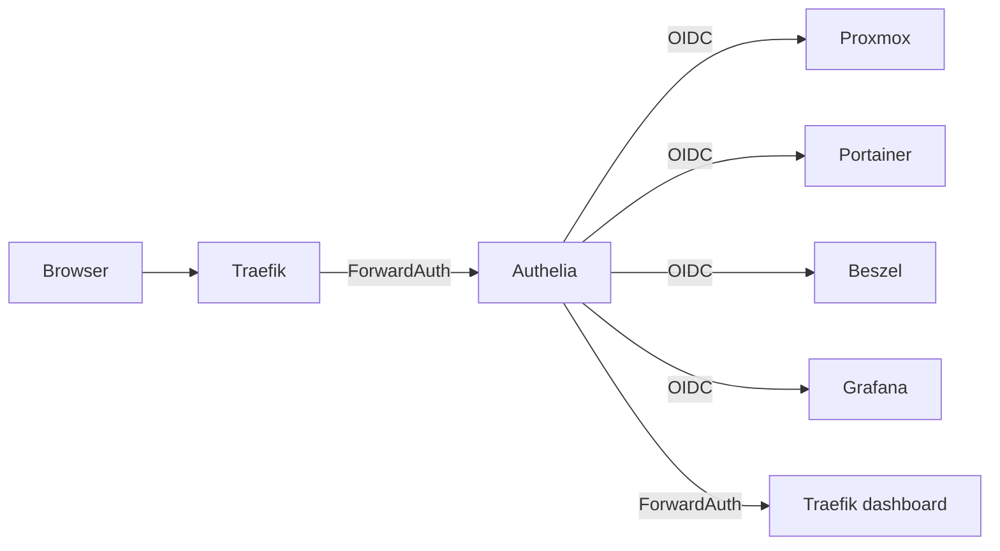

# Authelia (SSO)

Portail d'authentification unique (SSO) + MFA pour les services du homelab.

## Acces

| | |
|---|---|
| URL | `https://auth.home.gabin-simond.fr` |
| Port interne | 9091 |
| Image | `authelia/authelia:latest` |

## Architecture


```mermaid
graph LR
    Browser --> Traefik
    Traefik -->|ForwardAuth| Authelia
    Authelia -->|OIDC| Proxmox
    Authelia -->|OIDC| Portainer
    Authelia -->|OIDC| Beszel
    Authelia -->|OIDC| Grafana
    Authelia -->|ForwardAuth| Traefik_dash[Traefik dashboard]
```

## Clients OIDC configurés

Relevé le 2026-09-24 dans `authelia/configuration.yml`. **Dix** clients — cette page n'en
listait que quatre.

| Service | Client ID | Policy | PKCE | `token_endpoint_auth_method` |
|---|---|---|---|---|
| Proxmox VE (galahad + lancelot) | `proxmox` | `two_factor` | — | défaut (`basic`) |
| Portainer | `portainer` | `two_factor` | — | défaut (`basic`) |
| Grafana | `grafana` | `two_factor` | S256 | `client_secret_basic` |
| PBS | `pbs` | `two_factor` | — | défaut (`basic`) |
| Homelable | `homelable` | `two_factor` | — | défaut (`basic`) |
| Beszel | `beszel` | `two_factor` | — | défaut (`basic`) |
| Pulse | `pulse` | `two_factor` | — | `client_secret_basic` |
| Forgejo | `forgejo` | `two_factor` | — | `client_secret_basic` |
| Outline | `outline` | `two_factor` | — | `client_secret_post` |
| Securo | `securo` | `two_factor` | S256 | `client_secret_post` |

Tous en `consent_mode: pre-configured`, ce qui évite l'écran de consentement à chaque
login (1 acceptation = 1 an de validité). Beszel était donné en `one_factor` sur cette
page : il est en `two_factor` comme les neuf autres.

:::warning[`invalid_client` veut dire « méthode refusée », pas « mauvais secret »]
La colonne `token_endpoint_auth_method` est celle qui coûte le plus de temps quand on
ajoute un client. Le défaut d'Authelia est `client_secret_basic` ; plusieurs applications
envoient leurs identifiants **dans le corps** de la requête (`client_secret_post`). Le
serveur répond alors `invalid_client` — et on part chercher une faute de frappe dans un
secret parfaitement correct.

Deux des dix clients sont en `post` : Outline et Securo.
:::

:::warning[Beszel OIDC — pre-requis]
L'image Beszel est scratch (pas de CA certs). Le container DOIT monter `/etc/ssl/certs/ca-certificates.crt:ro` + env `SSL_CERT_FILE` pour que PocketBase puisse faire le token exchange HTTPS vers Authelia. De plus, `auth.home.gabin-simond.fr` doit avoir un rewrite DNS spécifique (non filtre par client) car le wildcard AdGuard ne matche pas les IPs Docker. Voir [dépannage](../operations/depannage.md#beszel--oidc-failed-to-fetch-oauth2-token).
:::

## ForwardAuth middleware

Relevé le 2026-09-24 : les routers portant `authelia@docker`.

| Router | Hôte | OIDC aussi ? |
|---|---|---|
| Traefik dashboard | `traefik.home…` | non |
| AdGuard primaire | `dns.home…` | non |
| AdGuard secondaire | `dns-failover.home…` | non |
| Homepage | `home.gabin-simond.fr` | non |
| CyberChef | `cyberchef.home…` | non |
| Dozzle | `dozzle.home…` | non |
| Stirling PDF | `pdf.home…` | non |
| Portainer | `portainer.home…` | **oui** |
| Beszel | `monitor.home…` | **oui** |
| Homelable | `homelable.home…` | **oui** |

Trois services portent **les deux couches** : le middleware ForwardAuth devant, et OIDC
dans l'application. Le premier ferme la porte à un non-authentifié avant que la requête
atteigne le backend ; le second donne l'identité à l'application.

:::note[AdGuard répond sur `dns.home…`, pas `adguard.home…`]
Cette page nommait `adguard.home.gabin-simond.fr`. Ce nom n'existe dans aucune règle
`Host()` — le router s'appelle `dns`. Un nom d'hôte faux dans une doc d'authentification
envoie chercher une panne là où il n'y a pas de service.
:::

**Deux exclusions délibérées**, écrites en clair dans le compose :

- **Forgejo** — un `forwardAuth` casserait `git` en ligne de commande et l'API. Il
  consomme Authelia en OIDC interne à la place.
- **Outline** — même raison : il **consomme** Authelia en OIDC, le doubler d'un
  ForwardAuth casserait le flux.

Middleware déclaré via label sur le container Authelia :
```text
traefik.http.middlewares.authelia.forwardAuth.address=http://authelia:9091/api/authz/forward-auth
```

## MFA

| Méthode | Statut |
|---|---|
| TOTP | Activé (`issuer: Homelab`, period 30s, skew 1) |
| WebAuthn FIDO2 | Activé — 2 YubiKeys enregistrees (`attachment: cross-platform`) |

Policy par defaut : `two_factor`. Beszel est en `one_factor` car c'est pas un enjeu sécurité critique (monitoring readonly).

## Configuration Proxmox

```bash
# Sur un node du cluster (se propage via /etc/pve)
pveum realm add authelia --type openid \
  --issuer-url https://auth.home.gabin-simond.fr \
  --client-id proxmox \
  --client-key <CLIENT_SECRET> \
  --username-claim preferred_username \
  --autocreate

# Realm par defaut → Authelia (pre-selectionne sur la page de login)
pveum realm modify authelia --default 1

# Nom affiche dans le selecteur de realm
pveum realm modify authelia --comment 'Authelia'

# ACL Administrator pour gabins@authelia
pveum acl modify / --user gabins@authelia --role Administrator
```

## Configuration Portainer

**Settings > Authentication > OAuth** :

| Champ | Valeur |
|---|---|
| Provider | Custom |
| Client ID | `portainer` |
| Authorization URL | `https://auth.home.gabin-simond.fr/api/oidc/authorization` |
| Access Token URL | `https://auth.home.gabin-simond.fr/api/oidc/token` |
| Resource URL | `https://auth.home.gabin-simond.fr/api/oidc/userinfo` |
| User Identifier | `preferred_username` |

## Configuration Grafana

Via env vars dans `/opt/logs/docker-compose.yml` sur LXC 101 :

```yaml
GF_AUTH_DISABLE_LOGIN_FORM: "true"
GF_AUTH_BASIC_ENABLED: "false"
GF_AUTH_OAUTH_AUTO_LOGIN: "true"
GF_AUTH_GENERIC_OAUTH_ENABLED: "true"
GF_AUTH_GENERIC_OAUTH_CLIENT_ID: grafana
GF_AUTH_GENERIC_OAUTH_SCOPES: "openid profile email groups"
GF_AUTH_GENERIC_OAUTH_USE_PKCE: "true"
# IMPORTANT: PAS de || 'Viewer' a la fin — Grafana 12.x evalue l'expression sur
# le ID token d'abord (qui n'a PAS le claim groups). Si l'expression retourne un
# role valide ('Viewer'), Grafana s'arrete la et ne consulte jamais le userinfo
# (qui a les groups). Sans fallback, le ID token retourne null → fallthrough vers
# userinfo → trouve groups → retourne GrafanaAdmin.
GF_AUTH_GENERIC_OAUTH_ROLE_ATTRIBUTE_PATH: "contains(groups[*], 'admins') && 'GrafanaAdmin'"
GF_AUTH_GENERIC_OAUTH_ROLE_ATTRIBUTE_STRICT: "false"
GF_AUTH_GENERIC_OAUTH_ALLOW_ASSIGN_GRAFANA_ADMIN: "true"
```

Voir [grafana.md](grafana.md) pour le détail complet.

## Configuration Beszel

**Settings > Auth providers > OpenID Connect** :

| Champ | Valeur |
|---|---|
| Client ID | `beszel` |
| Display name | `Authelia` |
| Auth URL | `https://auth.home.gabin-simond.fr/api/oidc/authorization` |
| Token URL | `https://auth.home.gabin-simond.fr/api/oidc/token` |
| User API URL | `https://auth.home.gabin-simond.fr/api/oidc/userinfo` |

L'authentification par mot de passe est désactivée via la variable d'environnement `DISABLE_PASSWORD_AUTH=true` dans le docker-compose. Cela empeche PocketBase de reactiver le formulaire email/mot de passe a chaque redémarrage du container.

## Fichiers

| Fichier | Emplacement | Versionne |
|---|---|---|
| `configuration.yml` | `/mnt/ssd/config/authelia/` | Non (secrets) — `.example` dans le repo |
| `users_database.yml` | `/mnt/ssd/config/authelia/` | Non (hashes) — `.example` dans le repo |
| `oidc.pem` (JWKS) | `/mnt/ssd/config/authelia/` | Non (clé privee) |
| `db.sqlite3` | `/mnt/ssd/config/authelia/` | Non (données) |

## Secrets au runtime : montés sur `/secrets` (hors `/config`)

Les secrets Authelia sont scellés via sops (`authelia/secrets/*` dans le repo), déscellés au boot par `homelab-unseal.service` vers le tmpfs `/run/homelab/authelia-secrets`, puis montés **read-only dans le container sur `/secrets`** (pas `/config/secrets`). Les variables `AUTHELIA_*_FILE` et `configuration.yml` pointent vers `/secrets/...`.

:::warning[Pourquoi `/secrets` et pas `/config/secrets`]
L'entrypoint de l'image Authelia fait `chown -R /config` au démarrage. Quand les secrets étaient montés en RO sous `/config/secrets`, ce chown échouait et crachait **~13 000 lignes `chown: ... Read-only file system`** par démarrage (et alimentait un replay-storm Loki). Monter hors de `/config` supprime le problème (fix 2026-06-25). Voir `projet/decisions.md`.
:::

## Regenerer les secrets

```bash
# Secrets Authelia (jwt_secret, session.secret, storage.encryption_key, hmac_secret)
openssl rand -hex 32

# Cle privee OIDC JWKS
openssl genrsa -out oidc.pem 4096

# Secret client OIDC (partie plain)
SECRET=$(openssl rand -base64 32)
# Hash pour Authelia (configuration.yml)
docker run --rm authelia/authelia:latest \
  authelia crypto hash generate pbkdf2 --password "$SECRET" \
  --iterations 310000 --variant sha512 --no-confirm

# Hash mot de passe utilisateur (users_database.yml)
docker run --rm authelia/authelia:latest \
  authelia crypto hash generate argon2 --password "<MOT_DE_PASSE>"
```

Le secret en clair va dans Vaultwarden + env var du service consommateur. Le hash pbkdf2 va dans `configuration.yml` d'Authelia.
