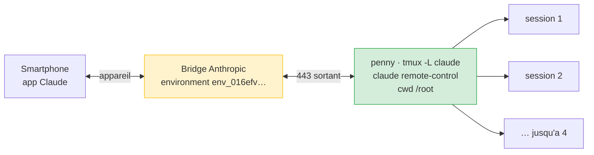

# Claude Remote Control — piloter penny depuis le smartphone

Service systemd qui expose penny comme **appareil connecté** dans l'app Claude : on y crée des sessions à la demande depuis le téléphone, sans SSH ni laptop. Objectif : diagnostiquer et réparer le homelab depuis la poche.

**Depuis 2026-08-03.**

## Pourquoi

L'incident du 2026-08-03 a montré le trou : le SSD Argon a décroché à 01:25, docker est mort dans la fenêtre `dietpi-backup`, et la stack est restée down **9 heures** — le temps que quelqu'un ouvre un terminal. Un accès Claude permanent depuis le téléphone réduit ce délai au temps de trajet jusqu'à la poche.

## Architecture



Le lien est **sortant en HTTPS** : aucun port entrant, aucune règle NAT sur la box. Cohérent avec la posture « zéro WAN forward » de penny.

Le serveur enregistre un **environment** côté Anthropic — c'est cette entité qui apparaît comme appareil dans l'app, avec une icône d'ordinateur et un point vert quand elle est en ligne. Son identifiant est persisté par répertoire de travail dans `~/.claude/projects/-root/bridge-pointer.json`.

### Le pointeur est l'ancre d'identité, et il est fragile {#pointeur-ancre-identite}

L'appareil reste le même d'un reboot à l'autre, mais pas gratuitement. Au démarrage, le serveur **relit** l'`environmentId` dans le pointeur et demande explicitement sa réutilisation :

```
[bridge:init] Found prior environment env_016efv… in pointer (ageMs=0);
              requesting reuse on registration
POST /v1/environments/bridge -> 200 environment_id=env_016efv…
```

Trois conditions, toutes vérifiées le 2026-08-27 :

- **Le fichier doit être valide en bloc.** Il porte cinq clés (`sessionId`, `environmentId`, `source`, `pid`, `procStart`). En retirer une le rend invalide, et le serveur ne récupère pas les survivantes : il jette le fichier **entier**, `environmentId` compris.
- **Le mtime doit être récent.** Un pointeur de plus de 4 h est jeté pour la même raison, avec la même conséquence.
- **`bridgeId` n'est pas l'identité.** Il est tiré au hasard à chaque démarrage (`be3eedc5` le 26/08, `645bc7ac` le 27/08). Sans `environmentId` à réutiliser, l'API crée un environnement neuf.

Le rejet est explicite dans `server-debug.log` :

```
[bridge:pointer] invalid schema, clearing: /root/.claude/projects/-root/bridge-pointer.json
[bridge:pointer] cleared  /root/.claude/projects/-root/bridge-pointer.json
[bridge:init] bridgeId=645bc7ac-…          <- plus de reuseEnvironmentId
POST /v1/environments/bridge -> 200 environment_id=env_016efv…   <- environnement NEUF
```

Le résultat visible est **un « penny » de plus dans l'app**, l'ancien restant en place, mort. Rien n'est perdu au passage : les conversations vivent dans `~/.claude/projects/-root/*.jsonl` et ne dépendent pas du pointeur.

:::danger[Ne jamais éditer le pointeur en supprimant une clé]
C'est exactement ce qu'a fait `penny-arm-reset-forensics.sh` le 2026-08-27 pour tuer une session zombie, en croyant « préserver `environmentId` ». La clé était bien encore dans le fichier, et sans effet : le serveur avait jeté le fichier avant de la lire. `env_017uqn…` est devenu `env_016efv…`.

La seule édition sûre est de changer une **valeur** en gardant les cinq clés. Pour se débarrasser d'une session morte sans perdre l'identité, remplacer la valeur de `sessionId` par un identifiant inexistant : le `bridge/reconnect` échoue alors en `400 Session not found`, chemin que le serveur traite proprement, et il repart sur une session neuve en conservant l'environnement. Raisonné à partir des logs du 26/08, pas encore exécuté.
:::

Tant que le service tourne, le pointeur ne vieillit pas : le serveur le réécrit **toutes les heures**, à l'ancre du `created_at` de la session. Vérifié sur deux démarrages indépendants.

| Démarrage | Ancre (session) | Écritures du pointeur | Écart |
|---|---|---|---|
| 26/08 | 18:26:02.303 | 19:26:02.465, 20:26:02.465, 21:26:02.472, 22:26:02.473, 23:26:02.499 | +1 h à 200 ms près |
| 27/08 | 08:57:00.591 | 09:57:00.550 | +1 h à 40 ms près |

Le battement est **inconditionnel** : celui du 27/08 est tombé pendant qu'une session travaillait activement sur la machine. Une session occupée ne le suspend pas, et il réécrit le pointeur sans toucher à l'`environmentId`.

Conséquence pratique : la règle des 4 h ne peut mordre que si le **service** est resté à l'arrêt plus de 4 h. Une penny simplement inactive ne risque rien, et il n'y a donc pas lieu de neutraliser la péremption par un `touch` au démarrage — ce serait désarmer une protection contre les sessions mortes pour couvrir un cas qui ne se produit pas.

## Composants

| Fichier | Rôle |
|---------|------|
| `homelab-config/scripts/claude-remote.sh` | superviseur (source de vérité) |
| `/usr/local/bin/claude-remote.sh` | copie live, **sur carte SD** |
| `homelab-config/system/systemd/claude-remote.service` | unit (source de vérité) |
| `/etc/systemd/system/claude-remote.service` | unit live |
| `/var/lib/claude-remote/claude-remote.log` | log persistant (`StateDirectory`) |
| `homelab-config/scripts/claude-remote-watch.sh` | garde-fou : scrape les événements de session, notifie les échecs |
| `homelab-config/system/systemd/claude-remote-watch.{service,timer}` | timer, une passe par minute |
| `/var/lib/claude-remote/server-events.log` | **événements de session horodatés** (la seule trace durable) |
| `/var/lib/claude-remote/server-debug.log` | `--debug-file` du serveur, rotaté à chaque lancement (`.1` conservé) |

## Décisions de design

**Le service ne dépend en rien de `/mnt/ssd`.** Script et binaire `claude` vivent sur la carte SD, et l'unit n'a volontairement **pas** de `RequiresMountsFor=/mnt/ssd`. C'est le cœur du design : le service doit survivre exactement à la panne qu'il sert à diagnostiquer. Vérifié en conditions réelles — la session est restée joignable pendant tout le décrochage SSD.

**Mode serveur, pas le flag `--remote-control`.** Le flag est limité par conception à **une session par process** : l'app affiche alors une session unique et figée. La sous-commande `claude remote-control` est un serveur persistant qui enregistre un environment et crée les sessions à la demande. C'est la différence entre « une conversation partagée » et « une machine où je peux lancer du travail ».

**`--capacity 4`.** Le défaut amont est 32 sessions concurrentes — chacune étant un process `claude` complet, c'est intenable sur un Pi 4. Quatre laisse de la marge sans risquer l'OOM.

**`--spawn same-dir`.** Le mode `worktree` isolerait chaque session dans un git worktree, mais exige un dépôt git : `/root` n'en est pas un. À reconsidérer si le `WorkingDirectory` bascule un jour vers un des deux repos — au prix de la dépendance au SSD.

**tmux plutôt que `script(1)`.** La TUI de `claude` exige un pty ; tmux le fournit et rend la session attachable (`tmux -L claude attach -t claude`) pour voir son état exact. La sortie n'inonde pas journald — on évite le chemin journald/mmap responsable des SIGBUS récurrents sur ARM. Socket dédié `-L claude` pour ne pas collider avec les sessions tmux interactives.

:::warning[Le pane tmux ne conserve AUCUN historique]
Contrairement à ce que cette page affirmait jusqu'au 2026-08-05, la sortie du serveur **ne s'accumule pas** dans le scrollback tmux. La TUI tourne en **écran alterné** : `tmux display-message -p '#{history_size}'` renvoie **0**, quel que soit `history-limit`. Les lignes d'événement (`Session failed`, `Reconnected after 16s`) s'effacent donc en défilant, sans laisser de trace — et journald ne peut pas servir de filet puisqu'il est en `Storage=volatile` sur cette machine.

C'est ce qui a rendu **définitivement inanalysable** l'échec de session du 2026-08-04 17:50:29. D'où les deux instruments ajoutés depuis : `--debug-file` côté serveur et `claude-remote-watch` côté scrape.
:::

**Log dans `/var/lib`, pas `/var/log`.** Sur DietPi, `/var/log` est un tmpfs de 50 MiB purgé **chaque heure** par `dietpi-ramlog` (`AUTO_SETUP_LOGGING_INDEX=-1`). Un log de santé y serait effacé toutes les heures. `StateDirectory=claude-remote` place le fichier sur la carte SD, persistant.

**Aucune directive de sandboxing.** Pas de `ProtectSystem`, `ProtectKernelModules` ni `PrivateTmp` : ce sont précisément ces options, sans `PrivateMounts=yes`, qui ont fait fuiter des mounts read-only sur `/etc` et `/usr/lib/modules` sur cette machine.

**Supervision dans le wrapper.** `ExecStart` rend la main tout de suite (tmux détaché), donc systemd ne peut pas surveiller `claude`. La boucle de relance vit dans le script : relance après 10 s, et abandon après 5 sorties rapides consécutives (< 30 s) avec notification ntfy — pour ne pas boucler indéfiniment sur une auth expirée.

## Exploitation

```bash
systemctl status claude-remote           # etat de l'unit
tmux -L claude attach -t claude          # ecran serveur (Ctrl-b d pour detacher)
tail -f /var/lib/claude-remote/claude-remote.log
systemctl restart claude-remote          # repart sur un serveur neuf
```

L'attache tmux montre l'**écran du serveur** — état de connexion, capacité utilisée, URL de l'environment, `espace` pour un QR code — et non un prompt : en mode serveur on ne tape pas localement dans la conversation. C'est le compromis assumé du modèle appareil.

Depuis un shell Claude ou une session SSH sur un nœud PVE, le socket tmux du service n'est pas visible (mount namespace privé) : passer par `nsenter -t 1 -m -- tmux -L claude capture-pane -p -t claude`.

### Signaux de santé

L'état `active` de systemd **ne reflète pas** la santé du serveur : `RemainAfterExit=yes` garde l'unit active même s'il est mort. Les vrais signaux :

| Signal | Où |
|--------|-----|
| Cycles de relance | `/var/lib/claude-remote/claude-remote.log` |
| Abandon après 5 échecs | notification ntfy priorité haute |
| Appareil hors ligne | le point vert disparaît dans l'app |
| **Échec d'une session** | `/var/lib/claude-remote/server-events.log` + notification ntfy |
| **Échec d'authentification** | `server-debug.log` + notification ntfy (voir [Authentification](#auth-token-longue-duree)) |
| Détail d'un échec | `/var/lib/claude-remote/server-debug.log` (le `.1` = run précédent) |

Le superviseur ne surveille que le **serveur**. Or une session peut mourir alors que le serveur reste parfaitement sain : c'est le cas le plus fréquent, et il ne produisait aucun signal avant le 2026-08-05. `claude-remote-watch` comble exactement ce trou.

### Dépannage

| Symptôme | Cause probable | Action |
|----------|----------------|--------|
| Appareil absent de l'app | auth OAuth expirée | `claude auth login` puis `systemctl restart claude-remote` |
| Log en boucle `exit rc=1 apres <30s` | binaire ou credentials KO | vérifier `/root/.claude/.credentials.json` |
| Notif ntfy « abandonnée » | 5 échecs rapides | corriger la cause, puis restart |
| Une relance sans cause apparente | coupure réseau > ~10 min : le serveur sort de lui-même | rien à faire, la boucle relance |
| Impossible d'ouvrir une session de plus | capacité 4 atteinte | fermer une session depuis l'app, ou relever `CLAUDE_REMOTE_CAPACITY` |
| **Je reviens sur une session, elle ne répond plus** | voir « Les deux modes » ci-dessous | la notif ntfy tranche entre amont et local |
| **Un « penny » de plus apparaît dans l'app** | le pointeur a été jeté au démarrage | `grep -a 'invalid schema, clearing' /var/lib/claude-remote/server-debug.log` ; puis supprimer l'appareil mort dans l'app |
| **`Failed to authenticate: OAuth session expired and could not be refreshed`** | renouvellement du jeton non effectué, **pas** une vraie expiration | voir [Authentification](#auth-token-longue-duree) |

#### Authentification {#auth-token-longue-duree}

:::danger Un jeton longue durée fait **tomber** le service
`claude setup-token` et `CLAUDE_CODE_OAUTH_TOKEN` produisent un jeton *inference-only*. Remote Control le refuse et sort en `rc=1` — le superviseur abandonne après 5 échecs rapides et **le service s'arrête**. Vérifié le 2026-08-31, deux fois.

```
Remote Control requires a full-scope login token. Long-lived tokens (from
`claude setup-token` or CLAUDE_CODE_OAUTH_TOKEN) are limited to inference-only
for security reasons. Run `claude auth login` to use Remote Control.
```

Le diagnostic du binaire est explicite : `oauthScopes=user:inference`, `hasProfileScope=false`. Seule une session complète obtenue par `claude auth login` convient.

Corollaire systemd : `EnvironmentFile=-` tolère un fichier **absent**, jamais une valeur **invalide**. Un mauvais collage suffit donc à mettre le service par terre.
:::

##### Pourquoi « expired » ne veut pas dire expiré

Le pont programme le renouvellement du jeton de chaque session **13 h** à l'avance :

```
[bridge:token] Scheduled token refresh in 774m 59s (expires=…, buffer=300s)
```

Or le jeton d'accès OAuth de `~/.claude/.credentials.json` ne vit que **8 h**. À l'échéance, le pont n'a plus rien à pousser :

```
[ERROR] [bridge:token] No OAuth token available for refresh (failure 1/3)
```

et la session rend `Failed to authenticate: OAuth session expired and could not be refreshed`.

Le `refresh_token`, lui, reste valide **30 jours**. Ce n'est donc pas une expiration : c'est un rafraîchissement qui n'a pas eu lieu. Re-logger à la main soulage le symptôme et ne corrige rien.

Vérifier l'échéance réelle avant toute action :

```bash
jq -r '.claudeAiOauth.refreshTokenExpiresAt' ~/.claude/.credentials.json  # → epoch ms
```

Les 2026-08-30 et 31, **9 occurrences** n'ont produit aucune notification : `claude-remote-watch` ne classait que les échecs de session scrapés sur le pane tmux, où les erreurs d'auth n'apparaissent jamais. La sonde et le signal ne lisaient pas la même source. Elle lit désormais aussi le `--debug-file`, ancrée sur `^<horodatage>Z [ERROR] [bridge:token]` — un motif large se matcherait lui-même, puisque le serveur journalise les messages utilisateur en clair sous `[bridge:ws]`.

:::note Un service `RemainAfterExit=yes` ne se recharge jamais
Le serveur tournait encore en 2.1.221 alors que 2.1.251 était installée depuis un moment. Vérifier la version **réellement chargée**, pas celle du binaire :

```bash
ls -l /proc/$(pgrep -f 'claude remote-control' | head -1)/exe
```
:::

#### Les deux modes de « session KO »

Le symptôme est identique dans l'app, les causes n'ont rien à voir. La notification indique lequel s'est produit ; `server-events.log` garde la trace.

| | Mode **amont** | Mode **local** |
|---|---|---|
| Trace | rafale `api_error` dans le transcript, `retryAttempt == maxRetries` | `Session failed: Process exited with error <cse_id>` dans `server-events.log` |
| Le process de session | **vivant**, endormi dans `epoll_wait`, ~0 % CPU | **mort** |
| Ce que ça donne | la session est muette ~4 min, puis affiche `API Error: 529 Overloaded` | plus rien ne répond, le slot de capacité peut rester consommé |
| Cause | saturation des serveurs Anthropic — **rien à réparer sur penny** | à déterminer avec `server-debug.log` |
| Action | attendre, cf. [status.claude.com](https://status.claude.com) | consulter le debug log, relancer le service si besoin |

Observé le 2026-08-05 : 10 × HTTP 529 `overloaded_error` en trois minutes, ladder de retry épuisée, puis une relance manuelle restée sans réponse pendant 4 min 12 s avant d'afficher l'erreur. Aucun défaut local — mais impossible de le savoir sans instrument, d'où ce tableau.

#### Reprendre une conversation après un drop

**La conversation n'est jamais perdue** : elle vit dans `~/.claude/projects/-root/<uuid>.jsonl`, indépendamment du process de session. Un drop ne casse que le rattachement de la session vivante.

Depuis l'app, dans **n'importe quelle** session penny, la commande **`/resume`** ouvre un sélecteur qui relit ces transcripts et reprend la conversation voulue. En ligne de commande : `claude --resume <session-id>`, ou `--fork-session` pour repartir d'une copie sans toucher l'original.

Nommer les sessions (`-n`/`--name`, ou `/rename` depuis l'app) rend ce sélecteur exploitable — sans quoi il faut retrouver un UUID parmi des dizaines de transcripts.


## Posture de sécurité

Ce service expose penny comme **appareil root permanent, pilotable depuis le compte Anthropic** — jusqu'à 4 sessions simultanées. Conséquence directe : la 2FA de ce compte devient un contrôle de sécurité du homelab, au même niveau que la clé SSH. Le mode de permissions reste celui de `~/.claude/settings.json` (`auto`) — les validations sensibles remontent dans l'app.
