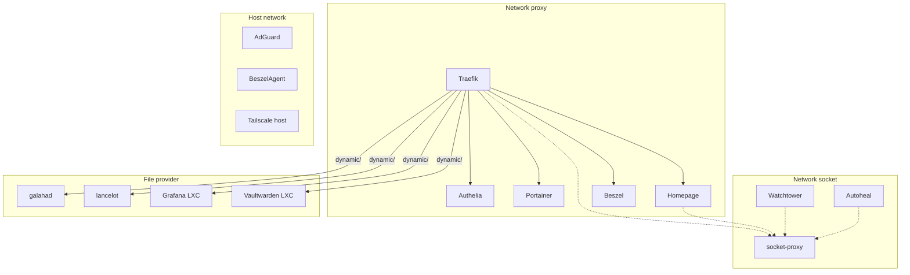

# Stack Docker (penny)

Tous les conteneurs sur penny tournent depuis un seul `/mnt/ssd/config/docker/docker-compose.yml`.
Docker data-root sur le SSD (`/mnt/ssd/docker`).

Grafana + Loki ne sont **pas** sur penny — ils tournent dans le LXC `observability` sur lancelot. Voir [grafana.md](grafana.md).

## Services

| Service | Image | Role | Reseau |
|---|---|---|---|
| **Traefik** | `traefik:latest` | Reverse proxy + TLS auto | proxy, socket |
| **AdGuard Home** | `adguard/adguardhome:latest` | DNS ad-blocking | host |
| **socket-proxy** | `tecnativa/docker-socket-proxy` | Expose API Docker restreinte (whitelist endpoints) | socket |
| **Portainer EE** | `portainer/portainer-ee:latest` | Gestion Docker | proxy |
| **Homepage** | `ghcr.io/gethomepage/homepage:latest` | Dashboard | proxy, socket |
| **Beszel** + agent | `henrygd/beszel` | Monitoring systeme (CPU/RAM/disk/net) | proxy / host |
| **Watchtower** | `containrrr/watchtower` | Auto-update non-critiques + notif ntfy pour critiques | proxy, socket |
| **Authelia** | `authelia/authelia:latest` | SSO / Identity Provider (OIDC) | proxy |
| **autoheal** | `willfarrell/autoheal` | Redemarre les containers unhealthy | socket |

Tailscale : **sur l'host** (pas en container) — SSH natif active.
Vaultwarden : **migre** sur LXC 102 `vault` (galahad, 192.168.1.32). Voir [vaultwarden.md](vaultwarden.md).

## Architecture



## Reseau socket — isolation Docker API

Plus aucun container ne mount `/var/run/docker.sock` directement (sauf Portainer par necessite admin). Tout passe par `socket-proxy`. Watchtower utilise aussi le proxy pour verifier et pull les images.

- **Endpoints autorises** : CONTAINERS, NETWORKS, SERVICES, TASKS, EVENTS, IMAGES, INFO, VERSION, PING, POST
- **Endpoints DROPPED** : AUTH, SECRETS, EXEC, VOLUMES, BUILD, COMMIT, CONFIGS, DISTRIBUTION, NODES, PLUGINS, SESSION, SWARM, SYSTEM
- Reseau `socket` marque `internal: true` — pas d'acces internet depuis ce reseau

## SSO (Authelia)

Voir [authelia.md](authelia.md) pour les details. Resume clients OIDC :

| Service | Client ID | Host |
|---|---|---|
| Proxmox galahad + lancelot | `proxmox` | LXC nodes |
| Portainer | `portainer` | penny |
| Beszel | `beszel` | penny |
| Grafana | `grafana` | LXC observability |

## DNS interne

Les containers sur `proxy` qui doivent resoudre `*.home.gabin-simond.fr` (pour contacter Authelia OIDC) utilisent `dns: 192.168.1.28` (AdGuard) :

- Homepage, Portainer, Beszel

## Volumes

Bind mounts (configs versionnees) :
```
/mnt/ssd/config/traefik/   → /config       (Traefik)
/mnt/ssd/config/adguard/   → /opt/adguardhome/conf (AdGuard)
/mnt/ssd/config/homepage/  → /app/config   (Homepage)
/mnt/ssd/config/authelia/  → /config       (Authelia)
```

Docker volumes (donnees) :
```
traefik-certs / traefik-data  — Certificats + logs
portainer-data                — Donnees Portainer
adguard-data                  — Donnees AdGuard
beszel-data                   — Donnees Beszel
```

## Variables d'environnement

Le fichier `/mnt/ssd/config/.env` (non versionne) contient :

```bash
CF_API_EMAIL=...                   # Email Cloudflare (Traefik DNS challenge)
CF_DNS_API_TOKEN=...               # Token API Cloudflare
TS_AUTHKEY=...                     # Auth key Tailscale
HOMEPAGE_VAR_PORTAINER_KEY=...     # Widget Portainer
HOMEPAGE_VAR_BESZEL_USER=...       # Widget Beszel
HOMEPAGE_VAR_BESZEL_PASS=...
HOMEPAGE_VAR_ADGUARD_USER=...      # Widget AdGuard
HOMEPAGE_VAR_ADGUARD_PASS=...
HOMEPAGE_VAR_PVE_TOKEN_ID=...      # Widget Proxmox (token readonly)
HOMEPAGE_VAR_PVE_TOKEN_SECRET=...
```

Tous ces secrets sont aussi stockes dans Vaultwarden. Voir [security.md](../infrastructure/security.md) section "Inventaire des secrets".
