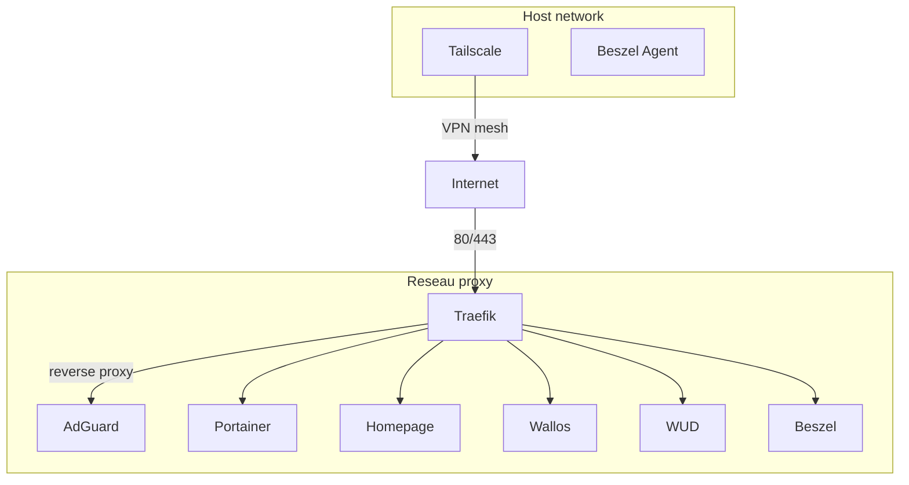

# Stack Docker

Tous les conteneurs tournent depuis un seul `docker-compose.yml` sur le RPi 4.
Docker data-root sur le SSD (`/mnt/ssd/docker`).

## Services

| Service | Image | Role |
|---|---|---|
| **Traefik** | `traefik:latest` | Reverse proxy + TLS auto |
| **AdGuard Home** | `adguard/adguardhome:latest` | DNS/DHCP ad-blocking |
| **Portainer EE** | `portainer/portainer-ee:latest` | Gestion Docker |
| **Homepage** | `ghcr.io/gethomepage/homepage:latest` | Dashboard |
| **Wallos** | `bellamy/wallos:latest` | Suivi abonnements |
| **Beszel** + agent | `henrygd/beszel` | Monitoring systeme |
| **WUD** | `getwud/wud` | Surveillance mises a jour containers |
| **Tailscale** | `tailscale/tailscale` | VPN mesh |

## Architecture Docker



## Volumes et donnees

=== "Bind mounts (configs)"

    ```
    /mnt/ssd/config/traefik/   → /config       (Traefik)
    /mnt/ssd/config/adguard/   → /opt/adguardhome/conf (AdGuard)
    /mnt/ssd/config/homepage/  → /app/config   (Homepage)
    ```

=== "Docker volumes (donnees)"

    ```
    traefik-certs    — Certificats TLS
    traefik-data     — Logs Traefik
    portainer-data   — Donnees Portainer
    adguard-data     — Donnees AdGuard
    wallos-db        — Base de donnees Wallos
    wallos-logos     — Logos uploads
    beszel-data      — Donnees Beszel
    ```

## Variables d'environnement

Le fichier `.env` (non versionne) contient :

```bash
CF_API_EMAIL=...          # Email Cloudflare (Traefik DNS challenge)
CF_DNS_API_TOKEN=...      # Token API Cloudflare
TS_AUTHKEY=...            # Auth key Tailscale
```
