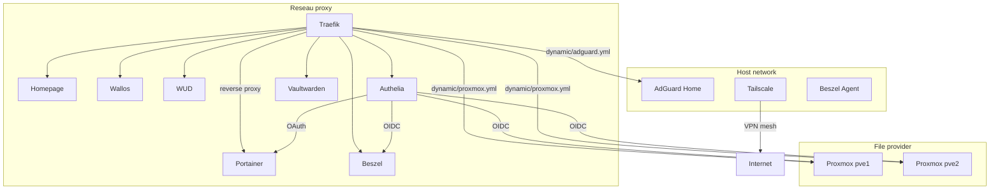

# Stack Docker

Tous les conteneurs tournent depuis un seul `docker-compose.yml` sur le RPi 4.
Docker data-root sur le SSD (`/mnt/ssd/docker`).

## Services

| Service | Image | Role | Reseau |
|---|---|---|---|
| **Traefik** | `traefik:latest` | Reverse proxy + TLS auto | proxy |
| **AdGuard Home** | `adguard/adguardhome:latest` | DNS ad-blocking | host |
| **Portainer EE** | `portainer/portainer-ee:latest` | Gestion Docker | proxy |
| **Homepage** | `ghcr.io/gethomepage/homepage:latest` | Dashboard | proxy |
| **Wallos** | `bellamy/wallos:latest` | Suivi abonnements | proxy (labels) |
| **Beszel** + agent | `henrygd/beszel` | Monitoring systeme | proxy / host |
| **WUD** | `getwud/wud` | Surveillance mises a jour containers | proxy |
| **Authelia** | `authelia/authelia:latest` | SSO / Identity Provider (OIDC) | proxy |
| **Vaultwarden** | `vaultwarden/server:latest` | Gestionnaire de mots de passe | proxy |
| **Tailscale** | `tailscale/tailscale` | VPN mesh | host |

## Architecture Docker



## SSO (Authelia)

Authelia fournit l'authentification centralisee via OIDC :

| Service | Methode | Client ID |
|---|---|---|
| Proxmox VE | OIDC natif (`authelia` realm) | `proxmox` |
| Portainer | OAuth2 natif | `portainer` |
| Beszel | OIDC via PocketBase | `beszel` |

Vaultwarden conserve son propre master password (pas de SSO, par design — evite la dependance circulaire).

## DNS interne

Les containers sur le reseau `proxy` qui ont besoin de resoudre `*.home.gabin-simond.fr` (pour contacter Authelia OIDC) utilisent `dns: 192.168.1.28` (AdGuard) :

- Homepage, Portainer, Beszel, Vaultwarden

## Volumes et donnees

=== "Bind mounts (configs)"

    ```
    /mnt/ssd/config/traefik/   → /config       (Traefik)
    /mnt/ssd/config/adguard/   → /opt/adguardhome/conf (AdGuard)
    /mnt/ssd/config/homepage/  → /app/config   (Homepage)
    /mnt/ssd/config/authelia/  → /config       (Authelia)
    ```

=== "Docker volumes (donnees)"

    ```
    traefik-certs      — Certificats TLS
    traefik-data       — Logs Traefik
    portainer-data     — Donnees Portainer
    adguard-data       — Donnees AdGuard
    wallos-db          — Base de donnees Wallos
    wallos-logos       — Logos uploads
    beszel-data        — Donnees Beszel
    vaultwarden-data   — Donnees Vaultwarden
    ```

## Variables d'environnement

Le fichier `.env` (non versionne) contient :

```bash
CF_API_EMAIL=...                   # Email Cloudflare (Traefik DNS challenge)
CF_DNS_API_TOKEN=...               # Token API Cloudflare
TS_AUTHKEY=...                     # Auth key Tailscale
HOMEPAGE_VAR_PORTAINER_KEY=...     # Token API Portainer (Homepage widget)
HOMEPAGE_VAR_BESZEL_USER=...       # Credentials Beszel (Homepage widget)
HOMEPAGE_VAR_BESZEL_PASS=...
HOMEPAGE_VAR_ADGUARD_USER=...      # Credentials AdGuard (Homepage widget)
HOMEPAGE_VAR_ADGUARD_PASS=...
HOMEPAGE_VAR_PVE_TOKEN_ID=...      # Token API Proxmox (Homepage widget)
HOMEPAGE_VAR_PVE_TOKEN_SECRET=...
```
