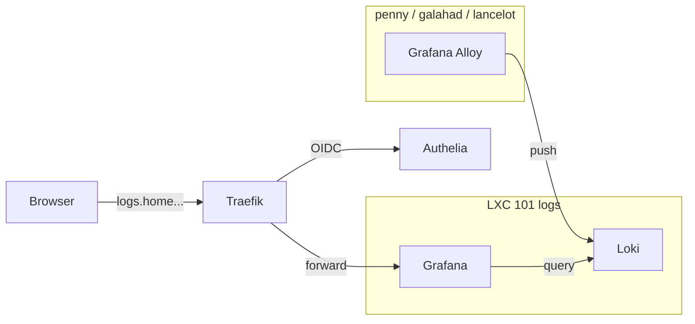

# Grafana (logs)

Visualisation des logs centralises (Loki + Alloy). Pas de metriques : c'est [Beszel](#) qui s'en occupe, pour eviter le doublon Prometheus + node_exporter.

## Acces

| | |
|---|---|
| URL | `https://logs.home.gabin-simond.fr` |
| Host | LXC 101 `logs` sur lancelot (192.168.1.31) |
| Port interne | 3000 |
| Image | `grafana/grafana:latest` |
| Source compose | `/opt/logs/docker-compose.yml` |
| Versioned | `/mnt/ssd/config/logs/` sur penny |

## Authentification

**100% OIDC Authelia** — pas de compte admin local, pas de login form.

- `GF_AUTH_DISABLE_LOGIN_FORM=true`
- `GF_AUTH_BASIC_ENABLED=false`
- `GF_AUTH_OAUTH_AUTO_LOGIN=true` (redirige direct sur Authelia)
- Role mapping : groupe `admins` dans users_database → `GrafanaAdmin`, sinon `Viewer`
- PKCE S256 requis

Le compte legacy `admin` est desactive dans la DB (`is_disabled=1`, password efface). `gabins` est `is_admin=1` + org Admin.

## Datasources

| Name | Type | URL | UID |
|---|---|---|---|
| Loki | loki | `http://loki:3100` | `loki` |

Provisionnee via `/opt/logs/grafana-provisioning/datasources/loki.yml` avec `uid: loki` pour que les dashboards la trouvent.

## Dashboards

| UID | Titre | Focus |
|---|---|---|
| `auth-security` | Auth & Securite | Authelia logins / echecs, fail2ban bans, auditd events |
| `traefik-access` | Traefik Access | Volume HTTP par classe (2xx/3xx/4xx/5xx), logs 4xx/5xx |
| `logs-explorer` | Logs Explorer | Recherche libre multi-host / multi-job avec filtres |

Provisionnes via `/opt/logs/dashboards/*.json` (read-only), folder Grafana `Homelab`.

## Architecture



## Sources des logs (Alloy)

| Host | Sources |
|---|---|
| penny | journald, Docker containers, fail2ban, `homelab_monitor.sh` |
| galahad | journald, `/var/log/audit/audit.log`, Proxmox logs, fail2ban |
| lancelot | journald, Proxmox logs, LXC stdout/stderr |

Retention Loki : 30 jours.

## Operations

### Ajouter un dashboard

Depose le JSON dans `/mnt/ssd/config/logs/dashboards/` (source), puis :

```bash
tar czf /tmp/bundle.tar.gz -C /mnt/ssd/config/logs dashboards grafana-provisioning docker-compose.yml
scp /tmp/bundle.tar.gz gabins@100.69.6.13:/tmp/
ssh gabins@100.69.6.13 "sudo pct push 101 /tmp/bundle.tar.gz /tmp/ && \
  sudo pct exec 101 -- bash -c 'cd /opt/logs && tar xzf /tmp/bundle.tar.gz && docker restart grafana'"
```

### Reset du compte admin (en cas d'urgence)

Si Authelia est down ET qu'il faut acceder a Grafana, passer en mode basic temporairement :

```bash
# Dans le LXC 101
docker stop grafana
# Editer /opt/logs/docker-compose.yml :
#   GF_AUTH_DISABLE_LOGIN_FORM: "false"
#   GF_AUTH_BASIC_ENABLED: "true"
#   GF_SECURITY_ADMIN_PASSWORD: "<one-shot>"
docker compose up -d grafana
# Apres intervention : retirer les 3 env vars et redeployer
```

## Credentials

| Element | Stockage |
|---|---|
| Client OIDC `grafana` — secret en clair | Vaultwarden (`Grafana OIDC client (Authelia)`) |
| Client OIDC `grafana` — hash pbkdf2 | `/mnt/ssd/config/authelia/configuration.yml` |
| Admin legacy | **Desactive** (aucun usage) |
