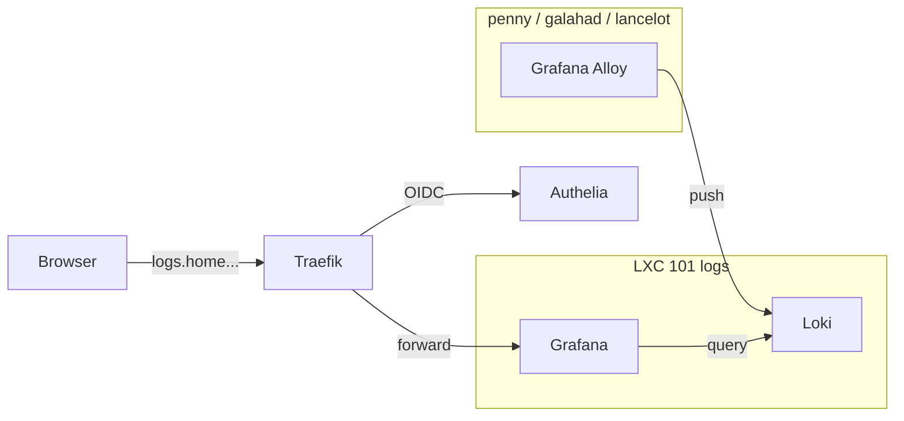

# Grafana (logs)

Visualisation des logs centralises (Loki + Alloy). Pas de metriques : c'est [Beszel](index.md) qui s'en occupé, pour éviter le doublon Prometheus + node_exporter.

## Acces

| | |
|---|---|
| URL | `https://logs.home.gabin-simond.fr` |
| Host | LXC 101 `logs` sur lancelot (192.168.1.31) |
| Port interne | 3000 |
| Image | `grafana/grafana:latest` |
| Source compose | `/opt/logs/docker-compose.yml` |
| Versioned | `homelab-config/logs/docker-compose.yml` (GitHub) |

## Authentification

**100% OIDC Authelia** — pas de compte admin local, pas de login form.

- `GF_AUTH_DISABLE_LOGIN_FORM=true`
- `GF_AUTH_BASIC_ENABLED=false`
- `GF_AUTH_OAUTH_AUTO_LOGIN=true` (redirige direct sur Authelia)
- PKCE S256 requis

### Rôle mapping (Grafana 12.x)

```text
GF_AUTH_GENERIC_OAUTH_ROLE_ATTRIBUTE_PATH: "contains(groups[*], 'admins') && 'GrafanaAdmin'"
GF_AUTH_GENERIC_OAUTH_ROLE_ATTRIBUTE_STRICT: "false"
GF_AUTH_GENERIC_OAUTH_ALLOW_ASSIGN_GRAFANA_ADMIN: "true"
```

Groupe `admins` dans Authelia `users_database.yml` → `GrafanaAdmin` (server admin + org admin).
Les users hors du groupe `admins` recoivent `auto_assign_org_role: Viewer`.

**Piege Grafana 12.x :** `role_attribute_path` est évalué sur le ID token EN PREMIER,
puis userinfo, puis access token. Authelia ne met PAS le claim `groups` dans le ID token
(seulement dans userinfo). Si l'expression a un fallback `|| 'Viewer'`, le ID token retourne
`'Viewer'` (rôle valide) et Grafana ne consulte JAMAIS le userinfo. Solution : pas de fallback
dans l'expression, le ID token retourne `null` → fallthrough vers userinfo → trouve les groups.

Le compte legacy `admin` est désactivé dans la DB (`is_disabled=1`, password efface). `gabins` est `is_admin=1` + org Admin.

## Datasources

| Name | Type | URL | UID |
|---|---|---|---|
| Loki | loki | `http://loki:3100` | `loki` |

Provisionnee via `/opt/logs/grafana-provisioning/datasources/loki.yml` avec `uid: loki` pour que les dashboards la trouvent.

## Dashboards

Quatre dashboards provisionnes via `/opt/logs/dashboards/*.json` (read-only), folder Grafana `Homelab`. Tous les KPI stats utilisent `[$__range]` et suivent le selecteur de temps Grafana.

### Homelab Overview (`homelab-overview`)

Le dashboard du matin — 5 secondes pour savoir si tout va bien.

| Ligne | Panneaux |
|---|---|
| KPIs sante | Erreurs, Container restarts, Autoheal, Events SSD |
| KPIs conscience | Logins echoues, Bans fail2ban, Watchtower MAJ, Sessions SSH |
| Graphes | Erreurs par service, Monitoring alerts (homelab_monitor.sh) |
| Logs événements | MAJ containers (Watchtower), SSD / Power / Certificats TLS |
| Logs erreurs | Erreurs recentes tous services |

### Sécurité (`auth-security`)

Deep dive quand un signal sécurité clignote sur l'overview.

| Ligne | Panneaux |
|---|---|
| KPIs | Logins reussis, Logins echoues, Bans fail2ban, Sudo commands |
| Graphes | Authelia logins, fail2ban bans par host, SSH sessions par host, Sudo par host |
| Logs | Authelia échecs + IP, WebAuthn/TOTP, SSH connexions, auditd |

### Trafic (`traefik-access`)

Deep dive sur le trafic HTTP via Traefik.

| Ligne | Panneaux |
|---|---|
| KPIs | Requêtes, 4xx, 5xx, Taux erreur |
| Graphes | Codes HTTP par classe (stacked), Volume par service backend |
| Logs | 4xx/5xx recents avec URL |

### Logs Explorer (`logs-explorer`)

Recherche libre avec filtres. Variables : Host, Job, Container, Recherche texte.

| Ligne | Panneaux |
|---|---|
| Graphes | Volume par host, Volume par container, Volume par job |
| Logs | Recherche libre (répond aux filtres variables) |

## Architecture



## Sources des logs (Alloy)

| Host | Sources |
|---|---|
| penny | journald, Docker containers, fail2ban, `homelab_monitor.sh` |
| galahad | journald, `/var/log/audit/audit.log`, Proxmox logs, fail2ban |
| lancelot | journald, Proxmox logs, LXC stdout/stderr |

Retention Loki : 30 jours.

## Opérations

### Ajouter un dashboard

Depose le JSON dans `/mnt/ssd/config/logs/dashboards/` (source sur penny), puis déploie via Tailscale SSH + `pct push` :

```bash
# Deployer chaque dashboard sur le LXC 101 (logs sur lancelot)
for f in /mnt/ssd/config/logs/dashboards/*.json; do
    tailscale ssh root@lancelot "pct push 101 /dev/stdin /opt/logs/dashboards/$(basename $f)" < "$f"
done
echo "Deploye — Grafana recharge automatiquement (updateIntervalSeconds: 60)"
```

!!! info "Pas besoin de restart Grafana"
    Le provisioner Grafana scanne `/opt/logs/dashboards/` toutes les 60 secondes. Les dashboards sont recharges automatiquement après un `pct push`.

### Reset du compte admin (en cas d'urgence)

Si Authelia est down ET qu'il faut acceder a Grafana, passer en mode basic temporairement :

```bash
# Dans le LXC 101
docker stop grafana
# Editer /opt/logs/docker-compose.yml :
#   GF_AUTH_DISABLE_LOGIN_FORM: "false"
#   GF_AUTH_BASIC_ENABLED: "true"
#   GF_SECURITY_ADMIN_PASSWORD: "<one-shot>"
docker compose up -d grafana
# Apres intervention : retirer les 3 env vars et redeployer
```

## Credentials

| Element | Stockage |
|---|---|
| Client OIDC `grafana` — secret en clair | Vaultwarden (`Grafana OIDC client (Authelia)`) |
| Client OIDC `grafana` — hash pbkdf2 | `/mnt/ssd/config/authelia/configuration.yml` |
| Admin legacy | **Désactivé** (aucun usage) |
