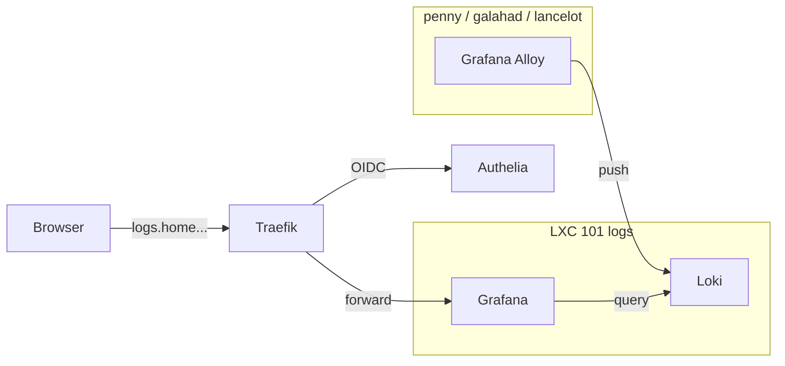

# Grafana (logs)

Visualisation des logs centralises (Loki + Alloy). Pas de metriques : c'est [Beszel](index.md) qui s'en occupé, pour éviter le doublon Prometheus + node_exporter.

## Acces

| | |
|---|---|
| URL | `https://logs.home.gabin-simond.fr` |
| Host | LXC 101 `logs` sur lancelot (192.168.1.31) |
| Port interne | 3000 |
| Image | `grafana/grafana:latest` |
| Source compose | `/opt/logs/docker-compose.yml` (sur la LXC 101, non git) |
| Versioned | `homelab-config/logs/logs-prod-1/docker-compose.yml` |

## Authentification

**100% OIDC Authelia** — pas de compte admin local, pas de login form.

- `GF_AUTH_DISABLE_LOGIN_FORM=true`
- `GF_AUTH_BASIC_ENABLED=false`
- `GF_AUTH_OAUTH_AUTO_LOGIN=true` (redirige direct sur Authelia)
- PKCE S256 requis

### Rôle mapping (Grafana 12.x)

```text
GF_AUTH_GENERIC_OAUTH_ROLE_ATTRIBUTE_PATH: "contains(groups[*], 'admins') && 'GrafanaAdmin'"
GF_AUTH_GENERIC_OAUTH_ROLE_ATTRIBUTE_STRICT: "false"
GF_AUTH_GENERIC_OAUTH_ALLOW_ASSIGN_GRAFANA_ADMIN: "true"
```

Groupe `admins` dans Authelia `users_database.yml` → `GrafanaAdmin` (server admin + org admin).
Les users hors du groupe `admins` recoivent `auto_assign_org_role: Viewer`.

**Piege Grafana 12.x :** `role_attribute_path` est évalué sur le ID token EN PREMIER,
puis userinfo, puis access token. Authelia ne met PAS le claim `groups` dans le ID token
(seulement dans userinfo). Si l'expression a un fallback `|| 'Viewer'`, le ID token retourne
`'Viewer'` (rôle valide) et Grafana ne consulte JAMAIS le userinfo. Solution : pas de fallback
dans l'expression, le ID token retourne `null` → fallthrough vers userinfo → trouve les groups.

Le compte legacy `admin` est désactivé dans la DB (`is_disabled=1`, password efface). `gabins` est `is_admin=1` + org Admin.

## Datasources

| Name | Type | URL | UID |
|---|---|---|---|
| Loki | loki | `http://loki:3100` | `loki` |

Provisionnee via `/opt/logs/grafana-provisioning/datasources/loki.yml` avec `uid: loki` pour que les dashboards la trouvent.

## Dashboards

**Cinq** tableaux provisionnés via `/opt/logs/dashboards/*.json` (read-only), folder
Grafana `Homelab`. Relevé le 2026-09-24, après la refonte des 22-24/09 : les anciens
`homelab-overview` et `logs-explorer` n'existent plus.

Tous suivent la même grammaire, et l'ordre des lignes est le propos :

| Ligne | Ce qu'elle répond |
|---|---|
| **Fiabilité des sources** | *Est-ce que je regarde des données ?* Nombre de journaux reçus, d'exportateurs actifs. Zéro ici invalide tout ce qui suit |
| **Verdict** | *Est-ce que ça va ?* Quelques compteurs, lisibles en cinq secondes |
| Détail | Les séries et les journaux, pour quand la réponse est non |

:::tip[Pourquoi « Fiabilité des sources » vient en premier]
Un panneau vide se lit « rien à signaler » alors qu'il veut souvent dire « plus de
source ». Mettre le compte des sources **avant** le verdict évite de lire un silence
comme une bonne nouvelle. C'est le même raisonnement que le
[dead-man-switch](../operations/monitoring.md#dead-man-switch-negative-space-alerting) et
que `guardrail-liveness`.
:::

| Fichier | Titre | Panneaux | À quoi il sert |
|---|---|---|---|
| `poste-commande.json` | Poste de commande | 15 | Le tableau du matin. Registre des garde-fous, combien sont muets, dernier verdict de chacun, erreurs et redémarrages |
| `hosts-capacity.json` | Hôtes / Capacité | 18 | Remplissage, mémoire, température, latence et débit disque, santé SMART du SSD |
| `auth-security.json` | Sécurité | 17 | Échecs d'authentification, refus de comptes connus, bans fail2ban, connexions SSH par hôte |
| `traefik-access.json` | Traefik — erreurs | 10 | 4xx, 5xx, erreurs par code et par service, plus une ligne « bruit connu » |
| `investigation.json` | Investigation | 15 | Fouille : volume par sévérité, hôte, conteneur, source ; unités et conteneurs les plus bavards ; recherche libre |

## Architecture


```mermaid
graph LR
    subgraph "penny / galahad / lancelot"
        Alloy[Grafana Alloy]
    end

    subgraph "LXC 101 logs"
        Loki
        Grafana
    end

    Alloy -->|push| Loki
    Grafana -->|query| Loki
    Browser -->|logs.home...| Traefik
    Traefik -->|OIDC| Authelia
    Traefik -->|forward| Grafana
```

## Sources des logs (Alloy)

| Host | `job` collectés |
|---|---|
| penny | `journald`, `docker`, `audit`, `fail2ban`, `monitor`, `watchdog` |
| galahad | `journald`, `audit`, `fail2ban`, `proxmox` |
| lancelot | `journald`, `audit`, `fail2ban`, `proxmox` |

Neuf des dix LXC expédient aussi. La **LXC 110 `securo` n'a pas d'Alloy** et n'apparaît
donc dans aucun tableau ni aucune alerte. L'inventaire complet par LXC est sur
[Alloy + Loki HA](alloy-loki-ha.md) — cette page ne le duplique pas.

Retention Loki : 30 jours.

## Opérations

### Ajouter un dashboard

Depose le JSON dans `/mnt/ssd/config/logs/logs-prod-1/dashboards/` (source sur penny), puis déploie :

```bash
logs/logs-prod-1/deploy-to-lxc101.sh
```

Le script pousse les fichiers, redémarre Grafana et contrôle les règles orphelines. À la
main, si besoin :

```bash
for f in /mnt/ssd/config/logs/logs-prod-1/dashboards/*.json; do
    tailscale ssh root@lancelot "pct push 101 /dev/stdin /opt/logs/dashboards/$(basename $f)" < "$f"
done
```

:::info[Pas besoin de restart Grafana]
Le provisioner Grafana scanne `/opt/logs/dashboards/` toutes les 60 secondes. Les dashboards sont recharges automatiquement après un `pct push`.
:::

### Retirer une règle d'alerte

:::danger[Retirer la règle du fichier ne la supprime PAS]
Le provisioning Grafana ne fait que **créer et mettre à jour** ce qu'il trouve
dans `rules.yml`. Une règle qu'on en retire reste vivante dans `grafana.db`
(`is_paused=0`) et continue de s'évaluer — indéfiniment, à travers les
redémarrages, sans que rien ne le signale.

Constaté le 2026-08-26 : les deux règles « Sucre », retirées du fichier le 25/08
après l'arrêt du service, tournaient encore le lendemain. Celle qui surveillait
le silence de sucre était un dead-man-switch sur un service volontairement mort :
**38 notifications ntfy en 24 heures, 60 % du trafic du topic.**
:::

Il faut nommer explicitement les `uid` dans un bloc `deleteRules`, au même niveau
que `groups` :

```yaml
deleteRules:
  - orgId: 1
    uid: alert-host-sucre-silent
  - orgId: 1
    uid: alert-sucre-llm-unavailable
```

Le bloc est **idempotent** : une fois les `uid` disparus de la base, Grafana
l'ignore en silence. On peut donc le garder comme trace du démantèlement.

Puis déployer et vérifier que la **base** reflète le changement — c'est la preuve
que le provisioning a bien agi, pas le fichier :

```bash
logs/logs-prod-1/deploy-to-lxc101.sh   # push + restart grafana + controle des orphelines
```

Ce script compare depuis le 2026-08-26 les `uid` de `rules.yml` à ceux de la table
`alert_rule` et **échoue** en affichant le bloc `deleteRules` à coller. En
manuel :

```bash
tailscale ssh root@lancelot \
  "pct exec 101 -- sqlite3 /opt/logs/grafana/grafana.db \
   'SELECT uid, title FROM alert_rule'"
```

:::warning[Un dead-man-switch sur une machine à moitié éteinte clignote]
La règle ne restait pas allumée, elle battait `FIRING`/`RESOLVED` : Alloy tournait
encore dans le LXC, donc des logs sporadiques frôlaient le seuil dans les deux
sens. Chaque transition est une notification. Avant de retirer une règle de
silence, couper aussi ce qui émet encore des logs — ou la règle sera plus bruyante
morte que vivante.
:::

### Reset du compte admin (en cas d'urgence)

Si Authelia est down ET qu'il faut acceder a Grafana, passer en mode basic temporairement :

```bash
# Dans le LXC 101
docker stop grafana
# Editer /opt/logs/docker-compose.yml :
#   GF_AUTH_DISABLE_LOGIN_FORM: "false"
#   GF_AUTH_BASIC_ENABLED: "true"
#   GF_SECURITY_ADMIN_PASSWORD: "<one-shot>"
docker compose up -d grafana
# Apres intervention : retirer les 3 env vars et redeployer
```

## Credentials

| Element | Stockage |
|---|---|
| Client OIDC `grafana` — secret en clair | Vaultwarden (`Grafana OIDC client (Authelia)`) |
| Client OIDC `grafana` — hash pbkdf2 | `/mnt/ssd/config/authelia/configuration.yml` |
| Admin legacy | **Désactivé** (aucun usage) |
