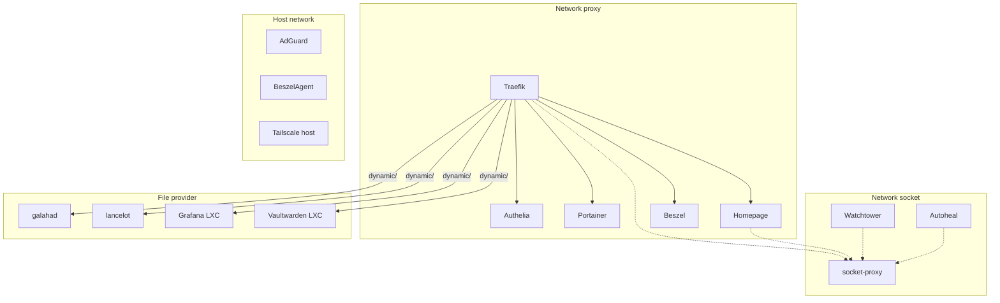

# Services

Vue d'ensemble de tous les services, leurs acces et l'architecture Docker.

## Services et acces

Tous les conteneurs sur penny tournent depuis un seul `/mnt/ssd/config/docker/docker-compose.yml`. Docker data-root sur le SSD (`/mnt/ssd/docker`).

Grafana + Loki ne sont **pas** sur penny — ils tournent dans le LXC `logs` sur lancelot. Voir [grafana.md](grafana.md).
Vaultwarden est **migre** sur LXC 102 `vault` (galahad, 192.168.1.32). Voir [vaultwarden.md](vaultwarden.md).
Tailscale tourne **sur l'host** (pas en container) — SSH natif activé.

| Service | Image | URL | Auth | Host | Réseau Docker |
|---|---|---|---|---|---|
| **Traefik** | `traefik:latest` | `traefik.home.*` | ForwardAuth Authelia | penny | proxy, socket |
| **AdGuard Home** | `adguard/adguardhome:latest` | `adguard.home.*` | ForwardAuth Authelia + bcrypt | penny (host net) | host |
| **AdGuard dns-failover** | — | `dns-failover.home.*` | ForwardAuth Authelia + bcrypt | LXC dns-failover / galahad | — |
| **socket-proxy** | `tecnativa/docker-socket-proxy` | — | — | penny | socket |
| **Portainer EE** | `portainer/portainer-ee:latest` | `portainer.home.*` | OIDC Authelia (SSO auto-login, internal hidden) | penny | proxy |
| **Homepage** | `ghcr.io/gethomepage/homepage:latest` | `home.*` | ForwardAuth Authelia | penny | proxy, socket |
| **Beszel** + agent | `henrygd/beszel` | `monitor.home.*` | OIDC Authelia (one_factor) | penny | proxy / host |
| **Watchtower** | `containrrr/watchtower` | — (headless) | — | penny | socket |
| **Authelia** | `authelia/authelia:latest` | `auth.home.*` | MFA TOTP + YubiKey | penny | proxy |
| **autoheal** | `willfarrell/autoheal` | — | — | penny | socket |
| **Grafana (logs)** | — | `logs.home.*` | OIDC Authelia (two_factor + PKCE, auto-login) | LXC logs / lancelot | — |
| **Vaultwarden** | — | `vault.home.*` | Master + TOTP | LXC vault / galahad | — |
| **Proxmox galahad** | — | `galahad.home.*` | OIDC Authelia / root@pam | galahad (bare metal) | — |
| **Proxmox lancelot** | — | `lancelot.home.*` | OIDC Authelia / root@pam | lancelot (bare metal) | — |
| **Docs** | — | `homelab.gabin-simond.fr` | Aucune (publique) | hors infra | — |

Tous les services web sont accessibles via `*.home.gabin-simond.fr` (reverse proxy Traefik). Tous les services sont proteges par [Authelia](authelia.md) (OIDC ou ForwardAuth). Voir [authelia.md](authelia.md) pour les clients OIDC et la configuration.

## Architecture Docker (penny)



### DNS interne

Les containers sur `proxy` qui doivent résoudre `*.home.gabin-simond.fr` (pour contacter Authelia OIDC) utilisent `dns: 192.168.1.28` (AdGuard) : Homepage, Portainer, Beszel. Voir [dépannage](../operations/depannage.md#docker-containers-dns-interne-et-oidc) si un container ne resout pas les domaines locaux.

## Réseaux Docker

| Réseau | Type | Usage |
|---|---|---|
| `proxy` | bridge | Services reverse-proxies par Traefik |
| `socket` | bridge (internal) | Clients de socket-proxy (Traefik, Homepage, Watchtower, autoheal) |
| `host` | host | AdGuard, Beszel Agent (Tailscale est sur l'host natif, pas Docker) |

Pour les implications sécurité (ICC, surface d'attaque inter-containers), voir [hardening — réseaux Docker](../securite/hardening.md#reseaux-docker-isolation-et-icc).

## Socket proxy — isolation Docker API

Plus aucun container ne mount `/var/run/docker.sock` directement (sauf Portainer par nécessité admin). Tout passe par `socket-proxy` sur le réseau `socket` (internal, pas d'internet).

Pour la liste détaillée des endpoints autorises/bloques et l'analyse de surface d'attaque, voir [hardening — socket proxy](../securite/hardening.md#socket-proxy).

## LXC Proxmox

| ID | Nom | Host | IP LAN | Rôle |
|---|---|---|---|---|
| 100 | dns-failover | galahad | `192.168.1.30` | AdGuard secondaire + health check penny |
| 101 | logs | lancelot | `192.168.1.31` | Loki + Grafana |
| 102 | vault | galahad | `192.168.1.32` | Vaultwarden |

Note d'isolement : `vault` et `logs` sont sur des hosts différents (galahad vs lancelot) — si un node tombe, on ne perd pas simultanement les secrets ET les logs.

## Acces distant

| Méthode | Détail |
|---|---|
| Tailscale | VPN mesh, acces a tous les services via IP Tailscale (`100.64.0.0/10`) |
| Tailscale SSH | Mode `check` (navigateur MFA), certs auto-rotated, pas de port 22 exposé |

## Services réseau (ports ouverts)

| Service | Port | Protocole | Scope firewall |
|---|---|---|---|
| AdGuard DNS | 53 | TCP/UDP | Tous |
| AdGuard DoT | 853 | TCP | Tous |
| Traefik HTTP → HTTPS | 80 | TCP | Tous |
| Traefik HTTPS | 443 | TCP | Tous |
| SSH penny | 2806 | TCP | Tous (clé obligatoire) |
| SSH galahad | 2807 | TCP | Tous (clé obligatoire) |
| SSH lancelot | 2808 | TCP | Tous (clé obligatoire) |
| AdGuard UI | 3000 | TCP | LAN + Tailscale |
| Beszel Agent | 45876 | TCP | LAN + Tailscale |

Tout le reste est DROP.

## Volumes et configuration

Bind mounts (configs versionnees) :
```text
/mnt/ssd/config/traefik/   → /config       (Traefik)
/mnt/ssd/config/adguard/   → /opt/adguardhome/conf (AdGuard)
/mnt/ssd/config/homepage/  → /app/config   (Homepage)
/mnt/ssd/config/authelia/  → /config       (Authelia)
```

Docker volumes (données) :
```text
traefik-certs / traefik-data  — Certificats + logs
portainer-data                — Donnees Portainer
adguard-data                  — Donnees AdGuard
beszel-data                   — Donnees Beszel
```

## Variables d'environnement

Le fichier `/mnt/ssd/config/.env` (non versionne) contient :

```bash
CF_API_EMAIL=...                   # Email Cloudflare (Traefik DNS challenge)
CF_DNS_API_TOKEN=...               # Token API Cloudflare
TS_AUTHKEY=...                     # Auth key Tailscale
HOMEPAGE_VAR_PORTAINER_KEY=...     # Widget Portainer
HOMEPAGE_VAR_BESZEL_USER=...       # Widget Beszel
HOMEPAGE_VAR_BESZEL_PASS=...
HOMEPAGE_VAR_ADGUARD_USER=...      # Widget AdGuard
HOMEPAGE_VAR_ADGUARD_PASS=...
HOMEPAGE_VAR_PVE_TOKEN_ID=...      # Widget Proxmox (token readonly)
HOMEPAGE_VAR_PVE_TOKEN_SECRET=...
```

Tous ces secrets sont aussi stockes dans Vaultwarden. Voir [politique de sécurité](../securite/politique.md#inventaire-des-secrets-a-stocker-dans-vaultwarden) pour l'inventaire complet.
