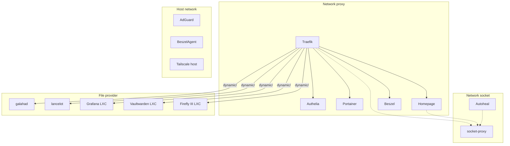

# Services

Vue d'ensemble de tous les services, leurs acces et l'architecture Docker.

## Services et acces

Tous les conteneurs sur penny tournent depuis un seul `/mnt/ssd/config/docker/docker-compose.yml`. Docker data-root sur le SSD (`/mnt/ssd/docker`).

Grafana + Loki ne sont **pas** sur penny — ils tournent dans le LXC `logs` sur lancelot. Voir [grafana.md](grafana.md).
Vaultwarden est **migre** sur LXC 102 `vault` (galahad, 192.168.1.32). Voir [vaultwarden.md](vaultwarden.md).
Firefly III et son importeur tournent dans le LXC `finance` (galahad, 192.168.1.37). Voir [firefly.md](firefly.md).
Tailscale tourne **sur l'host** (pas en container) — SSH natif activé.

### Exposés derrière Traefik

| Service | Image | URL | Host | Réseau Docker |
|---|---|---|---|---|
| **[Traefik](traefik.md)** | `traefik:latest` | `traefik.home…` | penny | proxy, socket |
| **[Authelia](authelia.md)** | `authelia/authelia:latest` | `auth.home…` | penny | proxy |
| **[AdGuard Home](adguard.md)** | `adguard/adguardhome:latest` | `dns.home…` | penny (host net) | host |
| **[Homepage](homepage.md)** | `ghcr.io/gethomepage/homepage:latest` | `home.gabin-simond.fr` | penny | proxy, socket |
| **[Portainer EE](portainer.md)** | `portainer/portainer-ee:latest` | `portainer.home…` | penny | proxy |
| **[Beszel](beszel.md)** | `henrygd/beszel:latest` | `monitor.home…` | penny | proxy |
| **[Forgejo](forgejo.md)** | `codeberg.org/forgejo/forgejo:13-rootless` | `git.home…` | penny | proxy |
| **[Outline](outline.md)** | `outlinewiki/outline:latest` | `wiki.home…` | penny | outline, proxy |
| **[ntfy](ntfy.md)** | `binwiederhier/ntfy:latest` | `ntfy.home…` + Funnel | penny | proxy |
| **[Dozzle](boite-a-outils.md)** | `amir20/dozzle:latest` | `dozzle.home…` | penny | proxy, socket |
| **[Homelable](homelable.md)** | `ghcr.io/pouzor/homelable-frontend:latest` | `homelable.home…` | penny | homelable, proxy |
| **[Kroki](boite-a-outils.md)** | `yuzutech/kroki:latest` | `kroki.home…` | penny | proxy |
| **[CyberChef](boite-a-outils.md)** | `ghcr.io/gchq/cyberchef:latest` | `cyberchef.home…` | penny | proxy |
| **[Stirling PDF](boite-a-outils.md)** | `ghcr.io/stirling-tools/s-pdf:latest-ultra-lite` | `pdf.home…` | penny | proxy |

### Sans URL — internes ou agents

| Service | Image | Rôle |
|---|---|---|
| **socket-proxy** | `lscr.io/linuxserver/socket-proxy:3.4.2-r0-ls88` | Filtre l'API Docker pour Traefik, Homepage, Dozzle, autoheal |
| **autoheal** | `willfarrell/autoheal:latest` | Redémarre les conteneurs `unhealthy` |
| **[CrowdSec](crowdsec.md)** | `crowdsecurity/crowdsec:latest` | Détection + bouncer Traefik |
| **beszel-agent** | `henrygd/beszel-agent:latest` | Agent de métriques (réseau host) |
| **[loki-replica](logs-stack.md)** | `grafana/loki:latest` | Réplica du Loki de la LXC 101 — survit à la perte de lancelot |
| **[status](boite-a-outils.md)** | `busybox:1.38` | Page d'état statique |
| **outline-db** / **outline-redis** | `postgres:16-alpine` / `redis:7-alpine` | Base et cache d'Outline |
| **kroki-mermaid** | `yuzutech/kroki-mermaid:latest` | Moteur Mermaid de Kroki |
| **homelable-backend** | `ghcr.io/pouzor/homelable-backend:latest` | API de Homelable |

### Hors penny

| Service | URL | Où |
|---|---|---|
| **[Grafana](grafana.md)** | `logs.home…` | LXC 101 `logs` / lancelot |
| **[Vaultwarden](vaultwarden.md)** | `vault.home…` | LXC 102 `vault` / galahad |
| **[PBS](pbs.md)** | `backup.home…` | LXC 103 `pbs` / lancelot |
| **[Pulse](pulse.md)** | `pulse.home…` | LXC 106 `pulse` / galahad |
| **[Firefly III](firefly.md)** + [importeur](firefly.md#importeur-de-donnees) | `finance.home…` / `import.home…` | LXC 109 `finance` / galahad |
| **[AdGuard secondaire](dns-failover.md)** | `dns-failover.home…` | LXC 100 `dns-failover` / galahad |
| **Proxmox** | `galahad.home…` / `lancelot.home…` | Les deux nœuds, bare metal |
| **Docs** | `homelab.gabin-simond.fr` | GitHub Pages, hors infra — seul service public sans Authelia |

:::note[Inventaire vérifié le 2026-08-26]
Les 24 conteneurs et 10 LXC ci-dessus ont été relevés sur les machines, pas
recopiés. Avant cette date le tableau en listait 16 et en oubliait 11 — dont
`ntfy`, `forgejo`, `outline` et `crowdsec`, tous cités des dizaines de fois
ailleurs dans cette documentation. Une page d'inventaire qui n'est pas
régénérée devient un piège : on y croit.
:::

Tous les services web sont accessibles via `*.home.gabin-simond.fr` (reverse proxy Traefik). Tous les services sont proteges par [Authelia](authelia.md) (OIDC ou ForwardAuth). Voir [authelia.md](authelia.md) pour les clients OIDC et la configuration.

## Architecture Docker (penny)


```mermaid
graph TB
    subgraph Network proxy
        Traefik --> Authelia
        Traefik --> Portainer
        Traefik --> Homepage
        Traefik --> Beszel
    end

    subgraph Network socket
        SP[socket-proxy]
        Traefik -.-> SP
        Homepage -.-> SP
        Autoheal -.-> SP
    end

    subgraph Host network
        AdGuard
        BeszelAgent
        Tailscale[Tailscale host]
    end

    subgraph File provider
        Traefik -->|dynamic/| PVE1[galahad]
        Traefik -->|dynamic/| PVE2[lancelot]
        Traefik -->|dynamic/| Logs[Grafana LXC]
        Traefik -->|dynamic/| Vault[Vaultwarden LXC]
        Traefik -->|dynamic/| Finance[Firefly III LXC]
    end
```

### DNS interne

Les containers sur `proxy` qui doivent résoudre `*.home.gabin-simond.fr` (pour contacter Authelia OIDC) utilisent `dns: 192.168.1.28` (AdGuard) : Homepage, Portainer, Beszel. Voir [dépannage](../operations/depannage.md#docker-containers--dns-interne-et-oidc) si un container ne resout pas les domaines locaux.

## Réseaux Docker

| Réseau | Type | Usage |
|---|---|---|
| `proxy` | bridge | Services reverse-proxies par Traefik |
| `socket` | bridge (internal) | Clients de socket-proxy (Traefik, Homepage, autoheal) |
| `host` | host | AdGuard, Beszel Agent (Tailscale est sur l'host natif, pas Docker) |
| `outline` | bridge | Outline avec sa base Postgres et son Redis |
| `homelable` | bridge | Homelable et son API |

Pour les implications sécurité (ICC, surface d'attaque inter-containers), voir [hardening — réseaux Docker](../securite/hardening.md#réseaux-docker--isolation-et-icc).

## Socket proxy — isolation Docker API

Plus aucun container ne mount `/var/run/docker.sock` directement (sauf Portainer par nécessité admin). Tout passe par `socket-proxy` sur le réseau `socket` (internal, pas d'internet).

Pour la liste détaillée des endpoints autorises/bloques et l'analyse de surface d'attaque, voir [hardening — socket proxy](../securite/hardening.md#socket-proxy).

## LXC Proxmox

| ID | Nom | Host | IP LAN | Rôle |
|---|---|---|---|---|
| 100 | [`dns-failover`](dns-failover.md) | galahad | `192.168.1.30` | AdGuard secondaire + sonde penny — Tailscale `guardian` |
| 101 | [`logs`](logs-stack.md) | lancelot | `192.168.1.31` | Loki + Grafana + Prometheus + relais ntfy |
| 102 | `vault` | galahad | `192.168.1.32` | Vaultwarden |
| 103 | [`pbs`](pbs.md) | lancelot | `192.168.1.33` | Proxmox Backup Server |
| 104 | [`zomboid`](zomboid.md) | galahad | DHCP | Serveur Project Zomboid |
| 105 | `sucre` | lancelot | DHCP | **Arrêté** depuis le 2026-08-25 — voir [Bilan et arrêt](../projet/sucre.md#bilan-et-arrêt) |
| 106 | [`pulse`](pulse.md) | galahad | `192.168.1.34` | Pulse (supervision Proxmox + Docker) |
| 107 | [`waterline`](waterline.md) | galahad | DHCP | Serveur de test du mod Waterline |
| 108 | [`ci-runner`](ci-runner.md) | lancelot | DHCP | Runner Forgejo Actions (aarch64) |
| 109 | [`finance`](firefly.md) | galahad | `192.168.1.37` | Firefly III + importeur |

Note d'isolement : `vault` et `logs` sont sur des hosts différents (galahad vs lancelot) — si un node tombe, on ne perd pas simultanement les secrets ET les logs.

## Acces distant

| Méthode | Détail |
|---|---|
| Tailscale | VPN mesh, acces a tous les services via IP Tailscale (`100.64.0.0/10`) |
| Tailscale SSH | Mode `check` (navigateur MFA), certs auto-rotated, pas de port 22 exposé |

## Services réseau (ports ouverts)

| Service | Port | Protocole | Scope firewall |
|---|---|---|---|
| AdGuard DNS | 53 | TCP/UDP | Tous |
| AdGuard DoT | 853 | TCP | Tous |
| Traefik HTTP → HTTPS | 80 | TCP | Tous |
| Traefik HTTPS | 443 | TCP | Tous |
| SSH penny | 2806 | TCP | Tous (clé obligatoire) |
| SSH galahad | 2807 | TCP | Tous (clé obligatoire) |
| SSH lancelot | 2808 | TCP | Tous (clé obligatoire) |
| AdGuard UI | 3000 | TCP | LAN + Tailscale |
| Beszel Agent | 45876 | TCP | LAN + Tailscale |

Tout le reste est DROP.

## Volumes et configuration

Bind mounts (configs versionnees) :
```text
/mnt/ssd/config/traefik/   → /config       (Traefik)
/mnt/ssd/config/adguard/   → /opt/adguardhome/conf (AdGuard)
/mnt/ssd/config/homepage/  → /app/config   (Homepage)
/mnt/ssd/config/authelia/  → /config       (Authelia)
```

Docker volumes (données) :
```text
traefik-certs / traefik-data  — Certificats + logs
portainer-data                — Donnees Portainer
adguard-data                  — Donnees AdGuard
beszel-data                   — Donnees Beszel
```

## Variables d'environnement

Les secrets ne vivent **pas** en clair dans le dépôt. `/mnt/ssd/config/.env` est un
**lien symbolique** vers `/run/homelab/.env` — donc sur un tmpfs, donc perdu à
chaque redémarrage, ce qui est voulu. La source de vérité est
`/mnt/ssd/config/.env.enc`, scellé par **sops** (clé `age` sur penny), et
`scripts/homelab-unseal.sh` le matérialise au démarrage.

```text
.env.enc            → versionné, chiffré         (la source)
.env → /run/…/.env  → tmpfs, en clair, éphémère  (ce que Compose lit)
```

Conséquence pratique : un `docker compose` lancé avant le descellement voit un
`.env` vide, et les conteneurs démarrent sans leurs variables. En cas de doute,
vérifier par `docker exec <conteneur> printenv`, jamais en lisant le fichier.

:::warning[Compose interpole aussi les `env_file`]
Depuis Compose 2.24, un `$` dans une valeur d'`env_file` est interprété. Un hash
bcrypt y perd un segment **en silence** — doubler les `$`.
:::

Ce que le fichier porte : les identifiants Cloudflare du challenge DNS de Traefik,
la clé d'enrôlement Tailscale, et les jetons de lecture des widgets Homepage
(Portainer, Beszel, AdGuard, Proxmox). L'inventaire nominatif est dans la
[politique de sécurité](../securite/politique.md#inventaire-des-secrets-a-stocker-dans-vaultwarden)
— cette page ne le duplique pas, pour n'avoir qu'un seul endroit à tenir à jour.
