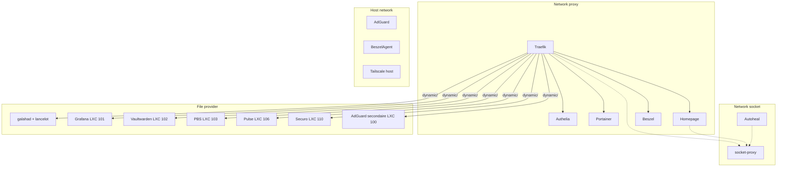

# Services

Vue d'ensemble de tous les services, leurs acces et l'architecture Docker.

## Services et acces

Tous les conteneurs sur penny tournent depuis un seul `/mnt/ssd/config/docker/docker-compose.yml`. Docker data-root sur le SSD (`/mnt/ssd/docker`).

Grafana + Loki ne sont **pas** sur penny — ils tournent dans le LXC `logs` sur lancelot. Voir [grafana.md](grafana.md).
Vaultwarden est **migre** sur LXC 102 `vault` (galahad, 192.168.1.32). Voir [vaultwarden.md](vaultwarden.md).
Tailscale tourne **sur l'host** (pas en container) — SSH natif activé.

### Exposés derrière Traefik

| Service | Image | URL | Host | Réseau Docker |
|---|---|---|---|---|
| **[Traefik](traefik.md)** | `traefik:latest` | `traefik.home…` | penny | proxy, socket |
| **[Authelia](authelia.md)** | `authelia/authelia:latest` | `auth.home…` | penny | proxy |
| **[AdGuard Home](adguard.md)** | `adguard/adguardhome:latest` | `dns.home…` | penny (host net) | host |
| **[Homepage](homepage.md)** | `ghcr.io/gethomepage/homepage:latest` | `home.gabin-simond.fr` | penny | proxy, socket |
| **[Portainer EE](portainer.md)** | `portainer/portainer-ee:latest` | `portainer.home…` | penny | proxy |
| **[Beszel](beszel.md)** | `henrygd/beszel:latest` | `monitor.home…` | penny | proxy |
| **[Forgejo](forgejo.md)** | `codeberg.org/forgejo/forgejo:13-rootless` | `git.home…` | penny | proxy |
| **[Outline](outline.md)** | `outlinewiki/outline:latest` | `wiki.home…` | penny | outline, proxy |
| **[ntfy](ntfy.md)** | `binwiederhier/ntfy:latest` | `ntfy.home…` + Funnel | penny | proxy |
| **[Dozzle](boite-a-outils.md)** | `amir20/dozzle:latest` | `dozzle.home…` | penny | proxy, socket |
| **[Homelable](homelable.md)** | `ghcr.io/pouzor/homelable-frontend:latest` | `homelable.home…` | penny | homelable, proxy |
| **[CyberChef](boite-a-outils.md)** | `ghcr.io/gchq/cyberchef:latest` | `cyberchef.home…` | penny | proxy |
| **[Stirling PDF](boite-a-outils.md)** | `ghcr.io/stirling-tools/s-pdf:latest-ultra-lite` | `pdf.home…` | penny | proxy |

### Sans URL — internes ou agents

| Service | Image | Rôle |
|---|---|---|
| **socket-proxy** | `lscr.io/linuxserver/socket-proxy:3.4.2-r0-ls88` | Filtre l'API Docker pour Traefik, Homepage, Dozzle, autoheal |
| **autoheal** | `willfarrell/autoheal:latest` | Redémarre les conteneurs `unhealthy` |
| **[CrowdSec](crowdsec.md)** | `crowdsecurity/crowdsec:latest` | Détection + bouncer Traefik |
| **beszel-agent** | `henrygd/beszel-agent:latest` | Agent de métriques (réseau host) |
| **[loki-replica](alloy-loki-ha.md)** | `grafana/loki:latest` | Réplica du Loki de la LXC 101 — survit à la perte de lancelot |
| **[status](boite-a-outils.md)** | `busybox:1.38` | Page d'état statique |
| **outline-db** / **outline-redis** | `postgres:16-alpine` / `redis:7-alpine` | Base et cache d'Outline |
| **homelable-backend** | `ghcr.io/pouzor/homelable-backend:latest` | API de Homelable |

### Sur l'hôte penny, hors Docker

| Service | Rôle |
|---|---|
| **Tailscale** | Installé nativement (pas en conteneur) — SSH natif activé, Funnel pour ntfy |
| **[claude-remote](claude-remote.md)** | Mode serveur `claude remote-control` : penny est un appareil dans l'app Claude |
| **AdGuard Home** | Tourne bien en conteneur, mais sur le réseau `host` (ports 53/3000 sur l'hôte) |
| `homelab_monitor.sh` | Cron chaque minute — voir [monitoring](../operations/monitoring.md) |
| Les 30 timers systemd | Sondes planifiées — voir [monitoring](../operations/monitoring.md#contrôles-planifiés-timers-penny) |

### Hors penny

| Service | URL | Où |
|---|---|---|
| **[Grafana](grafana.md)** | `logs.home…` | LXC 101 `logs` / lancelot |
| **[Vaultwarden](vaultwarden.md)** | `vault.home…` | LXC 102 `vault` / galahad |
| **[PBS](pbs.md)** | `backup.home…` | LXC 103 `pbs` / lancelot |
| **[Pulse](pulse.md)** | `pulse.home…` | LXC 106 `pulse` / galahad |
| **[AdGuard secondaire](dns-failover.md)** | `dns-failover.home…` | LXC 100 `dns-failover` / galahad |
| **Proxmox** | `galahad.home…` / `lancelot.home…` | Les deux nœuds, bare metal |
| **Securo** | `securo.home…` | LXC 110 `securo` / lancelot — en évaluation depuis le 2026-09 |
| **Proxmox** | `galahad.home…` / `lancelot.home…` | Les deux nœuds, bare metal |
| **Docs** | `homelab.gabin-simond.fr` | GitHub Pages, hors infra — seul service public sans Authelia |

:::note[Inventaire re-vérifié le 2026-09-24]
Les **22 conteneurs** et **10 LXC** ci-dessus ont été relevés sur les machines, pas
recopiés. Ils étaient 24 au relevé du 2026-08-26 : `kroki` et `kroki-mermaid` ont été
[retirés le 2026-08-31](../projet/journal/2026-08-31-retrait-kroki.md).

Côté LXC le compte n'a pas bougé mais la composition si : `109` portait Firefly III,
retiré le 2026-09-19 ; `110` porte Securo depuis le 2026-09.

Avant le 26/08 le tableau en listait 16 et en oubliait 11 — dont `ntfy`, `forgejo`,
`outline` et `crowdsec`, tous cités des dizaines de fois ailleurs dans cette
documentation. Une page d'inventaire qui n'est pas régénérée devient un piège : on y
croit. Pour la redériver :

```bash
docker ps -a --format '{{.Names}}\t{{.Image}}'   # sur penny
pct list                                          # sur galahad, puis lancelot
```
:::

Tous les services web sont accessibles via `*.home.gabin-simond.fr` (reverse proxy Traefik). Tous les services sont proteges par [Authelia](authelia.md) (OIDC ou ForwardAuth). Voir [authelia.md](authelia.md) pour les clients OIDC et la configuration.

## Architecture Docker (penny)


```mermaid
graph TB
    subgraph Network proxy
        Traefik --> Authelia
        Traefik --> Portainer
        Traefik --> Homepage
        Traefik --> Beszel
    end

    subgraph Network socket
        SP[socket-proxy]
        Traefik -.-> SP
        Homepage -.-> SP
        Autoheal -.-> SP
    end

    subgraph Host network
        AdGuard
        BeszelAgent
        Tailscale[Tailscale host]
    end

    subgraph File provider
        Traefik -->|dynamic/| PVE[galahad + lancelot]
        Traefik -->|dynamic/| Logs[Grafana LXC 101]
        Traefik -->|dynamic/| Vault[Vaultwarden LXC 102]
        Traefik -->|dynamic/| PBS[PBS LXC 103]
        Traefik -->|dynamic/| Pulse[Pulse LXC 106]
        Traefik -->|dynamic/| Securo[Securo LXC 110]
        Traefik -->|dynamic/| DnsFO[AdGuard secondaire LXC 100]
    end
```

Le répertoire `dynamic/` porte aussi les fichiers qui ne déclarent aucun backend mais des
middlewares partagés : `crowdsec-bouncer.yml`, `rate-limit.yml`, `security-headers.yml`,
`tls-options.yml`.

### DNS interne

Les containers sur `proxy` qui doivent résoudre `*.home.gabin-simond.fr` (pour contacter Authelia OIDC) utilisent `dns: 192.168.1.28` (AdGuard) : Homepage, Portainer, Beszel. Voir [dépannage](../operations/depannage.md#docker-containers--dns-interne-et-oidc) si un container ne resout pas les domaines locaux.

## Réseaux Docker

| Réseau | Type | Usage |
|---|---|---|
| `proxy` | bridge | Services reverse-proxies par Traefik |
| `socket` | bridge (internal) | Clients de socket-proxy (Traefik, Homepage, autoheal) |
| `host` | host | AdGuard, Beszel Agent (Tailscale est sur l'host natif, pas Docker) |
| `outline` | bridge | Outline avec sa base Postgres et son Redis |
| `homelable` | bridge | Homelable et son API |

Pour les implications sécurité (ICC, surface d'attaque inter-containers), voir [hardening — réseaux Docker](../securite/hardening.md#réseaux-docker--isolation-et-icc).

## Socket proxy — isolation Docker API

Presque tout passe par `socket-proxy` sur le réseau `socket` (internal, pas d'internet).
**Deux** conteneurs montent encore `/var/run/docker.sock` en direct, relevés le
2026-09-24 : `portainer` (nécessité admin) et `beszel-agent` (métriques par conteneur).
Les deux en `ro`. Voir [portainer](portainer.md#la-seule-exception-au-socket-proxy).

Pour la liste détaillée des endpoints autorises/bloques et l'analyse de surface d'attaque, voir [hardening — socket proxy](../securite/hardening.md#socket-proxy).

## LXC Proxmox

| ID | Nom | Host | IP LAN | Rôle |
|---|---|---|---|---|
| 100 | [`dns-failover`](dns-failover.md) | galahad | `192.168.1.30` | AdGuard secondaire + sonde penny — Tailscale `guardian` |
| 101 | [`logs`](logs-stack.md) | lancelot | `192.168.1.31` | Loki + Grafana + Prometheus + relais ntfy |
| 102 | [`vault`](vaultwarden.md) | galahad | `192.168.1.32` | Vaultwarden |
| 103 | [`pbs`](pbs.md) | lancelot | `192.168.1.33` | Proxmox Backup Server |
| 104 | [`zomboid`](zomboid.md) | galahad | DHCP | Serveur Project Zomboid |
| 105 | `sucre` | lancelot | DHCP | **Arrêté** depuis le 2026-08-25 — voir [Bilan et arrêt](../projet/sucre.md#bilan-et-arrêt) |
| 106 | [`pulse`](pulse.md) | galahad | `192.168.1.34` | Pulse (supervision Proxmox + Docker) |
| 107 | [`waterline`](waterline.md) | galahad | DHCP | Serveur de test du mod Waterline |
| 108 | [`ci-runner`](ci-runner.md) | lancelot | DHCP | Runner Forgejo Actions (aarch64) |
| 110 | `securo` | lancelot | `192.168.1.38` | Securo — agrégateur financier, **en évaluation**. 6 conteneurs (backend, frontend, 2 workers Celery, Redis, Postgres+pgvector) |

`securo` n'a pas de page dédiée : il est cité ici et dans la
[dérive de configuration](../operations/derive-configuration.md), et l'inventaire reste
son seul domicile tant que l'évaluation n'est pas tranchée.

Note d'isolement : `vault` et `logs` sont sur des hosts différents (galahad vs lancelot) — si un node tombe, on ne perd pas simultanement les secrets ET les logs.

## Acces distant

| Méthode | Détail |
|---|---|
| Tailscale | VPN mesh, acces a tous les services via IP Tailscale (`100.64.0.0/10`) |
| Tailscale SSH | Mode `check` (navigateur MFA), certs auto-rotated, pas de port 22 exposé |

## Services réseau (ports ouverts)

Relevé sur penny le **2026-09-24** (`iptables -L INPUT -n`), sauf les deux lignes SSH des
nœuds PVE qui concernent leurs propres pare-feux.

| Service | Port | Protocole | Scope firewall |
|---|---|---|---|
| AdGuard DNS | 53 | TCP/UDP | Tous |
| AdGuard DoT | 853 | TCP | Tous — **mais rien n'écoute derrière**, voir ci-dessous |
| Traefik HTTP → HTTPS | 80 | TCP | Tous |
| Traefik HTTPS | 443 | TCP | Tous |
| SSH penny | 2806 | TCP | Tous (clé obligatoire) |
| SSH galahad | 2807 | TCP | Tous (clé obligatoire, pare-feu de galahad) |
| SSH lancelot | 2808 | TCP | Tous (clé obligatoire, pare-feu de lancelot) |
| AdGuard UI | 3000 | TCP | LAN + Tailscale |
| Beszel Agent | 45876 | TCP | LAN + Tailscale |
| node-exporter | 9100 | TCP | LAN (scrape par le Prometheus de la LXC 101) |
| NFS rpcbind | 111 | TCP/UDP | LAN + Tailscale (export du datastore PBS) |
| NFS | 2049 | TCP | LAN + Tailscale (export du datastore PBS) |
| corosync-qnetd | 5403 | TCP | LAN + Tailscale — voir [cluster et QDevice](../architecture/cluster-qdevice.md) |

La politique de la chaîne `INPUT` est bien `DROP` : tout le reste est refusé.

:::warning[Le port 853 est ouvert sur un service éteint]
La règle existe, mais AdGuard ne sert pas DNS-over-TLS : `tls.enabled: false` dans
`AdGuardHome.yaml`, et rien n'écoute sur 853.

Deux conséquences, opposées et toutes deux gênantes. Un client configuré en DoT vers
penny échouera, sans que le tableau ci-dessus l'ait laissé prévoir. Et une règle ouverte
sans service derrière est une ligne de pare-feu qu'on croit justifiée : le jour où
quelque chose se met à écouter sur 853, il est exposé sans décision.
:::

## Volumes et configuration

Bind mounts (configs versionnees), relevés le 2026-09-24 :
```text
/mnt/ssd/config/traefik/                     → /config                  (Traefik)
/mnt/ssd/config/authelia/                    → /config                  (Authelia)
/mnt/ssd/config/homepage/                    → /app/config              (Homepage)
/mnt/ssd/config/crowdsec/                    → /etc/crowdsec            (CrowdSec)
/mnt/ssd/config/adguard/adguard-prod-1/      → /opt/adguardhome/conf    (AdGuard)
/mnt/ssd/config/ntfy/server.yml              → /etc/ntfy/server.yml  ro (ntfy)
/mnt/ssd/config/logs/logs-replica-1/loki-config.yml → /etc/loki/local-config.yaml ro
```

:::note[AdGuard a un niveau de plus que les autres]
Le chemin est `adguard/adguard-prod-1/`, pas `adguard/` — le sous-répertoire distingue
l'instance primaire de la config du secondaire (LXC 100). Un `sed` lancé sur `adguard/`
en croyant viser la config touche les deux.
:::

Docker volumes (données) réellement montés :
```text
traefik-certs / traefik-data  — Certificats + logs d'acces (lus aussi par CrowdSec)
portainer-data                — Donnees Portainer
adguard-data                  — Donnees AdGuard
beszel-data                   — Donnees Beszel
crowdsec-data                 — Base des decisions CrowdSec
ntfy-data                     — Messages et jetons ntfy
loki-replica-data             — Replica du Loki de la LXC 101
homelable-data                — Donnees de Homelable
```

:::warning[Deux jeux de volumes coexistent, un seul sert]
`docker volume ls` rend les mêmes noms sous **deux préfixes**, `config_` et `docker_` :
une trace d'un changement de nom de projet Compose. Les volumes vivants sont les
`config_*` — **sauf CrowdSec**, qui tourne sur `docker_crowdsec-data` pendant que
`config_crowdsec-data` traîne à vide.

Conséquence : un `docker volume prune` mal ciblé peut supprimer la base CrowdSec en
croyant nettoyer d'anciens volumes. Toujours vérifier le nom réellement monté :

```bash
docker inspect crowdsec --format '{{range .Mounts}}{{.Name}} {{end}}'
```
:::

## Variables d'environnement

Les secrets ne vivent **pas** en clair dans le dépôt. `/mnt/ssd/config/.env` est un
**lien symbolique** vers `/run/homelab/.env` — donc sur un tmpfs, donc perdu à
chaque redémarrage, ce qui est voulu. La source de vérité est
`/mnt/ssd/config/.env.enc`, scellé par **sops** (clé `age` sur penny), et
`scripts/homelab-unseal.sh` le matérialise au démarrage.

```text
.env.enc            → versionné, chiffré         (la source)
.env → /run/…/.env  → tmpfs, en clair, éphémère  (ce que Compose lit)
```

Conséquence pratique : un `docker compose` lancé avant le descellement voit un
`.env` vide, et les conteneurs démarrent sans leurs variables. En cas de doute,
vérifier par `docker exec <conteneur> printenv`, jamais en lisant le fichier.

:::warning[Compose interpole aussi les `env_file`]
Depuis Compose 2.24, un `$` dans une valeur d'`env_file` est interprété. Un hash
bcrypt y perd un segment **en silence** — doubler les `$`.
:::

Ce que le fichier porte : les identifiants Cloudflare du challenge DNS de Traefik,
la clé d'enrôlement Tailscale, et les jetons de lecture des widgets Homepage
(Portainer, Beszel, AdGuard, Proxmox). L'inventaire nominatif est dans la
[politique de sécurité](../securite/politique.md#inventaire-des-secrets-a-stocker-dans-vaultwarden)
— cette page ne le duplique pas, pour n'avoir qu'un seul endroit à tenir à jour.
