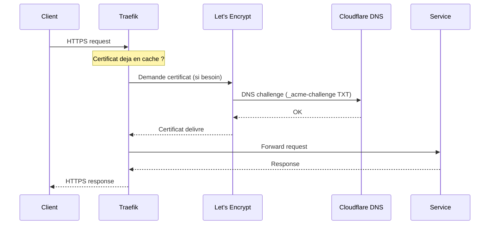

# Traefik

Reverse proxy avec TLS automatique via Let's Encrypt et DNS challenge Cloudflare.

## Acces

| | |
|---|---|
| URL | `https://traefik.home.gabin-simond.fr` (dashboard) |
| Host | penny (Docker) |
| Image | `traefik:latest` (digest pinned) |
| Port interne | 8080 (dashboard, non expose) |
| Auth | ForwardAuth Authelia |

## Fonctionnement



## Configuration

Traefik est configure via :

- **Labels Docker** sur chaque conteneur — definissent les routes (services sur penny)
- **File provider** (`traefik/dynamic/`) — routes vers les services hors Docker (Proxmox, LXC)
- **`traefik.yml`** — configuration statique (entrypoints, certresolver, middlewares)
- **Variables d'env** — `CF_API_EMAIL` et `CF_DNS_API_TOKEN` pour le DNS challenge

### Entrypoints

| Entrypoint | Port | Usage |
|---|---|---|
| `web` | 80 | HTTP (redirige automatiquement vers HTTPS) |
| `websecure` | 443 | HTTPS (TLS) |

### Labels Docker (template)

```yaml
labels:
  - "traefik.enable=true"
  - "traefik.http.routers.SERVICE.rule=Host(`service.home.gabin-simond.fr`)"
  - "traefik.http.routers.SERVICE.entrypoints=websecure"
  - "traefik.http.services.SERVICE.loadbalancer.server.port=PORT_INTERNE"
  - "traefik.http.routers.SERVICE.tls=true"
  - "traefik.http.routers.SERVICE.tls.certresolver=letencrypt"
```

### File provider (services externes)

Routes vers Proxmox et LXC dans `traefik/dynamic/` :

| Fichier | Service | Backend |
|---|---|---|
| `proxmox.yml` | galahad / lancelot | `https://192.168.1.18:8006` / `https://192.168.1.19:8006` |
| `adguard.yml` | AdGuard (host mode) | `http://192.168.1.28:3000` |

Les services file provider utilisent un `serversTransport` dedie avec `insecureSkipVerify` (les certs Proxmox sont auto-signes). Ce transport est **scope** — pas applique globalement.

## Middlewares

### Global (applique sur `websecure`)

- **`security-headers`** : HSTS, X-Frame-Options `DENY`, X-Content-Type-Options `nosniff`, Referrer-Policy `strict-origin-when-cross-origin`, Permissions-Policy restrictive

!!! warning "Pas de CSP global"
    CSP retire du middleware global — casse les SPA (Beszel, Proxmox, Portainer). Voir [decisions.md](../projet/decisions.md#security-headers--pas-de-csp-global-per-route-headers).

### Specifiques (par route)

| Middleware | Usage | Cible |
|---|---|---|
| `authelia` | ForwardAuth SSO | Traefik dashboard, Homepage, AdGuard, Watchtower |
| `auth-rate-limit` | 100 req/s burst SPA | `auth.home.gabin-simond.fr` |

!!! info "Routes PVE sans security headers"
    Les routes Proxmox n'ont AUCUN security header Traefik — ExtJS et COOP sont incompatibles.

## TLS hardening

- **Certificats** : Let's Encrypt via DNS challenge Cloudflare
- **CAA records DNS** : `letsencrypt.org` uniquement + `iodef mailto:`
- **minVersion** : TLS 1.2 (TLS 1.3 actif par defaut)
- **Cipher suites** : Mozilla intermediate (ChaCha20 + AES-GCM, ECDHE only)
- **Curves** : X25519, P256, P384
- **sniStrict** : rejette les requetes avec SNI non-route
- **Redirect HTTP → HTTPS** : tout le trafic port 80 redirige vers 443

Pour les details TLS et certificats, voir le [guide TLS](../guides/tls.md).

## Reseau

Tous les services proxifies sont sur le reseau Docker `proxy` (bridge).
Tailscale et Beszel Agent utilisent le reseau host.
AdGuard (host mode) est route via le file provider.

## Fichiers

| Fichier | Emplacement |
|---|---|
| Config statique | `/mnt/ssd/config/traefik/traefik.yml` |
| Routes dynamiques | `/mnt/ssd/config/traefik/dynamic/*.yml` |
| Certificats | Volume `traefik-certs` → `/certs/acme.json` |
| Logs | Volume `traefik-data` |
