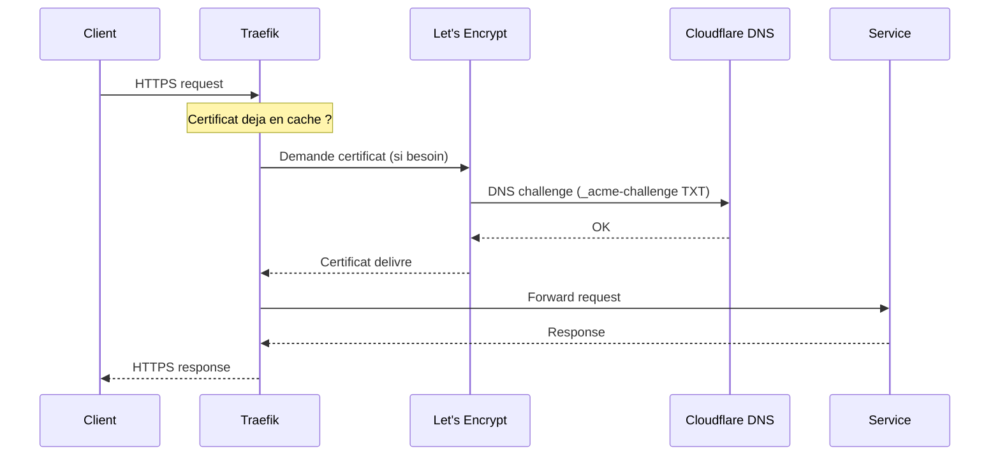

# Traefik

Reverse proxy avec TLS automatique via Let's Encrypt et DNS challenge Cloudflare.

## Fonctionnement



## Configuration

Traefik est configure via :

- **Labels Docker** sur chaque conteneur — definissent les routes
- **`traefik.yml`** — configuration statique (entrypoints, certresolver)
- **Variables d'env** — `CF_API_EMAIL` et `CF_DNS_API_TOKEN` pour le DNS challenge

### Entrypoints

| Entrypoint | Port | Usage |
|---|---|---|
| `web` | 80 | HTTP (redirige vers HTTPS) |
| `websecure` | 443 | HTTPS (TLS) |

### Labels type

```yaml
labels:
  - "traefik.enable=true"
  - "traefik.http.routers.SERVICE.rule=Host(`service.home.example.fr`)"
  - "traefik.http.routers.SERVICE.entrypoints=websecure"
  - "traefik.http.services.SERVICE.loadbalancer.server.port=PORT"
  - "traefik.http.routers.SERVICE.tls=true"
  - "traefik.http.routers.SERVICE.tls.certresolver=letencrypt"
```

## Reseau

Tous les services proxifies sont sur le reseau Docker `proxy` (bridge).
Tailscale et Beszel Agent utilisent le reseau host.
