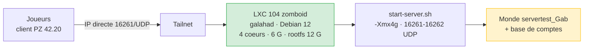

# Project Zomboid — serveur dédié B42.20

Serveur Project Zomboid **Build 42.20** hébergé dans le LXC 104 `zomboid` sur galahad, monde restauré depuis une sauvegarde. Accès réservé au cercle d'amis via Tailscale, aucun port ouvert sur la box.

**Depuis 2026-08-03.**

## Architecture



Le serveur est en `Public=false` + `Open=true` : les joueurs se connectent en **IP directe**, sans passer par le réseau Steam — le comportement voulu sur un VPN.

Adresse tailnet du conteneur : **`100.118.152.0`**, port `16261/UDP`.

:::warning[Ne pas activer `--accept-routes` sur ce conteneur]
Avec `--accept-routes`, le conteneur accepte la route `192.168.1.0/24` annoncée sur le tailnet et répond aux machines du LAN via `tailscale0` alors que les paquets arrivent par `eth0`. Ce routage asymétrique coupe l'accès SSH depuis penny (`ip route get 192.168.1.28` renvoie alors `dev tailscale0`). Le conteneur doit être **joignable** sur le tailnet, pas y router le LAN : `tailscale set --accept-routes=false`.

Accès hors-bande si le réseau du conteneur est cassé :
`ssh galahad "sudo nsenter -t 1 -m -- pct exec 104 -- <commande>"` — le `nsenter` est nécessaire car `/etc/pve` est en lecture seule dans les sessions SSH des nœuds PVE.
:::

## Composants

| Élément | Emplacement |
|---|---|
| Serveur | `/opt/pzserver` dans le LXC 104 (6,9 G) |
| Données du jeu | `/home/pzuser/Zomboid/` — `Server/` (config) et `Saves/Multiplayer/` (monde) |
| Base de comptes | `/home/pzuser/Zomboid/db/servertest Gab.db` |
| Lanceur | `homelab-config/scripts/pz-run.sh` → `/usr/local/bin/pz-run.sh` (dans le CT) |
| Unit | `homelab-config/system/systemd/zomboid.service` |
| Mise à jour | `/usr/local/bin/pz-install.sh` (dans le CT), **manuelle uniquement** |
| Sauvegarde | `homelab-config/scripts/pz-backup.sh` + timer, **sur penny** |
| Surveillance disque | `homelab-config/scripts/pz-disk-check.sh` + timer, **sur penny** |
| Spec de conception | `homelab-config/specs/2026-08-03-project-zomboid-server-design.md` |

## Le nom du serveur contient un espace

`servertest Gab` — et c'est intentionnel côté PZ. Lancé avec `-servername "servertest Gab"`, le moteur lit `servertest Gab.ini` et écrit le monde dans `Saves/Multiplayer/servertest_Gab` (espace remplacé par un underscore). Les deux formes coexistent donc normalement. **Toujours mettre le nom entre guillemets**, et ne pas « corriger » cette asymétrie : elle relie la config au monde.

L'`.ini` est en **CRLF** (issu d'un client Windows). Un `sed` qui ne matche pas le `\r` échoue silencieusement.

## Ne jamais mettre à jour automatiquement

PZ exige que **client et serveur soient sur la même build**. L'unit ne lance aucun `app_update` : si le serveur passait en 42.21 pendant la nuit, plus aucun joueur en 42.20 ne pourrait se connecter.

La mise à jour est une opération volontaire, coordonnée avec les joueurs :

```bash
systemctl stop zomboid
/usr/local/bin/pz-install.sh          # app_update 380870 validate
# Le heap revient a -Xmx8g : le remettre a 4g
sed -i 's/"-Xmx8g"/"-Xmx4g"/' /opt/pzserver/ProjectZomboid64.json
systemctl start zomboid
```

La branche `public` de l'app `380870` sert Build 42 depuis le 29 juillet 2026 ; `legacy41` sert Build 41 et `42.19` la version précédente. Aucun flag `-beta` n'est nécessaire.

## Exploitation

```bash
# Dans le LXC 104 (depuis penny : ssh root@192.168.1.9)
systemctl status zomboid
journalctl -u zomboid -f
ss -ulnp | grep 1626                  # doit montrer 16261 et 16262
sqlite3 '/home/pzuser/Zomboid/db/servertest Gab.db' 'SELECT username, role FROM whitelist;'
```

### Arrêt propre

L'unit envoie `quit` dans un FIFO (`/run/pz/stdin`) monté sur le stdin du serveur, ce qui déclenche la sauvegarde du monde. `SIGTERM` ne sert que de dernier recours après `TimeoutStopSec=180`. Les deux voies ont été vérifiées : `SaveAll` puis `Shutdown handling finished` dans le journal.

Le monde est en outre écrit toutes les 10 minutes (`SaveWorldEveryMinutes=10`) : à l'origine ce réglage était à `0`, ce qui n'écrivait qu'à l'arrêt propre et perdait toute la session en cas de crash.

### Rôles et comptes

| Compte | Rôle |
|---|---|
| `Igatax` | `admin` (rôle 7) |
| `Reckos` | `user` (rôle 2) — rétrogradé le 2026-08-04 |
| `admin` | `user` (rôle 2) |

Les rôles PZ vont de `banned` (1) à `admin` (7), avec `user`, `priority`, `observer`, `gm` et `moderator` entre les deux.

#### Le compte `admin` ne peut pas être supprimé, mais il peut être neutralisé

Vérifié le 2026-08-04 : serveur arrêté, ligne supprimée de `whitelist` alors qu'un
autre compte était déjà rôle 7. Au démarrage suivant le serveur écrit
`User 'admin' not found, creating it`, puis **attend un mot de passe sur stdin** et
recrée le compte en rôle `admin`. Supprimer la ligne ne fait donc que la régénérer,
avec plus de privilèges qu'avant.

En revanche **le passer en rôle `user` (2) survit au redémarrage** : le serveur ne
touche à ce compte que s'il est absent. C'est la seule neutralisation durable —
compte présent, aucune capacité. La tentative in-game du 2026-08-03 avait pourtant
journalisé `admin granted user access level on admin` sans que la base change : ne
pas se fier au message de la console, vérifier la table.

:::tip[Répondre au prompt au lieu de le subir]
Le stdin du serveur est un FIFO (`/run/pz/stdin`). Si le prompt apparaît,
y écrire le mot de passe **deux fois** (saisie puis confirmation) libère le
démarrage en quelques secondes :

```bash
printf '%s\n' "$PW" > /run/pz/stdin   # saisie
sleep 4
printf '%s\n' "$PW" > /run/pz/stdin   # confirmation
```

Sans cela le démarrage reste bloqué — c'est ce qui avait coûté 4 minutes de
coupure le 2026-08-03.
:::

### Sauvegarde

Modèle **pull depuis penny** : le credential reste sur penny, le conteneur de jeu ne détient aucun secret de push. Le `tar` est streamé, donc rien n'est écrit dans le conteneur, dont le rootfs est à l'étroit.

```bash
systemctl list-timers pz-backup pz-disk-check   # sur penny
ls -la /mnt/ssd/data/pz-backups/                # 28 archives = 1 semaine
tail /var/lib/pz-backup/pz-backup.log
```

Toutes les 6 heures, 28 archives conservées, ~6 Mo chacune. La destination étant sur le SSD, elle est déjà couverte par les repos restic.

### Surveillance disque

Le point de tension du projet. Horaire, en pull depuis penny, avec notification ntfy **uniquement en cas de franchissement de seuil** et un cooldown de 12 h par condition : galahad sous 5 Go libres, ou le conteneur sous 2 Go.

La surveillance est sur penny parce que **galahad n'a aucun chemin ntfy** — ni le script `lynis-notify.sh`, ni `/run/homelab/.env`. Distribuer le token ntfy vers un nœud pour un serveur de jeu aurait été disproportionné.

## Dépannage

| Symptôme | Cause probable | Action |
|---|---|---|
| Le service ne démarre pas, log `Enter new administrator password` | compte `admin` absent de `whitelist` | écrire le mot de passe deux fois dans `/run/pz/stdin` (voir [Rôles et comptes](#le-compte-admin-ne-peut-pas-être-supprimé-mais-il-peut-être-neutralisé)) — méthode vérifiée le 2026-08-04. L'ancienne consigne `-adminusername admin -adminpassword <pass>` n'a **pas** pu être confirmée sur B42.20 et est à considérer comme non vérifiée |
| Un joueur arrive sur un personnage neuf | pseudo différent de l'original | les personnages sont indexés par nom d'utilisateur dans le monde : réutiliser le pseudo exact |
| `Reckos` sans droits admin | colonne `world` divergente | `UPDATE whitelist SET world='servertest Gab' WHERE username='Reckos';` |
| OOM de la JVM | `-Xmx` revenu à `8g` après un `app_update` | remettre `4g` dans `ProjectZomboid64.json` |
| Clients ne peuvent plus se connecter après une mise à jour | build serveur ≠ build client | réaligner les deux, ou revenir sur la branche `42.19` |
| Notification « espace disque » | le monde grossit, ou l'install a gonflé | purger les archives locales, ou agrandir le rootfs (galahad a de la marge) |

## Limites assumées

**Pas de haute disponibilité** : le serveur meurt avec galahad. Acceptable pour un serveur de jeu.

**Ressources partagées avec vault.** galahad n'a que 4 cœurs, partagés avec vault (critique), dns-failover et pulse. `MaxPlayers` a été ramené de 32 à 8 pour cette raison. À surveiller aux premières sessions à plusieurs.

**Un chunk du monde restauré a échoué au chargement** (`765,659`, plus quatre `invalid room metaID` sur `map_meta.bin`). Sans cascade et sans bloquer le démarrage, mais la zone concernée a pu être régénérée et perdre son contenu local.
